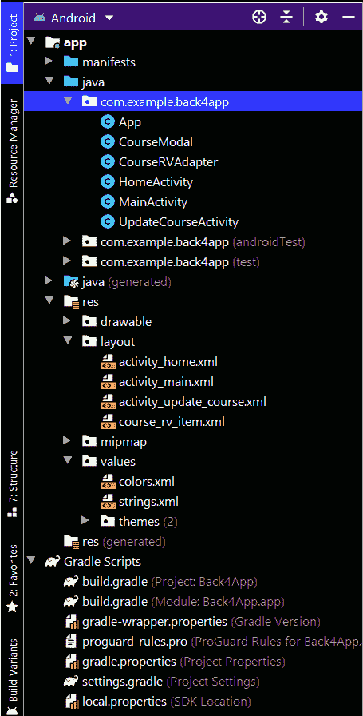

# 安卓如何删除 Back4App 数据库中的数据？

> 原文:[https://www . geeksforgeeks . org/如何删除 back4app 中的数据-android 中的数据库/](https://www.geeksforgeeks.org/how-to-delete-data-in-back4app-database-in-android/)

我们已经看到[将数据添加到我们的 Back4App 数据库](https://www.geeksforgeeks.org/how-to-add-data-to-back4app-database-in-android/)中，同时[读取](https://www.geeksforgeeks.org/how-to-read-data-from-back4app-database-in-android/)和[更新](https://www.geeksforgeeks.org/how-to-update-data-in-back4app-database-in-android/)这些数据。在本文中，我们将看一下**删除**这个数据。

### **我们要建什么？**

我们将在更新数据的更新屏幕中添加一个简单的按钮，在该屏幕中，我们将添加一个删除课程的新按钮。删除后，该课程将从我们的数据库中删除。

### **分步实施**

**第一步:新建删除 activity_update_course.xml 文件内数据的按钮**

因为我们在上一篇文章中创建了新的更新课程活动。所以我们将简单地给它添加一个新按钮。将以下代码片段添加到**activity _ update _ course . XML**文件中。

## 可扩展标记语言

```java
<!--button for deleting our course-->
<Button
  android:id="@+id/idBtnDelete"
  android:layout_width="0dp"
  android:layout_height="wrap_content"
  android:layout_margin="3dp"
  android:layout_weight="1"
  android:text="Delete Course"
  android:textAllCaps="false" />
```

以下是**activity _ update _ course . XML**文件的更新代码。

## 可扩展标记语言

```java
<?xml version="1.0" encoding="utf-8"?>
<LinearLayout
    xmlns:android="http://schemas.android.com/apk/res/android"
    xmlns:tools="http://schemas.android.com/tools"
    android:layout_width="match_parent"
    android:layout_height="match_parent"
    android:orientation="vertical"
    tools:context=".UpdateCourseActivity">

    <!--Edit text for getting course Name-->
    <EditText
        android:id="@+id/idEdtCourseName"
        android:layout_width="match_parent"
        android:layout_height="wrap_content"
        android:layout_marginStart="10dp"
        android:layout_marginTop="20dp"
        android:layout_marginEnd="10dp"
        android:hint="Course Name"
        android:importantForAutofill="no"
        android:inputType="text" />

    <!--Edittext for getting course Duration-->
    <EditText
        android:id="@+id/idEdtCourseDuration"
        android:layout_width="match_parent"
        android:layout_height="wrap_content"
        android:layout_marginStart="10dp"
        android:layout_marginTop="20dp"
        android:layout_marginEnd="10dp"
        android:hint="Course Duration in min"
        android:importantForAutofill="no"
        android:inputType="time" />

    <!--Edittext for getting course Description-->
    <EditText
        android:id="@+id/idEdtCourseDescription"
        android:layout_width="match_parent"
        android:layout_height="wrap_content"
        android:layout_marginStart="10dp"
        android:layout_marginTop="20dp"
        android:layout_marginEnd="10dp"
        android:hint="Course Description"
        android:importantForAutofill="no"
        android:inputType="text" />

    <LinearLayout
        android:layout_width="match_parent"
        android:layout_height="wrap_content"
        android:layout_marginStart="10dp"
        android:layout_marginTop="20dp"
        android:layout_marginEnd="10dp"
        android:orientation="horizontal"
        android:weightSum="2">

        <LinearLayout
            android:layout_width="match_parent"
            android:layout_height="wrap_content"
            android:layout_marginStart="10dp"
            android:layout_marginTop="20dp"
            android:layout_marginEnd="10dp"
            android:orientation="horizontal"
            android:weightSum="2">

            <!--button for updating our course-->
            <Button
                android:id="@+id/idBtnUpdate"
                android:layout_width="0dp"
                android:layout_height="wrap_content"
                android:layout_margin="3dp"
                android:layout_weight="1"
                android:text="Update Course"
                android:textAllCaps="false" />

            <!--button for deleting our course-->
            <Button
                android:id="@+id/idBtnDelete"
                android:layout_width="0dp"
                android:layout_height="wrap_content"
                android:layout_margin="3dp"
                android:layout_weight="1"
                android:text="Delete Course"
                android:textAllCaps="false" />

        </LinearLayout>

    </LinearLayout>

</LinearLayout>
```

**第二步:现在我们必须在 UpdateCourseActivity.java 文件** **中初始化这个按钮，并在其中添加 onClickListener**

转到**UpdateCourseActivity.java**文件，添加以下代码片段。

## Java 语言(一种计算机语言，尤用于创建网站)

```java
// Adding on click listener for delete button
deleteCourseBtn.setOnClickListener(new View.OnClickListener() {
            @Override
            public void onClick(View v) {
                // calling a method to delete a course.
                deleteCourse(originalCourseName);
        }
});

private void deleteCourse(String courseName) {

        // Configure Query with our query.
        ParseQuery<ParseObject> query = ParseQuery.getQuery("courses");

        // adding a condition where our course name
        // must be equal to the original course name
        query.whereEqualTo("courseName", courseName);

        // on below line we are finding the course with the course name.
        query.findInBackground(new FindCallback<ParseObject>() {
            @Override
            public void done(List<ParseObject> objects, ParseException e) {
                // if the error is null.
                if (e == null) {
                    // on below line we are getting the first course and
                    // calling a delete method to delete this course.
                    objects.get(0).deleteInBackground(new DeleteCallback() {
                        @Override
                        public void done(ParseException e) {
                            // inside done method checking if the error is null or not.
                            if (e == null) {
                                // if the error is not null then we are displaying a toast message and opening our home activity.
                                Toast.makeText(UpdateCourseActivity.this, "Course Deleted..", Toast.LENGTH_SHORT).show();
                                Intent i = new Intent(UpdateCourseActivity.this, HomeActivity.class);
                                startActivity(i);
                            } else {
                                // if we get error we are displaying it in below line.
                                Toast.makeText(UpdateCourseActivity.this, "Fail to delete course..", Toast.LENGTH_SHORT).show();
                            }
                        }
                    });
                } else {
                    // if we don't get the data in our database then we are displaying below message.
                    Toast.makeText(UpdateCourseActivity.this, "Fail to get the object..", Toast.LENGTH_SHORT).show();
                }
            }
     });
}
```

以下是**UpdateCourseActivity.java**文件的更新代码。

## Java 语言(一种计算机语言，尤用于创建网站)

```java
import android.content.Intent;
import android.os.Bundle;
import android.text.TextUtils;
import android.view.View;
import android.widget.Button;
import android.widget.EditText;
import android.widget.Toast;

import androidx.appcompat.app.AppCompatActivity;

import com.parse.DeleteCallback;
import com.parse.FindCallback;
import com.parse.GetCallback;
import com.parse.ParseException;
import com.parse.ParseObject;
import com.parse.ParseQuery;
import com.parse.SaveCallback;

import java.util.List;

public class UpdateCourseActivity extends AppCompatActivity {

    // creating variables for our edit text
    private EditText courseNameEdt, courseDurationEdt, courseDescriptionEdt;

    // creating variable for button
    private Button updateCourseBtn, deleteCourseBtn;

    // creating a strings for storing our values from edittext fields.
    private String courseName, courseDuration, courseDescription, originalCourseName, objectID;

    @Override
    protected void onCreate(Bundle savedInstanceState) {
        super.onCreate(savedInstanceState);
        setContentView(R.layout.activity_update_course);

        // initializing our edittext and buttons
        deleteCourseBtn = findViewById(R.id.idBtnDelete);
        updateCourseBtn = findViewById(R.id.idBtnUpdate);
        courseNameEdt = findViewById(R.id.idEdtCourseName);
        courseDescriptionEdt = findViewById(R.id.idEdtCourseDescription);
        courseDurationEdt = findViewById(R.id.idEdtCourseDuration);

        // on below line we are setting data to our edit text field.
        courseNameEdt.setText(getIntent().getStringExtra("courseName"));
        courseDescriptionEdt.setText(getIntent().getStringExtra("courseDescription"));
        courseDurationEdt.setText(getIntent().getStringExtra("courseDuration"));
        originalCourseName = getIntent().getStringExtra("courseName");

        // Adding on click listener for delete button
        deleteCourseBtn.setOnClickListener(new View.OnClickListener() {
            @Override
            public void onClick(View v) {
                // calling a method to delete a course.
                deleteCourse(originalCourseName);
            }
        });

        updateCourseBtn.setOnClickListener(new View.OnClickListener() {
            @Override
            public void onClick(View v) {
                courseName = courseNameEdt.getText().toString();
                courseDescription = courseDescriptionEdt.getText().toString();
                courseDuration = courseDurationEdt.getText().toString();
                // validating the text fields if empty or not.
                if (TextUtils.isEmpty(courseName)) {
                    courseNameEdt.setError("Please enter Course Name");
                } else if (TextUtils.isEmpty(courseDescription)) {
                    courseDescriptionEdt.setError("Please enter Course Description");
                } else if (TextUtils.isEmpty(courseDuration)) {
                    courseDurationEdt.setError("Please enter Course Duration");
                } else {
                    // calling method to update data.
                    updateData(originalCourseName, courseName, courseDescription, courseDuration);
                }
            }
        });
    }

    private void deleteCourse(String courseName) {

        // Configure Query with our query.
        ParseQuery<ParseObject> query = ParseQuery.getQuery("courses");

        // adding a condition where our course name
        // must be equal to the original course name
        query.whereEqualTo("courseName", courseName);

        // on below line we are finding the course with the course name.
        query.findInBackground(new FindCallback<ParseObject>() {
            @Override
            public void done(List<ParseObject> objects, ParseException e) {
                // if the error is null.
                if (e == null) {
                    // on below line we are getting the first course and
                    // calling a delete method to delete this course.
                    objects.get(0).deleteInBackground(new DeleteCallback() {
                        @Override
                        public void done(ParseException e) {
                            // inside done method checking if the error is null or not.
                            if (e == null) {
                                // if the error is not null then we are displaying a toast message and opening our home activity.
                                Toast.makeText(UpdateCourseActivity.this, "Course Deleted..", Toast.LENGTH_SHORT).show();
                                Intent i = new Intent(UpdateCourseActivity.this, HomeActivity.class);
                                startActivity(i);
                            } else {
                                // if we get error we are displaying it in below line.
                                Toast.makeText(UpdateCourseActivity.this, "Fail to delete course..", Toast.LENGTH_SHORT).show();
                            }
                        }
                    });
                } else {
                    // if we don't get the data in our database then we are displaying below message.
                    Toast.makeText(UpdateCourseActivity.this, "Fail to get the object..", Toast.LENGTH_SHORT).show();
                }
            }
        });
    }

    private void updateData(String originalCourseName, String courseName, String courseDescription, String courseDuration) {

        // Configure Query with our query.
        ParseQuery<ParseObject> query = ParseQuery.getQuery("courses");

        // adding a condition where our course name must be equal to the original course name
        query.whereEqualTo("courseName", originalCourseName);

        // in below method we are getting the unique id
        // of the course which we have to make update.
        query.getFirstInBackground(new GetCallback<ParseObject>() {
            @Override
            public void done(ParseObject object, ParseException e) {
                // inside done method we check
                // if the error is null or not.
                if (e == null) {

                    // if the error is null then we are getting
                    // our object id in below line.
                    objectID = object.getObjectId().toString();

                    // after getting our object id we will
                    // move towards updating our course.
                    // calling below method to update our course.
                    query.getInBackground(objectID, new GetCallback<ParseObject>() {
                        @Override
                        public void done(ParseObject object, ParseException e) {
                            // in this method we are getting the
                            // object which we have to update.
                            if (e == null) {

                                // in below line we are adding new data
                                // to the object which we get from its id.
                                // on below line we are adding our data
                                // with their key value in our object.
                                object.put("courseName", courseName);
                                object.put("courseDescription", courseDescription);
                                object.put("courseDuration", courseDuration);

                                // after adding new data then we are
                                // calling a method to save this data
                                object.saveInBackground(new SaveCallback() {
                                    @Override
                                    public void done(ParseException e) {
                                        // inside on done method we are checking
                                        // if the error is null or not.
                                        if (e == null) {
                                            // if the error is null our data has been updated.
                                            // we are displaying a toast message and redirecting
                                            // our user to home activity where we are displaying course list.
                                            Toast.makeText(UpdateCourseActivity.this, "Course Updated..", Toast.LENGTH_SHORT).show();
                                            Intent i = new Intent(UpdateCourseActivity.this, HomeActivity.class);
                                            startActivity(i);
                                        } else {
                                            // below line is for error handling.
                                            Toast.makeText(UpdateCourseActivity.this, "Fail to update data " + e.getLocalizedMessage(), Toast.LENGTH_SHORT).show();
                                        }
                                    }
                                });
                            } else {
                                // on below line we are displaying a message
                                // if we don't get the object from its id.
                                Toast.makeText(UpdateCourseActivity.this, "Fail to update course " + e.getLocalizedMessage(), Toast.LENGTH_SHORT).show();
                            }
                        }
                    });
                } else {
                    // this is error handling if we don't get the id for our object
                    Toast.makeText(UpdateCourseActivity.this, "Fail to get object ID..", Toast.LENGTH_SHORT).show();
                }
            }
        });
    }
}
```

现在运行您的应用程序，并查看应用程序的输出。请确保在执行此操作之前添加课程。

**输出:**

<video class="wp-video-shortcode" id="video-571909-1" width="640" height="360" preload="metadata" controls=""><source type="video/mp4" src="https://media.geeksforgeeks.org/wp-content/uploads/20210307230205/Screenrecorder-2021-03-07-23-00-33-447.mp4?_=1">[https://media.geeksforgeeks.org/wp-content/uploads/20210307230205/Screenrecorder-2021-03-07-23-00-33-447.mp4](https://media.geeksforgeeks.org/wp-content/uploads/20210307230205/Screenrecorder-2021-03-07-23-00-33-447.mp4)</video>

**下面是执行删除操作后 Android Studio 中的文件结构:**

