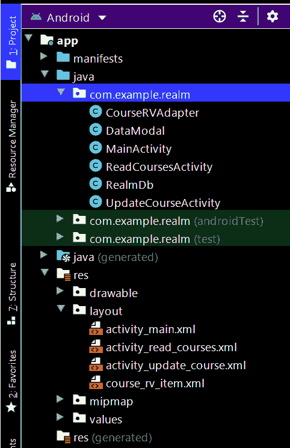

# 安卓如何删除领域数据库中的数据？

> 原文:[https://www . geeksforgeeks . org/如何删除领域中的数据-安卓中的数据库/](https://www.geeksforgeeks.org/how-to-delete-data-in-realm-database-in-android/)

在之前关于领域数据库的系列文章中，我们看到[添加](https://www.geeksforgeeks.org/how-to-install-and-add-data-to-realm-database-in-android/)、[读取](https://www.geeksforgeeks.org/how-to-read-data-from-realm-database-in-android/)、[使用安卓中的领域数据库更新](https://www.geeksforgeeks.org/how-to-update-data-in-realm-database-in-android/)数据。在那篇文章中，我们添加了课程细节，阅读并更新了它们。在本文中，我们将看一下**在安卓应用程序**中从我们的领域数据库中删除这些课程细节。

### 我们将在本文中构建什么？

我们将构建一个简单的应用程序，我们将在现有的应用程序中工作，我们将简单地添加一个新按钮，从领域数据库中删除我们的课程。下面是视频，我们将在其中看到我们将在本文中构建的内容。

<video class="wp-video-shortcode" id="video-580200-1" width="640" height="360" preload="metadata" controls=""><source type="video/mp4" src="https://media.geeksforgeeks.org/wp-content/uploads/20210320113001/20210320_112911.mp4?_=1">[https://media.geeksforgeeks.org/wp-content/uploads/20210320113001/20210320_112911.mp4](https://media.geeksforgeeks.org/wp-content/uploads/20210320113001/20210320_112911.mp4)</video>

### **分步**实施

**第一步:在应用项目的 build.gradle 文件中添加 google repository。**

> buildscript {
> 
> 存储库{
> 
> 谷歌()
> 
> mavenuentral _)
> 
> }

**所有的 Jetpack 组件都可以在 Google Maven 存储库中找到，包括在 build.gradle 文件**中

> 所有项目{
> 
> 存储库{
> 
> 谷歌()
> 
> mavenuentral _)
> 
> }
> 
> }

**步骤 2:使用 activity_update_course.xml 文件**

导航到**应用程序> res >布局>activity _ update _ course . XML**文件，并在该布局中添加一个用于删除课程的按钮。下面是该文件的代码。

## 可扩展标记语言

```
<!--Button for deleting your course to database-->
<Button
  android:id="@+id/idBtnDeleteCourse"
  android:layout_width="match_parent"
  android:layout_height="wrap_content"
  android:layout_margin="10dp"
  android:text="Delete Course"
  android:textAllCaps="false"
  android:visibility="visible" />
```

以下是添加上述代码片段后**activity _ update _ course . XML**文件的更新代码。

## 可扩展标记语言

```
<?xml version="1.0" encoding="utf-8"?>
<LinearLayout
    xmlns:android="http://schemas.android.com/apk/res/android"
    xmlns:tools="http://schemas.android.com/tools"
    android:layout_width="match_parent"
    android:layout_height="match_parent"
    android:orientation="vertical"
    tools:context=".UpdateCourseActivity">

    <!--Edit text to enter course name-->
    <EditText
        android:id="@+id/idEdtCourseName"
        android:layout_width="match_parent"
        android:layout_height="wrap_content"
        android:layout_margin="10dp"
        android:hint="Enter Course Name" />

    <!--edit text to enter course duration-->
    <EditText
        android:id="@+id/idEdtCourseDuration"
        android:layout_width="match_parent"
        android:layout_height="wrap_content"
        android:layout_margin="10dp"
        android:hint="Enter Course Duration" />

    <!--edit text to display course tracks-->
    <EditText
        android:id="@+id/idEdtCourseTracks"
        android:layout_width="match_parent"
        android:layout_height="wrap_content"
        android:layout_margin="10dp"
        android:hint="Enter Course Tracks" />

    <!--edit text for course description-->
    <EditText
        android:id="@+id/idEdtCourseDescription"
        android:layout_width="match_parent"
        android:layout_height="wrap_content"
        android:layout_margin="10dp"
        android:hint="Enter Course Description" />

    <!--button for updating course-->
    <Button
        android:id="@+id/idBtnUpdateCourse"
        android:layout_width="match_parent"
        android:layout_height="wrap_content"
        android:layout_margin="10dp"
        android:text="Update Course"
        android:textAllCaps="false" />

    <!--Button for deleting your course to database-->
    <Button
        android:id="@+id/idBtnDeleteCourse"
        android:layout_width="match_parent"
        android:layout_height="wrap_content"
        android:layout_margin="10dp"
        android:text="Delete Course"
        android:textAllCaps="false"
        android:visibility="visible" />

</LinearLayout>
```

**步骤 3:使用 UpdateCourseActivity.java 文件**

初始化我们的按钮，删除我们的课程。导航到**应用程序> java >你的应用程序的包名>UpdateCourseActivity.java**文件，并添加下面的代码。

## Java 语言(一种计算机语言，尤用于创建网站)

```
// adding on click listener for delete course button.
deleteCourseBtn.setOnClickListener(new View.OnClickListener() {
            @Override
            public void onClick(View v) {
                // on below line we are calling a method to delete course.
                deleteCourse(id);
                // after deleting we are displaying a toast message as course deleted.
                Toast.makeText(UpdateCourseActivity.this, "Course Deleted.", Toast.LENGTH_SHORT).show();
                // after that we are opening a new activity via an intent.
                Intent i = new Intent(UpdateCourseActivity.this, ReadCoursesActivity.class);
                startActivity(i);
                finish();
            }
        });
    }

// deleteCourse() function
private void deleteCourse(long id) {
        // on below line we are finding data from our modal class by comparing it with the course id.
        DataModal modal = realm.where(DataModal.class).equalTo("id", id).findFirst();
        // on below line we are executing a realm transaction.
        realm.executeTransaction(new Realm.Transaction() {
            @Override
            public void execute(Realm realm) {
                // on below line we are calling a method for deleting this course
                modal.deleteFromRealm();
            }
     });
}
```

以下是添加上述代码片段后**UpdateCourseActivity.java**文件的更新代码。

## Java 语言(一种计算机语言，尤用于创建网站)

```
import android.content.Intent;
import android.os.Bundle;
import android.text.TextUtils;
import android.view.View;
import android.widget.Button;
import android.widget.EditText;
import android.widget.Toast;

import androidx.appcompat.app.AppCompatActivity;

import io.realm.Realm;

public class UpdateCourseActivity extends AppCompatActivity {

    // creating variables for our edit text
    private EditText courseNameEdt, courseDurationEdt, courseDescriptionEdt, courseTracksEdt;

    // creating a strings for storing
    // our values from edittext fields.
    private String courseName, courseDuration, courseDescription, courseTracks;
    private long id;
    private Button updateCourseBtn, deleteCourseBtn;
    private Realm realm;

    @Override
    protected void onCreate(Bundle savedInstanceState) {
        super.onCreate(savedInstanceState);
        setContentView(R.layout.activity_update_course);

        // initializing our edittext and buttons
        realm = Realm.getDefaultInstance();
        courseNameEdt = findViewById(R.id.idEdtCourseName);
        courseDescriptionEdt = findViewById(R.id.idEdtCourseDescription);
        courseDurationEdt = findViewById(R.id.idEdtCourseDuration);
        courseTracksEdt = findViewById(R.id.idEdtCourseTracks);
        updateCourseBtn = findViewById(R.id.idBtnUpdateCourse);
        deleteCourseBtn = findViewById(R.id.idBtnDeleteCourse);

        // on below line we are getting data which is passed from intent.
        courseName = getIntent().getStringExtra("courseName");
        courseDuration = getIntent().getStringExtra("courseDuration");
        courseDescription = getIntent().getStringExtra("courseDescription");
        courseTracks = getIntent().getStringExtra("courseTracks");
        id = getIntent().getLongExtra("id", 0);

        // on below line we are setting data in our edit test fields.
        courseNameEdt.setText(courseName);
        courseDurationEdt.setText(courseDuration);
        courseDescriptionEdt.setText(courseDescription);
        courseTracksEdt.setText(courseTracks);

        // adding on click listener for update button.
        updateCourseBtn.setOnClickListener(new View.OnClickListener() {
            @Override
            public void onClick(View v) {

                // getting data from edittext fields.
                String courseName = courseNameEdt.getText().toString();
                String courseDescription = courseDescriptionEdt.getText().toString();
                String courseDuration = courseDurationEdt.getText().toString();
                String courseTracks = courseTracksEdt.getText().toString();

                // validating the text fields if empty or not.
                if (TextUtils.isEmpty(courseName)) {
                    courseNameEdt.setError("Please enter Course Name");
                } else if (TextUtils.isEmpty(courseDescription)) {
                    courseDescriptionEdt.setError("Please enter Course Description");
                } else if (TextUtils.isEmpty(courseDuration)) {
                    courseDurationEdt.setError("Please enter Course Duration");
                } else if (TextUtils.isEmpty(courseTracks)) {
                    courseTracksEdt.setError("Please enter Course Tracks");
                } else {
                    // on below line we are getting data from our modal where
                    // the id of the course equals to which we passed previously.
                    final DataModal modal = realm.where(DataModal.class).equalTo("id", id).findFirst();
                    updateCourse(modal, courseName, courseDescription, courseDuration, courseTracks);
                }

                // on below line we are displaying a toast message when course is updated.
                Toast.makeText(UpdateCourseActivity.this, "Course Updated.", Toast.LENGTH_SHORT).show();

                // on below line we are opening our activity for read course activity to view updated course.
                Intent i = new Intent(UpdateCourseActivity.this, ReadCoursesActivity.class);
                startActivity(i);
                finish();
            }
        });

        // adding on click listener for delete course button.
        deleteCourseBtn.setOnClickListener(new View.OnClickListener() {
            @Override
            public void onClick(View v) {
                // on below line we are calling a method to delete course.
                deleteCourse(id);
                // after deleting we are displaying a toast message as course deleted.
                Toast.makeText(UpdateCourseActivity.this, "Course Deleted.", Toast.LENGTH_SHORT).show();
                // after that we are opening a new activity via an intent.
                Intent i = new Intent(UpdateCourseActivity.this, ReadCoursesActivity.class);
                startActivity(i);
                finish();
            }
        });
    }

    private void updateCourse(DataModal modal, String courseName, String courseDescription, String courseDuration, String courseTracks) {

        // on below line we are calling
        // a method to execute a transaction.
        realm.executeTransaction(new Realm.Transaction() {
            @Override
            public void execute(Realm realm) {
                // on below line we are setting data to our modal class
                // which we get from our edit text fields.
                modal.setCourseDescription(courseDescription);
                modal.setCourseName(courseName);
                modal.setCourseDuration(courseDuration);
                modal.setCourseTracks(courseTracks);

                // inside on execute method we are calling a method to copy
                // and update to real m database from our modal class.
                realm.copyToRealmOrUpdate(modal);
            }
        });
    }

    // deleteCourse() function
    private void deleteCourse(long id) {
        // on below line we are finding data from our modal class by comparing it with the course id.
        DataModal modal = realm.where(DataModal.class).equalTo("id", id).findFirst();
        // on below line we are executing a realm transaction.
        realm.executeTransaction(new Realm.Transaction() {
            @Override
            public void execute(Realm realm) {
                // on below line we are calling a method for deleting this course
                modal.deleteFromRealm();
            }
        });
    }
}
```

现在运行您的应用程序并查看代码输出:

**输出:**

<video class="wp-video-shortcode" id="video-580200-2" width="640" height="360" preload="metadata" controls=""><source type="video/mp4" src="https://media.geeksforgeeks.org/wp-content/uploads/20210320113001/20210320_112911.mp4?_=2">[https://media.geeksforgeeks.org/wp-content/uploads/20210320113001/20210320_112911.mp4](https://media.geeksforgeeks.org/wp-content/uploads/20210320113001/20210320_112911.mp4)</video>

**下面是执行 CRUD 操作后完整的项目文件结构:**



**在下方链接查看项目:**[https://github.com/ChaitanyaMunje/Realm-Db](https://github.com/ChaitanyaMunje/Realm-Db)