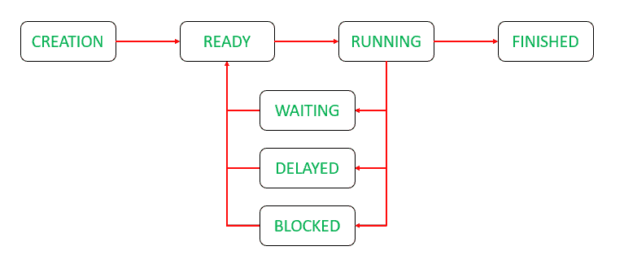
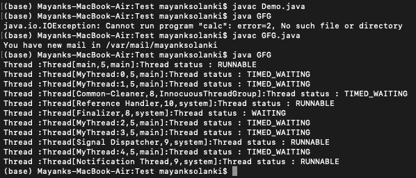

# 如何在 Java 中显示所有线程状态？

> 原文:[https://www . geesforgeks . org/how-display-all-threads-status-in-Java/](https://www.geeksforgeeks.org/how-to-display-all-threads-status-in-java/)

线程是进程中的轻量级进程..java 中的多线程是一个特性，它允许程序的两个或多个部分同时执行，以最大化 CPU 的利用率。这里检索线程状态的方法是通过 [*getState()*](https://www.geeksforgeeks.org/lifecycle-and-states-of-a-thread-in-java/) 方法的[线程类](https://www.geeksforgeeks.org/java-lang-thread-class-java/)。java 线程可以存在于以下任何一种状态，线程的状态是它在给定实例中存在的状态。如上图所示的[线程的生命周期](https://www.geeksforgeeks.org/lifecycle-and-states-of-a-thread-in-java/)是了解更多状态的最好方法，其中状态如下:

*   新的
*   可追捕的
*   堵塞的
*   等待
*   定时等待
*   终止的



> **注意:**当一个线程正在被执行时，所有其他线程都处于阻塞状态，而不是等待状态。

**程序:**显示线程状态

1.  线程是通过实现可运行接口来创建的。
2.  线程的状态可以通过线程类对象的 *getState()* 方法来检索。

**示例:**

## Java 语言(一种计算机语言，尤用于创建网站)

```java
// Java Program to Display all Threads Status

// Importing Set class fom java.util package
import java.util.Set;

// Class 1
// helepr Class implementing Runnable interface
class MyThread implements Runnable {

    // run() method whenever thread is invoked
    public void run()
    {

        // Try block to check for exceptions
        try {

            // making thread to
            Thread.sleep(2000);
        }

        // Catch block to handle the exceptions
        catch (Exception err) {

            // Print the exception
            System.out.println(err);
        }
    }
}

// Class 2
// Main Class to check thread status
public class GFG {

    // Main driver method
    public static void main(String args[]) throws Exception
    {

        // Iterating to create multiple threads
        // Customly creating 5 threads
        for (int thread_num = 0; thread_num < 5;
             thread_num++) {

            // Creating single thread object
            Thread t = new Thread(new MyThread());

            // Setting name of the particular thread
            // using setName() method
            t.setName("MyThread:" + thread_num);

            // Starting the current thread
            // using start() method
            t.start();
        }

        // Creating set object to hold all the threads where
        // Thread.getAllStackTraces().keySet() returns
        // all threads including application threads and
        // system threads
        Set<Thread> threadSet
            = Thread.getAllStackTraces().keySet();

        // Now, for loop is used to iterate through the
        // threadset
        for (Thread t : threadSet) {

            // Printing the thread status using getState()
            // method
            System.out.println("Thread :" + t + ":"
                               + "Thread status : "
                               + t.getState());
        }
    }
}
```

**输出:**

