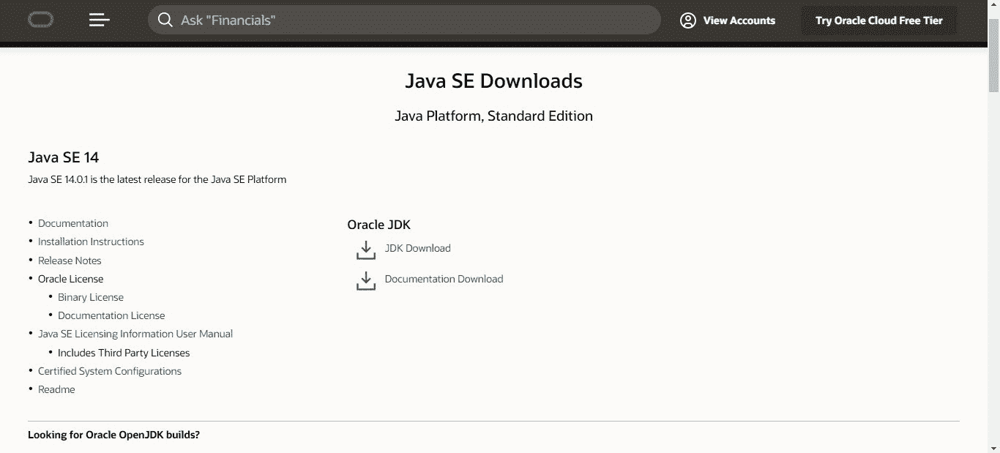
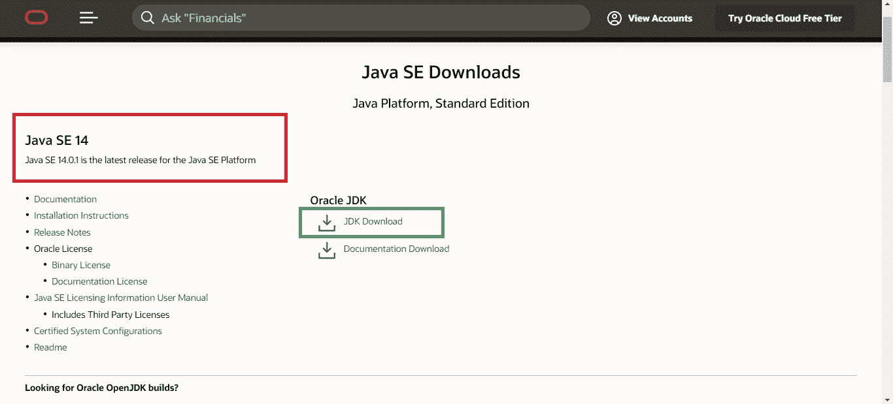
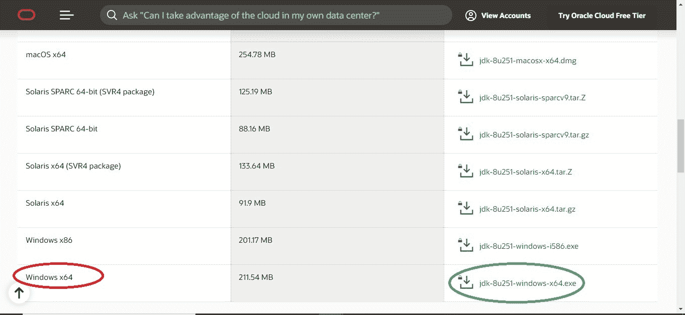
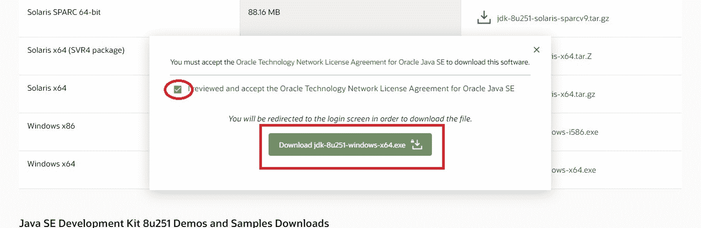
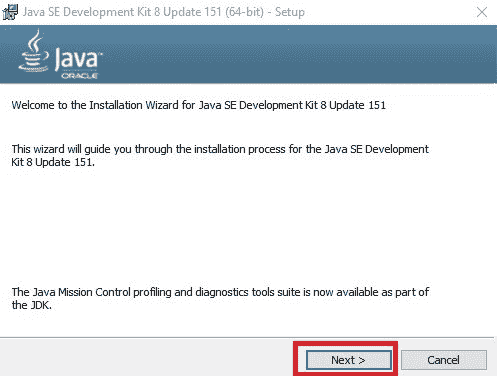
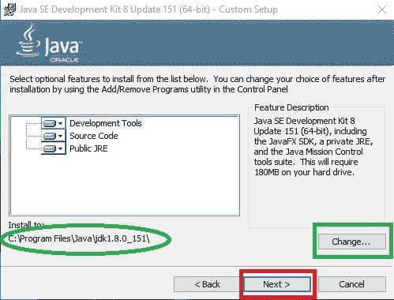
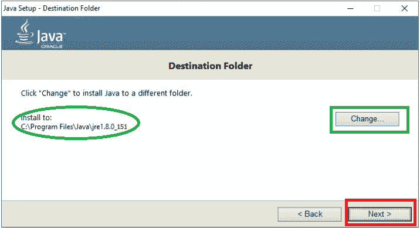
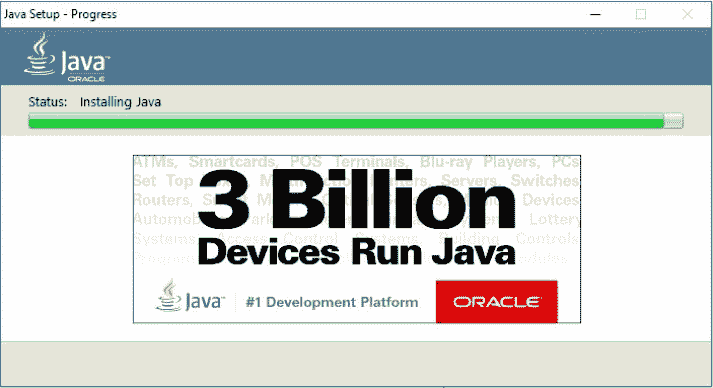
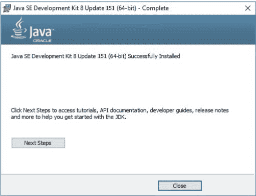

# 如何为 64 位机下载安装 Java？

> 原文:[https://www . geesforgeks . org/64 位机器如何下载和安装 Java/](https://www.geeksforgeeks.org/how-to-download-and-install-java-for-64-bit-machine/)

[Java](https://www.geeksforgeeks.org/java-tutorials/) 是目前最流行、应用最广泛的编程语言之一。多年来，它一直是最流行的编程语言之一。在本文中，我们将看到如何在 64 位架构机器上下载和安装 Java。

为了下载和安装 java，可以遵循以下步骤。下面描述的所有步骤都是在 Windows 10 操作系统上执行的，但是该过程也与其他操作系统非常相似。

*   **第一步:**在浏览器中打开[https://www . Oracle . com/Java/technologies/javase-downloads . html](https://www.oracle.com/java/technologies/javase-downloads.html)URL，会导航到官方的 Oracle Java 下载页面。

*   **第二步:**现在，滚动到我们想要下载的 Java 版本，点击 **JDK 下载**选项，如下图:

*   **第 3 步:**向下滚动至页面，点击适合您电脑操作系统的下载按钮选项。但是对于 64 位机器，选择以 **x64** 结尾的软件名称。

点击下载按钮后，会出现一个弹出窗口，提示我们必须接受**甲骨文 Java SE 的甲骨文技术网络许可协议**才能下载该软件。因此，点击复选框，然后继续下载，如下所示:

*   **第 4 步:**我们现在将导航到**甲骨文登录页面**。我们需要登录该帐户。登录后，我们的下载将立即开始，如下所示:

*   **第五步:**下载程序完成后，我们需要运行安装程序。Java 安装向导打开后，点击**下一步**按钮，如下图所示:

*   **第六步:**再次点击**下一步**按钮如果我们希望在默认目录中安装 Java 开发工具包(用绿色圈起来)，或者我们可以通过点击**更改**按钮来更改该目录。

*   **第 7 步:**安装将如下所示开始:

*   **第 8 步:**现在，它会询问 **JRE(Java 运行时环境)**的安装目录。同样，我们可以继续使用默认目录或相应地更改它。

*   **步骤 9:**Java 安装将成功完成，如下图所示:

*   **第 10 步:**最后，在确认窗口出现 Java 安装完毕后，我们可以点击**关闭**按钮。

安装 Java 后，我们可以使用本文中提到的步骤进行设置。