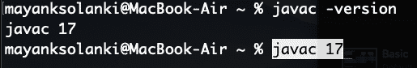
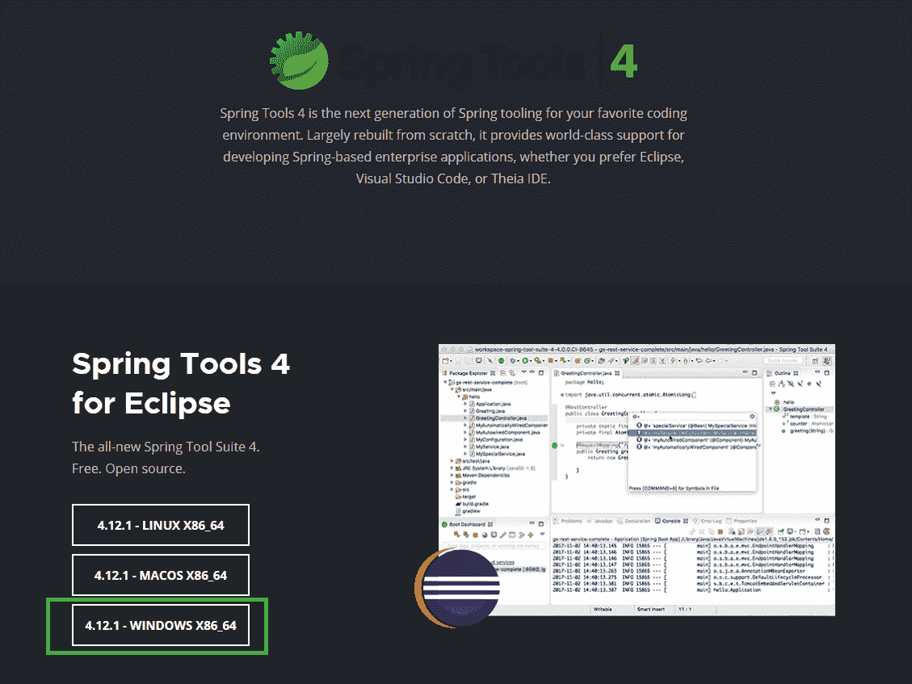
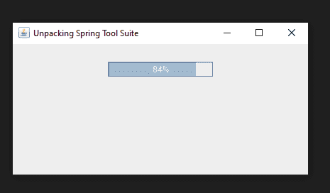
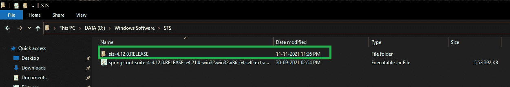
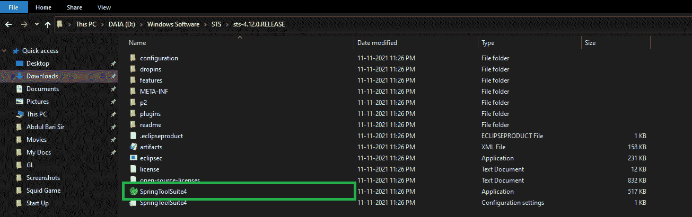
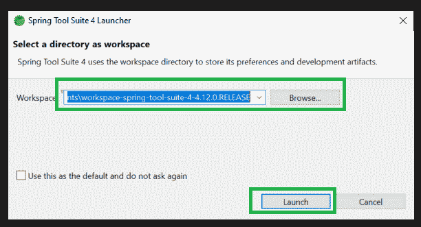
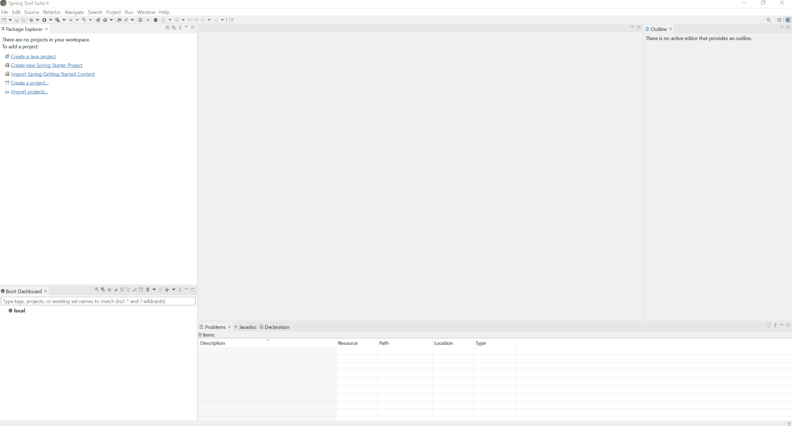

# 如何下载安装 Spring 工具套件(Eclipse 的 Spring Tools 4)IDE？

> 原文:[https://www . geeksforgeeks . org/如何下载和安装-spring-tool-suite-spring-tools-4-for-eclipse-ide/](https://www.geeksforgeeks.org/how-to-download-and-install-spring-tool-suite-spring-tools-4-for-eclipse-ide/)

[Spring 工具套件](https://www.geeksforgeeks.org/introduction-to-spring-boot/) (STS)是一个为开发基于 Spring 的企业应用而量身定制的 java IDE。它更容易、更快、更方便。最重要的是，它基于 Eclipse 集成开发环境。STS 是免费的、开源的，并且由 VMware 提供支持。Spring Tools 4 是下一代 Spring 工具，适合最喜欢的编码环境。很大程度上是从零开始重建的，它为开发基于 Spring 的企业应用程序提供了世界级的支持，无论您更喜欢 Eclipse、Visual Studio Code 还是忒伊亚 IDE。

**先决条件:**确保您已经安装了 Java 开发工具包(JDK)版本 8 或更高版本。要检查，只需进入终端，输入以下命令，检查它是否存在。

```java
javac -version
```



**程序:**这些是要依次遵循的步骤，下面将通过视觉辅助工具进一步讨论:

1.  根据操作系统将 SpringToolSuite 下载到本地机器上。
2.  将下载的 JAR 文件移动到相应的文件夹。
3.  解压这个 JAR 文件，打开相应的文件夹。
4.  点击*弹簧工具套件 4* 应用文件
5.  选择代表工作区的目录，并按下*“启动”*按钮。

**第一步:** [去他们的网站，在 Spring Tools 4 中的 Eclipse 部分](https://spring.io/tools)下载。根据您的操作系统选择相应的文件。

> 在这里，我们将使用 Windows 操作系统，因此我们选择了 **Windows** 选项，如下图所示。



**第二步:**点击按钮后一个 **Jar 文件**将被下载到你的本地系统。现在创建一个文件夹，并将这个 Jar 文件移动到那个文件夹。双击那个 Jar 文件。一个弹出窗口会这样出现。



**步骤 3:** 成功解包后，将创建一个新文件夹，如下图所示。现在打开文件夹。



**第 4 步:**现在在这个文件夹中点击**springtoolsuit 4**应用文件，如下图所示。



**第 5 步:**现在点击**浏览**按钮，然后点击**启动**按钮，选择您的目录作为工作区。你完蛋了。



> 这是弹簧工具套件的**主屏幕(Eclipse 的弹簧工具 4)IDE**

