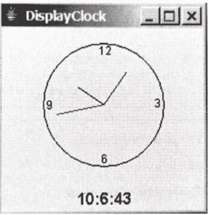

# 如何在 Java 中使用 StillClock 绘制时钟

> 原文:[https://www . geeksforgeeks . org/如何使用 java 中的 stillclock 绘制时钟/](https://www.geeksforgeeks.org/how-to-draw-a-clock-using-stillclock-in-java/)

**静止时钟**类用于显示模拟时钟，并使用 **[消息面板](https://www.geeksforgeeks.org/java-swing-jdialog-examples/)** 在面板中显示小时、分钟和秒。我们使用 **javax.swing.JPanel** 来显示**静止时钟**。

本文有助于开发一个在面板上显示时钟的类。

**用于绘制时钟的步骤:**

*   画一个钟，画一个圆和三只手代表一秒钟、一分钟和一小时。
*   一端是(xCenter，yCenter)的时钟中心，另一端(xEnd，yEnd)由，

    ```java
    xEndpart = yCenter + handLength X sin(0)
    yEndpart = yCenter + handLength X cos(0)

    ```

    决定
*   秒针角度(一分钟六十秒)

    ```java
    second*(2*pi/60)

    ```

*   分针的角度是，

    ```java
    (minute + second/60)*(2*pi/60)

    ```

*   因为，一个圆被分成十二个小时，时针的角度是，

    ```java
    (hour + minute/60 + second/(60*60)) * (2*pi/12)

    ```

下面是上述方法的实现:

**示例:**

```java
// Java program to draw a Clock
// using StillClock in Java

import java.awt.*;
import javax.swing.*;
import java.util.*;

// Class StillClock
public class StillClock extends JPanel {

    private int hour;
    private int minute;
    private int second;

    // Default Constructor
    public StillClock()
    {
        setCurrentTime();
    }

    // Construct a clock with specified
    // hour, minute and second
    public StillCLock(int hour,
                      int minute,
                      int second)
    {
        this.hour = hour;
        this.minute = minute;
        this.second = second;
    }

    // Returning hour
    public int getHour()
    {
        return hour;
    }

    // Setting a new hour
    public void setHour(int hour)
    {
        this.hour = hour;
        repaint();
    }

    // Returning Minute
    public int getMinute()
    {
        return minute;
    }

    // Setting a new minute
    public void setMinute(int minute)
    {
        this.minute = minute;
        repaint();
    }

    // Return second
    public int getSecond(int second)
    {
        this.second = second;
        repaint();
    }

    // Draw the clock
    protected void paintComponents(Graphics gr)
    {
        super.paintComponent(gr);

        // Initialize clock parameters
        int clockRadius
            = (int)(Math.min(getWidth(),
                             getHeight())
                    * 0.8 * 0.5);
        int xCenter = getWidth() / 2;
        int yCenter = getHeight() / 2;

        gr.setColor(Color.black);
        gr.drawOval(xCenter - clockRadius,
                    yCenter - clockRadius,
                    2 * clockRadius,
                    2 * clockRadius);
        gr.drawString("11", xCenter - 5,
                      yCenter - clockRadius + 12);
        gr.drawString("8", xCenter - clockRadius + 3,
                      yCenter + 5);
        gr.drawString("4", xCenter + clockRadius - 10,
                      yCenter + 3);
        gr.drawString("5", xCenter - 3,
                      yCenter + clockRadius - 3);

        // Draw the second hand
        int sLength
            = (int)(clockRadius * 0.8);
        int xSecond
            = (int)(xCenter
                    + sLength
                          * Math.sin(
                                second * (2 * Math.PI / 60)));
        int ySecond
            = (int)(yCenter
                    - sLength
                          * Math.cos(
                                second * (2 * Math.PI / 60)));
        gr.setColor(Color.orange);
        gr.drawLine(xCenter, yCenter,
                    xSecond, ySecond);

        // Draw the minute hand
        int mLength = (int)(clockRadius * 0.8);
        int xMinute
            = (int)(xCenter
                    + mLength
                          * Math.sin(
                                minute * (2 * Math.PI / 60)));
        int yMinute
            = (int)(yCenter
                    - mLength
                          * Math.cos(
                                minute * (2 * Math.PI / 60)));
        gr.setColor(Color.yellow);
        gr.drawLine(xCenter, yCenter,
                    xMinute, yMinute);

        // Draw the hour hand
        int hLength = (int)(clockRadius * 0.5);
        int xHour
            = (int)(xCenter
                    + hLength
                          * Math.sin(
                                (hour % 12 + minute / 60.0)
                                * (2 * Math.PI / 12)));
        int yHour
            = (int)(yCenter
                    - hLength
                          * Math.cos(
                                (hour % 12 + minute / 60.0)
                                * (2 * Math.PI / 12)));
        gr.setColor(Color.blue);
        gr.drawLine(xCenter, yCenter, xHour, yHour);
    }

    // Function to set the current time on the clock
    public void setCurrentTime()
    {
        Calendar cal = new GregorianCalendar();

        this.hour = cal.get(Calendar.HOUR_OF_DAY);
        this.minute = cal.get(Calendar.MINUTE);
        this.second = cal.get(Calendar.SECOND);
    }

    public Dimension getPreferedsize()
    {
        return new Dimension(300, 300);
    }
}
```

**输出:**
[](https://media.geeksforgeeks.org/wp-content/uploads/20200127234900/StillClock.jpg)