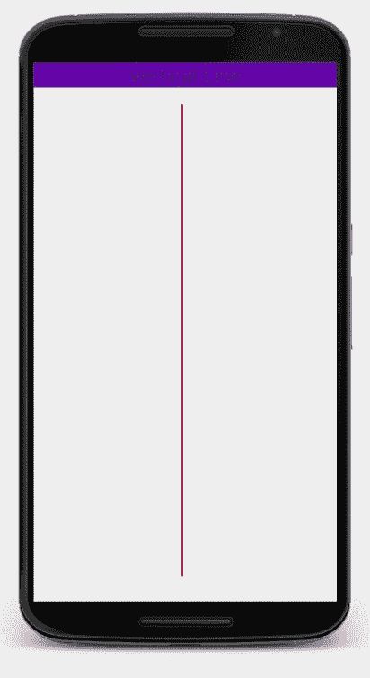
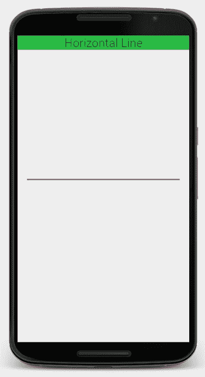

# 如何使用 XML 在安卓应用中绘制水平线和垂直线

> 原文:[https://www . geesforgeks . org/如何在安卓应用中绘制水平和垂直线条-使用-xml/](https://www.geeksforgeeks.org/how-to-draw-horizontal-and-vertical-lines-in-an-android-app-using-xml/)

本文演示了如何在[安卓应用](https://www.geeksforgeeks.org/android-app-development-fundamentals-for-beginners/)中画一条水平线和一条垂直线。

虽然我们有无数的 [XML 标签](https://www.geeksforgeeks.org/xml-tags/)来满足我们几乎所有的需求，但遗憾的是，我们没有任何标签如 **<线>** 标签来画线。但是， **<视图>** 标记可以用 XML 作为变通方法。

> **注意:****【视图】**标签与安卓中的**视图类**不同。

<u>**如何画垂直线？**</u>
考虑下面的 XML 代码，在安卓中画一条垂直线:

```
<LinearLayout
    android:layout_width="match_parent"
    android:layout_height="match_parent"
    android:orientation="vertical">

    <TextView
        android:layout_height="wrap_content"
        android:layout_width="match_parent"
        android:text="Vertical Line"
        android:background="#512DA8"
        android:textSize="25sp"
        android:gravity="center_horizontal"/>

    <View
        android:layout_width="2dp"
        android:layout_height="560dp"
        android:background="#E91E63"
        android:layout_marginTop="20dp"
        android:layout_marginLeft="175dp"/>
</LinearLayout>
```

这里，我们使用**“视图”**标签创建一个**矩形**，宽度非常小，使其成为一条垂直线。在上面的代码中，绘制了一条高度为“560dp”、宽度为“2dp”的红色垂直线，该垂直线位于屏幕左侧“175dp”的左边距，以及位于其上方的*文本视图*的“20dp”的上边距。通过分别增加和减少**【视图】**标签的`layout_width`可以增加或减少这条线的厚度。

**注意:**要运行这段代码，我们可以将这段代码复制粘贴到乌达城提供的 [XML 可视化工具](https://labs.udacity.com/android-visualizer/#/android/sandbox)中。确保清除可视化工具中所有以前编写的代码(如果有)。

**输出:**

[](https://media.geeksforgeeks.org/wp-content/uploads/20200414184712/vertical-line.jpg)

**画水平线:**
水平线可以用与垂直线非常相似的方式画出。下面是水平线的 XML 代码:

```
<LinearLayout
    android:layout_width="match_parent"
    android:layout_height="match_parent"
    android:orientation="vertical">

    <TextView
        android:layout_height="wrap_content"
        android:layout_width="match_parent"
        android:text="Horizontal Line"
        android:background="#4CAF50"
        android:textSize="25sp"
        android:gravity="center_horizontal"/>

    <View
        android:layout_width="320dp"
        android:layout_height="2dp"
        android:background="#E91E63"
        android:layout_marginTop="270dp"
        android:layout_marginLeft="20dp"/>
</LinearLayout>
```

这里，一条水平线是通过制作一个高度和宽度都很小的矩形来画的，这样它就变成了一条水平线。在上面的代码中，绘制了一条高度为“2dp”、宽度为“320dp”的红色水平线，该水平线位于屏幕左侧“20dp”的左边距，以及位于其上方的*文本视图*的上边距“270dp”。这里，与垂直线的`layout_width`相比，线的厚度可以通过增加和减少`layout_height`的值来增加或减少。

**输出:**

[](https://media.geeksforgeeks.org/wp-content/uploads/20200414184710/horizontal-line.jpg)