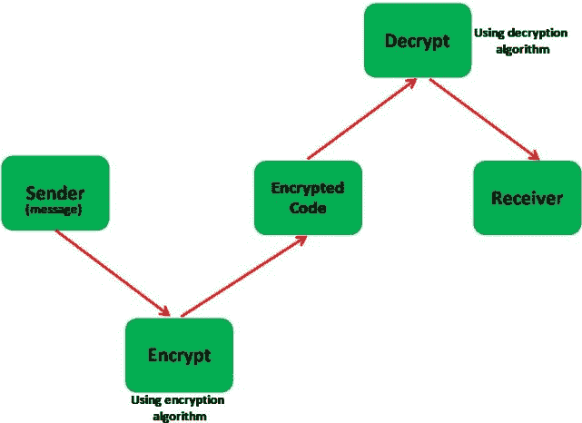

# 如何使用密码学对安卓系统中的文本进行加密和解密？

> 原文:[https://www . geesforgeks . org/如何使用加密技术对安卓文本进行加密和解密/](https://www.geeksforgeeks.org/how-to-encrypt-and-decrypt-text-in-android-using-cryptography/)

[](https://www.geeksforgeeks.org/cryptography-introduction-to-crypto-terminologies/)**密码学是一种通过使用代码来保护信息和通信安全的技术，这样只有那些接收信息的人才能理解和处理信息。从而防止未经授权访问信息。前缀“crypt”表示“隐藏”，后缀 graphics 表示“书写”。**

****

### **项目概述**

**在本文中，我们将构建一个[](https://www.geeksforgeeks.org/android-app-development-fundamentals-for-beginners/)**安卓应用程序，该应用程序可以分别使用编码和解码算法对消息进行**加密**和**解密**。该应用的主页将为用户提供两个选项:****

1.  ******加密:**是将可读信息转换为不可读信息的过程。为此，我们使用编码算法。****
2.  ******解密:**是将数据或信息从不可读形式转换为可读形式的过程。为此，我们使用解码算法。****

****下面给出了一个 GIF 示例，来了解一下在本文中要做什么。请注意，我们将使用 **Java** 语言来实现这个项目。****

********

### ****逐步实施****

******第一步:创建新项目******

****在安卓工作室创建新项目请参考 [**【如何在安卓工作室创建/启动新项目】**](https://www.geeksforgeeks.org/android-how-to-create-start-a-new-project-in-android-studio/) 。注意选择 **Java** 作为编程语言。****

******第二步:在进入编码部分之前，你首先要做一些前置任务******

******修改 colors.xml 文件:******

## ****可扩展标记语言****

```
**<?xml version="1.0" encoding="utf-8"?> 
<resources> 
    <color name="colorPrimary">#6200EE</color> 
    <color name="colorPrimaryDark">#3700B3</color> 
    <color name="colorAccent">#03DAC5</color> 
    <color name="green">#0F9D58</color>
</resources>**
```

******修改 style.xml 文件:**将应用主题更改为无功能栏****

## ****可扩展标记语言****

```
**<resources>
    <!-- Base application theme. -->
    <style name="AppTheme" parent="Theme.AppCompat.NoActionBar">
        <!-- Customize your theme here. -->
        <item name="colorPrimary">@color/colorPrimary</item>
        <item name="colorPrimaryDark">@color/colorPrimaryDark</item>
        <item name="colorAccent">@color/colorAccent</item>
    </style>
</resources>**
```