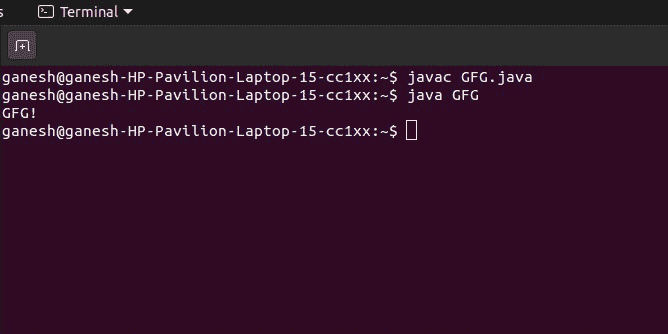

# 如何用 Java 执行一个. class 文件？

> 原文:[https://www . geesforgeks . org/如何在 java 中执行类文件/](https://www.geeksforgeeks.org/how-to-execute-a-class-file-in-java/)

一个 [Java 类文件](https://www.geeksforgeeks.org/java-class-file/)是一个编译好的 Java 文件。它由 Java 编译器编译成字节码，由 Java 虚拟机执行。

**1。**编译你的。java 文件，打开终端(Mac)或命令提示符(Windows)。

**2。**导航到 java 文件所在的文件夹。

**3。**要编译，请键入

> javac<javafilename>的缩写形式</javafilename>

**4。**点击进入后，。每个类文件将出现在同一个文件夹中。java 文件。

**5** 。要运行类文件，它必须有一个主方法，

> java<classname></classname>

**6。**结果将显示在终端或命令提示符下。

**例**

## Java 语言(一种计算机语言，尤用于创建网站)

```java
// Run a class file in java

import java.io.*;

class GFG {
    public static void main(String[] args)
    {
          // prints GFG!
        System.out.println("GFG!");
    }
}
```

**Output**

```java
GFG!
```

