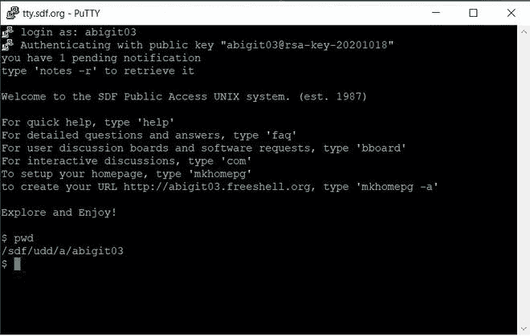
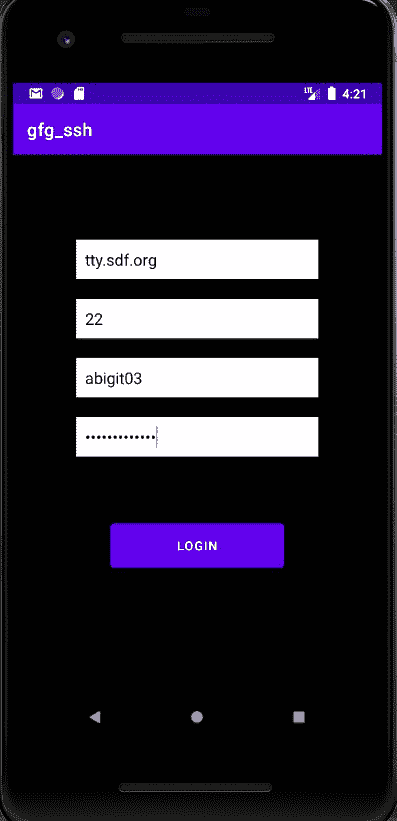
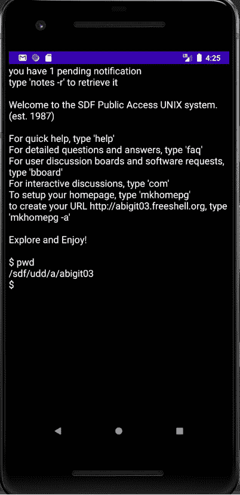

# 安卓系统如何通过 SSH 远程执行命令？

> 原文:[https://www . geesforgeks . org/how-to-execute-commands-remote-via-ssh-in-Android/](https://www.geeksforgeeks.org/how-to-execute-commands-remotely-via-ssh-in-android/)

[SSH 协议](https://www.geeksforgeeks.org/introduction-to-sshsecure-shell-keys/)使用加密来保护客户端和服务器之间的连接。所有用户身份验证、命令、输出和文件传输都经过加密，以抵御网络攻击。通常情况下，您需要 SSH 到您的云虚拟机或远程外壳中。通常，我们需要一个 SSH 客户端来建立 SSH 连接。对于 Windows，免费的图形用户界面客户端 **PuTTY** 用于此目的。以下是在 PuTTY 中访问远程 Linux 外壳的样子:



下面的教程说明了如何在安卓系统中实现同样的效果。注意，我们将使用 **Java** 语言来实现这个项目。T4】图书馆:阿帕奇米娜 SSHD

### 逐步实施

**第一步:创建新项目**

要在安卓工作室创建新项目，请参考[如何在安卓工作室创建/启动新项目](https://www.geeksforgeeks.org/android-how-to-create-start-a-new-project-in-android-studio/)。注意选择 **Java** 作为编程语言。

**第二步:添加依赖关系**

现在我们需要添加所需的依赖项，以便使用 apache mina sshd 库。在项目目录中打开 **app/src/build.gradle** 文件，并在依赖项下添加以下内容:

> //添加 apache mina 库所需的实现
> 
> 实现' org . Apache . Mina:Mina-core:3 . 0 . 0-M2 '
> 
> 实现' org . Apache . sshd:sshd-core:2 . 1 . 0 '
> 
> 实现' org . Apache . sshd:sshd-putty:2 . 1 . 0 '
> 
> 实现' org . Apache . sshd:sshd-common:2 . 1 . 0 '
> 
> 实现' org.slf4j:slf4j-api:1.7.5 '
> 
> 实现' org.slf4j:slf4j-simple:1.6.4 '

**第三步:在你的 AndroidManifest.xml 文件**中添加访问互联网的权限

在您的<货单></货单>标签内的**src/RES/AnDroidManifest . XML**文件中添加以下两行。

**第四步:修改 strings.xml 文件**

打开 **app > src >主> res >值> strings.xml** 并添加以下代码:

## 可扩展标记语言

```java
<resources>
    <string name="app_name">gfg_ssh</string>
    <string name="host">Host</string>
    <string name="port">Port</string>
    <string name="defaultPort">22</string>
    <string name="username">Username</string>
    <string name="password">Password</string>
    <string name="button_send">SEND</string>
</resources>
```

**第五步:搭建 UI**

我们将在我们的应用程序中进行两项活动。

*   **主要活动**:这里我们输入登录详细信息
*   **sshActivity** :在这里，我们将看到 shell 输出。

**使用 activity_main.xml 文件:**

现在，导航到**应用> src >主> res >布局> activity_main.xml** 并将下面的代码添加到文件中。

## 可扩展标记语言

```java
<?xml version="1.0" encoding="utf-8"?>
<androidx.constraintlayout.widget.ConstraintLayout 
    xmlns:android="http://schemas.android.com/apk/res/android"
    xmlns:app="http://schemas.android.com/apk/res-auto"
    xmlns:tools="http://schemas.android.com/tools"
    android:layout_width="match_parent"
    android:layout_height="match_parent"
    android:background="@color/black"
    tools:context=".MainActivity">

    <LinearLayout
        android:id="@+id/linear"
        android:layout_width="270dp"
        android:layout_height="413dp"
        android:layout_margin="50dp"
        android:orientation="vertical"
        app:layout_constraintBottom_toBottomOf="parent"
        app:layout_constraintEnd_toEndOf="parent"
        app:layout_constraintStart_toStartOf="parent"
        app:layout_constraintTop_toTopOf="parent"
        app:layout_constraintWidth_percent=".8">

        <EditText
            android:id="@+id/editText"
            android:layout_width="match_parent"
            android:layout_height="wrap_content"
            android:layout_gravity="center"
            android:autofillHints="host"
            android:background="@color/white"
            android:ems="10"
            android:hint="@string/host"
            android:inputType="textPersonName"
            android:padding="10dp"
            android:textColor="@color/black"
            android:textColorHint="@color/black"
            app:layout_constraintWidth_percent=".8" />

        <EditText
            android:id="@+id/portField"
            android:layout_width="match_parent"
            android:layout_height="wrap_content"
            android:layout_marginTop="22dp"
            android:autofillHints="port"
            android:background="@color/white"
            android:ems="10"
            android:hint="@string/port"
            android:inputType="textPersonName"
            android:padding="10dp"
            android:textColor="@color/black"
            android:textColorHint="@color/black"
            app:layout_constraintHorizontal_bias="0.5"
            app:layout_constraintWidth_percent=".8"
            tools:text="@string/defaultPort" />

        <EditText
            android:id="@+id/usernameField"
            android:layout_width="match_parent"
            android:layout_height="wrap_content"
            android:layout_marginTop="22dp"
            android:autofillHints="username"
            android:background="@color/white"
            android:ems="10"
            android:hint="@string/username"
            android:inputType="textPersonName"
            android:padding="10dp"
            android:textColor="@color/black"
            android:textColorHint="@color/black"
            app:layout_constraintBottom_toTopOf="@+id/passwordField"
            app:layout_constraintEnd_toEndOf="parent"
            app:layout_constraintHorizontal_bias="0.5"
            app:layout_constraintStart_toStartOf="parent"
            app:layout_constraintTop_toBottomOf="@+id/portField"
            app:layout_constraintWidth_percent=".8" />

        <EditText
            android:id="@+id/passwordField"
            android:layout_width="match_parent"
            android:layout_height="wrap_content"
            android:layout_marginTop="22dp"
            android:autofillHints="password"
            android:background="@color/white"
            android:ems="10"
            android:hint="@string/password"
            android:inputType="textPassword"
            android:padding="10dp"
            android:textColor="@color/black"
            android:textColorHint="@color/black"
            app:layout_constraintWidth_percent=".8" />

        <Button
            android:id="@+id/button"
            android:layout_width="194dp"
            android:layout_height="61dp"
            android:layout_gravity="center"
            android:layout_marginTop="69dp"
            android:layout_marginBottom="373dp"
            android:background="#594FAA"
            android:onClick="authenticate"
            android:text="@string/button_send"
            android:textColor="@android:color/background_light"
            tools:text="@string/button_send" />
    </LinearLayout>
</androidx.constraintlayout.widget.ConstraintLayout>
```

首先，通过右键单击活动文件夹(com.example.gfg_ssh)创建一个新的活动 sshActivity，然后选择**新建>活动>清空活动**和现在将下面的代码添加到 **activity_ssh.xml** 文件中，用于此活动的 UI。

## 可扩展标记语言

```java
<?xml version="1.0" encoding="utf-8"?>
<androidx.coordinatorlayout.widget.CoordinatorLayout 
    xmlns:android="http://schemas.android.com/apk/res/android"
    xmlns:tools="http://schemas.android.com/tools"
    android:layout_width="match_parent"
    android:layout_height="match_parent"
    tools:context=".sshActivity">

    <TextView
        android:id="@+id/textView"
        android:layout_width="match_parent"
        android:layout_height="688dp"
        android:background="@android:color/black"
        android:textColor="@color/white"
        android:textSize="18sp" />

</androidx.coordinatorlayout.widget.CoordinatorLayout>
```

**步骤 6:使用 MainActivity.java 文件**

转到**MainActivity.java**文件，参考以下代码。以下是**MainActivity.java**文件的代码。代码中添加了注释，以更详细地理解代码。

## Java 语言(一种计算机语言，尤用于创建网站)

```java
import android.content.Intent;
import android.os.Bundle;
import android.view.View;
import android.widget.EditText;

import androidx.appcompat.app.AppCompatActivity;

public class MainActivity extends AppCompatActivity {

    @Override
    protected void onCreate(Bundle savedInstanceState) {
        super.onCreate(savedInstanceState);
        setContentView(R.layout.activity_main);
    }

    public void authenticate(View view) {

        // Create an intent for sshActivity
        Intent intent = new Intent(this, sshActivity.class);

        // Declare fields
        EditText editText = (EditText) findViewById(R.id.editText);
        EditText portField = (EditText) findViewById(R.id.portField);
        EditText usernameField = (EditText) findViewById(R.id.usernameField);
        EditText passwordField = (EditText) findViewById(R.id.passwordField);

        // Get input data from fields
        String host = editText.getText().toString();
        String port = portField.getText().toString();
        String username = usernameField.getText().toString();
        String password = passwordField.getText().toString();

        // Pass on data to sshActivity via intent
        intent.putExtra("host", host);
        intent.putExtra("port", port);
        intent.putExtra("username", username);
        intent.putExtra("password", password);
        startActivity(intent);
        finish();
    }
}
```

**步骤 7:使用 sshActivity.java 文件**

这是我们导入 **Apache MINA SSHD 库**并通过 SSH 连接到我们的远程机器的活动。我们从意向中获取登录数据。下面是**sshActivity.java**文件的代码。代码中添加了注释，以更详细地理解代码。

## Java 语言(一种计算机语言，尤用于创建网站)

```java
import android.content.Context;
import android.content.Intent;
import android.os.Bundle;
import android.widget.TextView;

import androidx.appcompat.app.AppCompatActivity;

import org.apache.sshd.client.SshClient;
import org.apache.sshd.client.channel.ClientChannel;
import org.apache.sshd.client.channel.ClientChannelEvent;
import org.apache.sshd.client.session.ClientSession;
import org.apache.sshd.common.channel.Channel;
import org.apache.sshd.server.forward.AcceptAllForwardingFilter;

import java.io.ByteArrayOutputStream;
import java.io.IOException;
import java.io.OutputStream;
import java.util.EnumSet;
import java.util.concurrent.TimeUnit;

public class sshActivity extends AppCompatActivity {

    ClientChannel channel;
    TextView shellOutput;
    String host, username, password;
    Integer port;
    String command;

    @Override
    protected void onCreate(Bundle savedInstanceState) {
        super.onCreate(savedInstanceState);
        setContentView(R.layout.activity_ssh);

        // set output field
        shellOutput = findViewById(R.id.textView);

        // Get user credentials from indent
        Intent intent = getIntent();
        host = intent.getStringExtra("host");
        port = Integer.parseInt(intent.getStringExtra("port"));
        username = intent.getStringExtra("username");
        password = intent.getStringExtra("password");

        // Command which will be executed
        command = "pwd\n";

        // Setting user.com property manually 
        // since isn't set by default in android
        String key = "user.home";
        Context Syscontext;
        Syscontext = getApplicationContext();
        String val = Syscontext.getApplicationInfo().dataDir;
        System.setProperty(key, val);

        // Creating a client instance
        SshClient client = SshClient.setUpDefaultClient();
        client.setForwardingFilter(AcceptAllForwardingFilter.INSTANCE);
        client.start();

        // Starting new thread because network processes 
        // can interfere with UI if started in main thread
        Thread thread = new Thread(new Runnable() {
            @Override
            public void run() {
                try {
                    // Connection establishment and authentication
                    try (ClientSession session = client.connect(username, host, port).verify(10000).getSession()) {
                        session.addPasswordIdentity(password);
                        session.auth().verify(50000);
                        System.out.println("Connection establihed");

                        // Create a channel to communicate
                        channel = session.createChannel(Channel.CHANNEL_SHELL);
                        System.out.println("Starting shell");

                        ByteArrayOutputStream responseStream = new ByteArrayOutputStream();
                        channel.setOut(responseStream);

                        // Open channel
                        channel.open().verify(5, TimeUnit.SECONDS);
                        try (OutputStream pipedIn = channel.getInvertedIn()) {
                            pipedIn.write(command.getBytes());
                            pipedIn.flush();
                        }

                        // Close channel
                        channel.waitFor(EnumSet.of(ClientChannelEvent.CLOSED),
                                TimeUnit.SECONDS.toMillis(5));

                        // Output after converting to string type
                        String responseString = new String(responseStream.toByteArray());
                        System.out.println(responseString);
                        shellOutput.setText(responseString);

                    } catch (IOException e) {
                        e.printStackTrace();
                    } finally {
                        client.stop();
                    }
                } catch (Exception e) {
                    e.printStackTrace();
                }
            }
        });
        thread.start();
    }
}
```

### 输出:

**登录:**



**SSH 命令执行:**

