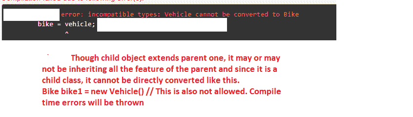

# 如何修复 java 中的 java.lang.classcastexception？

> 原文:[https://www . geesforgeks . org/how-fix-Java-lang-class castexception-in-Java/](https://www.geeksforgeeks.org/how-to-fix-java-lang-classcastexception-in-java/)

当我们试图将条目的数据类型转换为另一种类型时，就会发生 Java 中的 ClassCastException。这与类型转换功能有关，数据类型转换只有在类扩展父类并且子类转换为父类时才成功。

在这里，我们可以将父类视为交通工具，子类可以是汽车、自行车、自行车等。作为形状的父类和子类可以是 2d 形状或 3d 形状等。

ClassCastException 有两种不同的构造函数。

1.  ClassCastException():用于创建 ClassCastException 类的实例。
2.  ClassCastException(字符串):它用于通过接受指定的字符串作为消息来创建 ClassCastException 类的实例。

让我们详细看看

## Java 语言(一种计算机语言，尤用于创建网站)

```java
import java.math.BigDecimal;
public class ClassCastExceptionExample {
    public static void main(String[] args)
    {
        // Creating a BigDecimal object
        Object sampleObject = new BigDecimal(10000000.45);
        System.out.println(sampleObject);
    }
}
```

**Output**

```java
10000000.4499999992549419403076171875
```

如果我们试图通过转换成不同的数据类型来打印这个值，比如字符串或整数等。，我们将获得 ClassCastException。

## Java 语言(一种计算机语言，尤用于创建网站)

```java
import java.math.BigDecimal;
public class Main {
    public static void main(String[] args)
    {
        // Creating a BigDecimal object
        Object sampleObject = new BigDecimal(10000000.45);

        // Trying to display the object by casting to String
        // As the object is created as BigDecimal but tried
        // to display by casting to String,
        // ClassCastException is thrown
        System.out.println((String)sampleObject);
    }
}
```

**输出:**

> 线程“main”Java . lang . class castexception 中的异常:类 java.math.BigDecimal 无法强制转换为类 java.lang.String(Java . math . bigdecimal 和 Java . lang . string 位于加载程序“bootstrap”的模块 java.base 中)
> 
> 在 Main.main(Main.java:11)

我们可以通过将代码转换为以下格式来修复异常打印:

## Java 语言(一种计算机语言，尤用于创建网站)

```java
import java.math.BigDecimal;

public class ClassCastExceptionExample {
    public static void main(String[] args)
    {
        // Creating a BigDecimal object
        Object sampleObject = new BigDecimal(10000000.45);

        // We can avoid ClassCastException by this way
        System.out.println(String.valueOf(sampleObject));
    }
}
```

**Output**

```java
10000000.4499999992549419403076171875
```

因此，在任何情况下，当我们试图转换对象的数据类型时，我们不能直接向下转换或向上转换到指定的数据类型。直接强制转换将不起作用，并且会引发 ClassCastException。相反，我们可以使用

**String.valueOf()方法。**它转换不同类型的值，如 int、long、boolean、character、float 等。，变成了字符串。

1.  public static string value of(boolean boolvalue)
2.  public static string value of(char charvalue)
3.  public static string value of(char[]char array value)
4.  公共静态字符串值(int intValue)
5.  公共静态字符串值(长值)
6.  公共静态字符串值(浮点值)
7.  公共静态字符串值(双精度值)
8.  公共静态字符串值(对象对象值)

是否有不同的方法可用，在我们上面的例子中，使用了最后一种方法。

在父类和子类之间。示例显示父类的实例不能转换为子类的实例。

## Java 语言(一种计算机语言，尤用于创建网站)

```java
class Vehicle {
    public Vehicle()
    {
        System.out.println(
            "An example instance of the Vehicle class to proceed for showing ClassCastException");
    }
}

final class Bike extends Vehicle {
    public Bike()
    {
        super();
        System.out.println(
            "An example instance of the Bike class that extends Vehicle as parent class to proceed for showing ClassCastException");
    }
}

public class ClassCastExceptionExample {
    public static void main(String[] args)
    {
        Vehicle vehicle = new Vehicle();
        Bike bike = new Bike();
        Bike bike1 = new Vehicle();
        // Check out for this statement.  Tried to convert
        // parent(vehicle) object to child object(bike).
        // Here compiler error is thrown

        bike = vehicle;
    }
}
```

**编译器错误:**



**为了克服编译时错误**，我们需要显式向下转换。即向下转换意味着父对象到子对象的类型转换。这意味着父对象的特征丢失，因此不可能进行隐式向下转换，因此我们需要如下方式进行显式转换

给出变更所需的代码片段。**以向下显式方式**

## Java 语言(一种计算机语言，尤用于创建网站)

```java
// An easier way to understand Downcasting
class Vehicle {
    String vehicleName;

    // Method in parent class
    void displayData()
    {
        System.out.println("From Vehicle class");
    }
}

class Bike extends Vehicle {
    double cost;

    // Overriding the parent class method and we can
    // additionaly mention about the child class
    @Override void displayData()
    {
        System.out.println("From bike  class" + cost);
    }
}

public class ClassCastExceptionExample {
    public static void main(String[] args)
    {

        Vehicle vehicle = new Bike();
        vehicle.vehicleName = "BMW";

        // Downcasting Explicitly
        Bike bike = (Bike)vehicle;

        bike.cost = 1000000;

        // Though vehiclename is not assigned, it takes BMW
        // as it is
        System.out.println(bike.vehicleName);
        System.out.println(bike.cost);
        bike.displayData();
    }
}
```

**Output**

```java
BMW
1000000.0
From bike  class1000000.0
```

**上播隐式方式**

将子对象向上转换为父对象的示例。可以隐式完成。这个工具为我们提供了访问父类成员的灵活性。

## Java 语言(一种计算机语言，尤用于创建网站)

```java
// An easier way to understand Upcasting
class Vehicle {
    String vehicleName;

    // Method in parent class
    void displayData()
    {
        System.out.println("From Vehicle class");
    }
}
class Bike extends Vehicle {

    double cost;

    // Overriding the parent class method and we can
    // additionaly mention about the child class
    @Override void displayData()
    {
        System.out.println("From bike  class..." + cost);
    }
}

public class ClassCastExceptionExample {
    public static void main(String[] args)
    {
        // Upcasting
        Vehicle vehicle = new Bike();

        vehicle.vehicleName = "Harley-Davidson";

        // vehicle.cost //not available as upcasting done
        // but originally Vehicle class dont have cost
        // attribute
        System.out.println(vehicle.vehicleName);

        vehicle.displayData(); // Hence here we will get
                               // output as 0.0
    }
}
```

**Output**

```java
Harley-Davidson
From bike  class...0.0
```

以向上转换的方式修复 ClassCastException，同时也会发生数据丢失

## Java 语言(一种计算机语言，尤用于创建网站)

```java
class Vehicle {
    public Vehicle()
    {
        System.out.println(
            "An example instance of the Vehicle class to proceed for showing ClassCast Exception");
    }
    public String display()
    {
        return "Vehicle class display method";
    }
}

class Bike extends Vehicle {
    public Bike()
    {
        super(); // Vehicle class constructor msg display as
                 // super() is nothing but calling parent
                 // method
        System.out.println(
            "An example instance of the Bike class that extends \nVehicle as parent class to proceed for showing ClassCast Exception");
    }
    public String display()
    {
        return "Bike class display method";
    }
}

public class ClassCastExceptionExample {
    public static void main(String[] args)
    {
        Vehicle vehicle = new Vehicle();

        Bike bike = new Bike();

        // But we can make bike point to vehicle, i.e.
        // pointing child object to parent object This is an
        // example for upcasting of child object to parent
        // object. It can be done implicitly This facility
        // gives us the flexibility to access the parent
        // class members
        vehicle = bike;

        // As upcasted here, vehicle.display() will provide
        // "Bike class display method" as output It has lost
        // its parent properties as now vehicle is nothing
        // but bike only
        System.out.println(
            "After upcasting bike(child) to vehicle(parent).."
            + vehicle.display());
    }
}
```

**Output**

```java
An example instance of the Vehicle class to proceed for showing ClassCast Exception
An example instance of the Vehicle class to proceed for showing ClassCast Exception
An example instance of the Bike class that extends 
Vehicle as parent class to proceed for showing ClassCast Exception
After upcasting bike(child) to vehicle(parent)..Bike class display method
```

**结论:**如果我们遵循亲子关系，通过向上投射或向下投射的方式，我们可以克服类投射异常。String.valueOf()方法有助于将不同的数据类型转换为 String，这样我们也可以克服这个问题。