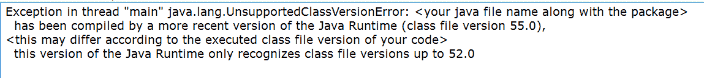
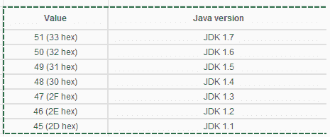
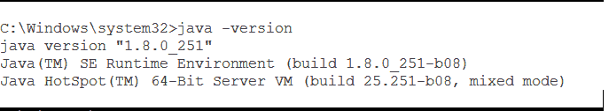
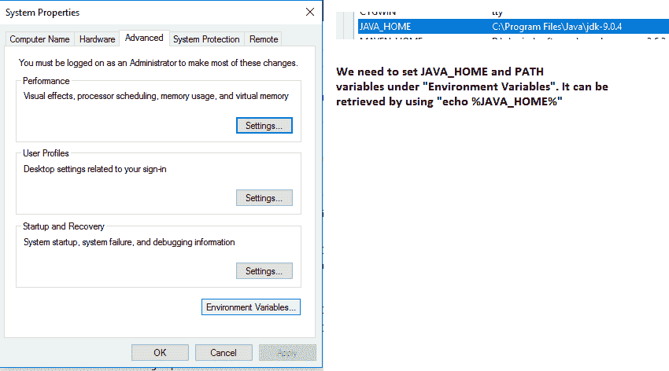
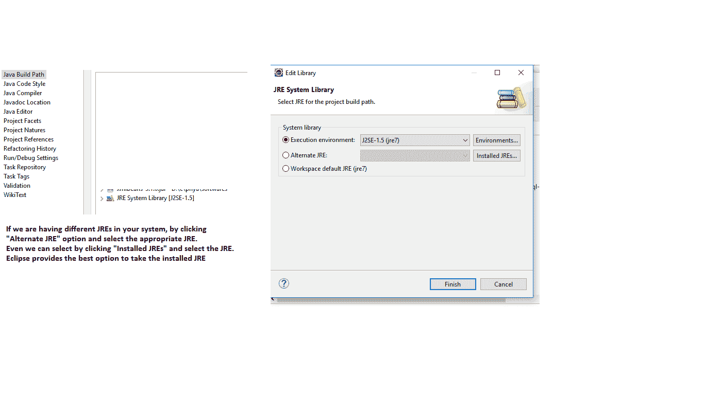
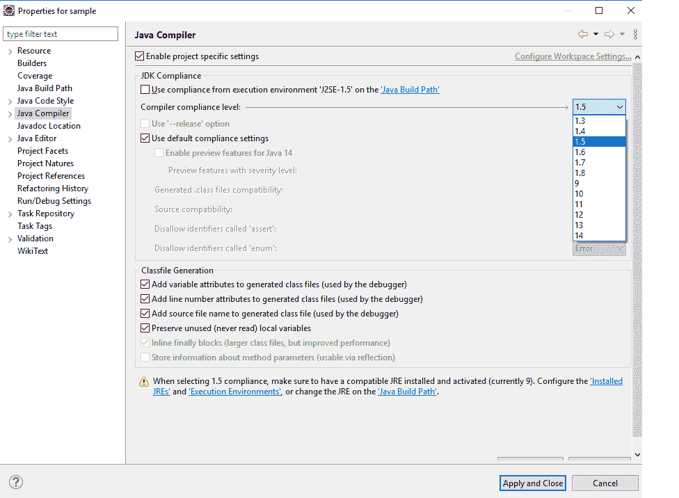
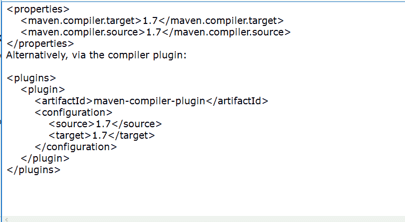
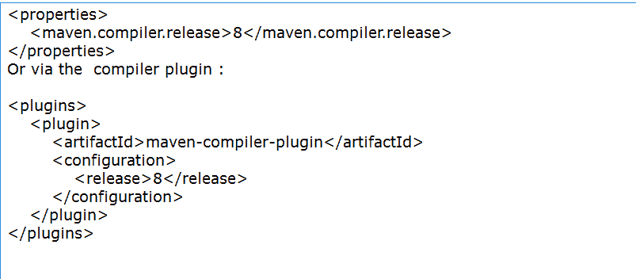

# 如何在 java 中修复 Java . lang . unsupportedclassversionerror？

> 原文:[https://www . geesforgeks . org/how-fix-Java-lang-unsupportedclassversionerror-in-Java/](https://www.geeksforgeeks.org/how-to-fix-java-lang-unsupportedclassversionerror-in-java/)

UnsupportedClassVersionError 是链接错误的子类，由 Java 虚拟机(JVM)引发。当读取类文件并且不支持主版本号和次版本号时，会引发此错误，尤其是在链接阶段，会引发此错误



不支持的类版本的示例快照错误

**抛出错误的情况:**

当我们试图使用较高版本的 Java 编译一个程序，并使用较低版本的 JVM 执行它时，就会抛出这个错误。但相反的情况并不成立。

因此，注意 java 版本是很重要的



**获取已安装的 java 版本:**

Java–版本(在命令提示符(窗口)中，我们可以给出)



检查 java 版本

**通过命令行修复程序:**

为了克服不支持的类版本错误，我们可以为早期版本的 Java 编译代码，或者在较新的 Java 版本上运行代码。这只是我们选择的决定。如果使用第三方库，最好在较新的 java 版本上运行，如果是为了分发，最好编译到较旧的版本。

**使用 JAVA_HOME 环境变量:**



在做 Java 程序时，设置 JAVA_HOME 并在路径中设置该值总是好的

我们也可以通过下面的方式在命令提示符下进行检查

```java
C:\Windows\system32>echo %JAVA_HOME%
C:\Program Files\Java\jdk-9.0.4
```

**在新的 JRE 上运行 java 程序的要求:**

移动到目录并找到 bin 目录。例如，如果 JRE 位于以下位置

```java
C:\Program Files\Java\jdk-11.0.2, then navigate till C:\Program Files\Java\jdk-11.0.2\bin
```

以...方式执行程序

```java
java <filename>   // Even we can give filename with full package
```

**在旧 JRE 上运行 java 程序的要求:**

**示例:**

```java
C:\Program Files\Java\jdk1.8.0_31\bin\javac <filename along with package>
```

为了确保兼容性，我们可以将“-bootclasspath”指向目标 JRE 的 rt.jar:

```java
javac -bootclasspath "C:\Program Files\Java\jdk1.8.0_31\jre\lib\rt.jar" 
\ -source 1.8 -target 1.8 <filename>
```

[主要适用于 JDK 8 及以下版本]

但是在 JDK 9 中，添加了“release”参数来替换“-source”和“-target”。

“–release”选项支持目标 6、7、8、9、10 和 11。例如，让我们使用“–release”来定位 Java 8:

```java
javac --release 8 <filename>
```

有许多 ide 可用于 Java 开发

让我们看看如何在 Eclipse 中克服“不受支持的类版本错误”



使用 Java 构建路径选择 JRE->已安装的 JRE

**Java 编译器等级选择:**



Java 编译器选择

**胃**

在 Maven 中构建和打包文件时，我们可以控制 Java 的版本。当使用 Java 7 或更早版本时，我们为编译器插件设置源和目标。

让我们使用编译器插件属性来设置源和目标:



–Java 9 中增加了发布选项



**结论:**

通过命令行方式、IDE 方式或 Maven 方式设置环境变化，我们可以克服“不支持类版本”。