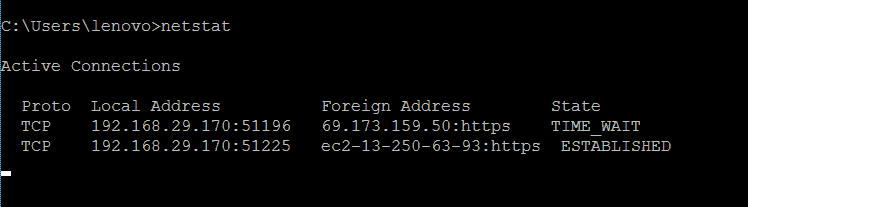
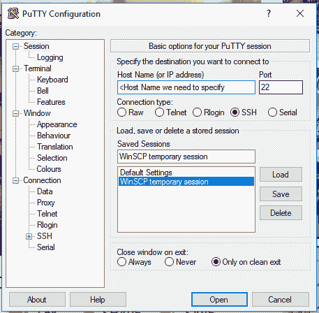
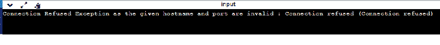

# 如何修复 java . net . connectionexception:连接被拒绝:用 Java 连接？

> 原文:[https://www . geesforgeks . org/how-fix-Java-net-connect exception-connect-rejected-connect-in-Java/](https://www.geeksforgeeks.org/how-to-fix-java-net-connectexception-connection-refused-connect-in-java/)

java . net . connectexception:connect 被拒绝:每当软件处于客户端-服务器体系结构中并试图建立从客户端到服务器的 TCP 连接时，connect 是 Java 中最常见的一种网络异常。为了解决通信问题，我们需要小心处理异常。首先，让我们看看 Java . net . connectionexception 出现的可能原因:连接被拒绝。

1.  由于涉及到客户端和服务器，两者都应该在局域网或互联网这样的网络中。如果它不存在，它将在客户端引发异常。
2.  如果服务器没有运行。通常像 8080(用于 tomcat)、3000 或 4200(用于 react/angular)、3306(MySQL)、27017(MongoDB)这样的端口被其他代理占用或完全关闭，即实例未启动。
3.  有时，由于某些被覆盖的设置等，服务器可能正在运行，但没有侦听端口。
4.  通常，出于安全原因，防火墙会在那里，如果它不允许通信。
5.  错误地，在给定的端口或随机端口生成号中提到了错误的端口。
6.  连接字符串信息错误。例如:

> connection conn = drivermanager . getconnection(" JDBC:MySQL://localhost/:3306<dbname>？"+“用户=<username>&密码=<password>”；</password></username></dbname>

**实现:**这里我们使用的是 MySQL 数据库连接，连接信息应该是这种格式。现在让我们看看修复 Java . net . connectionexception 的方法:连接被拒绝。使用如下所示的命令 Ping 目标主机:

```java
ping <hostname> - to test

ipconfig(for windows)/ifconfig(linux) - to get network configuration

netstat - statistical report
```



```java
nslookup - DNS lookup name
```

有像“Putty”这样的工具可以用来通信，它是 Windows 和 Unix 的 Telnet 和 SSH 的免费实现。



**例 1:**

## Java 语言(一种计算机语言，尤用于创建网站)

```java
// Java Program to Illustrate Creation of ConnectException

// Importing required classes
import java.io;
import java.net.*;
import java.util.*;

// Main class
// To test hostname and port connectivity
public class GFG {

    // Main driver method
    public static void main(String[] args)
    {

        // Hostname is defined so do have arbitrary
        // localhost value which is nothing but 127.0.0.1
        String hostname = "127.0.0.1";

        // PORT is defined here
        // It should have been 8080 or 8000 but cannot be 80

        // If IP and PORT is invalid it will get exception
        // Trying to connect
        int port = 80;

        // Try block to check for exceptions
        try (Socket socket = new Socket(hostname, port)) {

            // InputStream to read data from socket
            InputStream inputStream
                = socket.getInputStream();
            InputStreamReader inputStreamReader
                = new InputStreamReader(inputStream);

            int data;

            StringBuilder outputString
                = new StringBuilder();

            // Data read from input stream
            while ((data = inputStreamReader.read())
                   != -1) {
                outputString.append((char)data);
            }
        }

        // Catch block to handle the exceptions
        catch (IOException ex) {

            // If the given hostname and port number are
            // invalid, connectivity cannot be established
            // and hence error thrown Exception will happen
            // when socket will not reachable
            System.out.println(
                "Connection Refused Exception as the given hostname and port are invalid : "
                + ex.getMessage());
        }
    }
}
```

**输出:**



**示例 2:** MySQL 连接性检查

## Java 语言(一种计算机语言，尤用于创建网站)

```java
// Java Program to Demonstrate DB Connection Setup

// Importing basic libraries
import java.io.*;
import java.util.*;

// Step 1: Importing DB
import java.sql.*;

// Try block to check for exceptions
try {

    // Setting initial connection object to null
    Connection con = null;

    String driver = "com.mysql.jdbc.Driver";

    // Step 2: Loading and registering drivers

    // Here if IP address is not your localhost,
    // need to specify that or specific address
    String IPADDRESS = "localhost"

        // 3306 is port number
        String url1
        = "jdbc:mysql://IPADDRESS:3306/";

    // If noy suggesting that to assign generally is
    // followed as DB = mySQL username= root, password=1234
    String db = "<your dbname>";
    String dbUser = "<username>";
    String dbPasswd = "<password>";

    // Loading driver using forName() method
    Class.forName(driver).newInstance();
    // Registering driver using DriverManager
    con = DriverManager.getConnection(url1 + db, dbUser,
                                      dbPasswd);

    // Display message on the console
    // when the connection is successfully setup
    System.out.println("Database Connection Established");
}

// Catch block to handle the exceptions
catch (IOException ex) {

    // Exception will happen when the IPAddress and port
    // number are mismatch By pinging, we can correct that

    // Display message on the console and
    // getting exception message using getMessage() method
    System.out.println(
        "Connection Refused Exception as the given hostname and port are invalid : "
        + ex.getMessage());
}
```

同样，对于其他数据库，我们需要为 MongoDB 指定正确的端口号，即 27017。如果存在 SSL(安全套接字层)，则需要检查防火墙的先前检查，因此通过编码，我们可以建议解决方案来克服异常

> **结论:**由于 ping、telnet **、**等现成命令可用，putty 等工具可用，可以检查连接信息，克服异常。