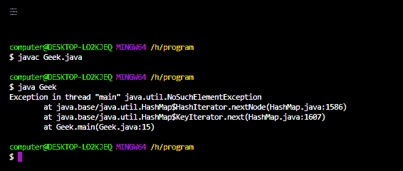
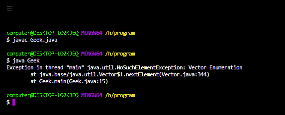
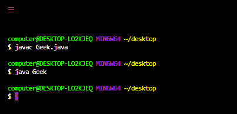

# 如何修复 java 中的 Java . util . nosucheelementexception？

> 原文:[https://www . geesforgeks . org/how-fix-Java-util-nosuchelementexception-in-Java/](https://www.geeksforgeeks.org/how-to-fix-java-util-nosuchelementexception-in-java/)

扰乱程序正常流程的未被接受、不想要的事件称为[](https://www.geeksforgeeks.org/exceptions-in-java/)****。**大多数时候异常是由我们的程序引起的，这些是可以恢复的。假设我们的程序要求是从位于美国的远程文件中读取数据。在运行时，如果远程文件不可用，那么我们将得到一个 RuntimeException，表示 fileNotFoundException。如果出现 fileNotFoundException，我们可以向程序提供本地文件，以便正常读取和继续程序的其余部分。**

****Java 中主要有** [**两种异常类型**](https://www.geeksforgeeks.org/checked-vs-unchecked-exceptions-in-java/) **如下:****

****1。检查异常:**编译器在运行时为程序的顺利执行而检查的异常称为检查异常。在我们的程序中，如果有机会出现检查异常，那么我们应该强制处理该检查异常(通过 try-catch 或 throws 关键字)，否则我们将得到编译时错误。检查异常的例子有*类未发现异常、IOException、SQLException、*等。**

****2。未检查异常:**未被编译器检查的异常，无论程序员是否处理这种类型的异常，都被称为未检查异常。未检查的*异常的例子有算术异常、数组异常等。***

> **是否检查异常只有在编译时不可能出现任何异常时，每个异常才会在运行时出现。**

****nosuchtelementexception:****

**它是 RuntimeException 的子类，因此是一个未检查的异常。当我们试图访问数组、集合或任何其他对象的内容时，JVM 会自动产生这个异常，并由枚举、迭代器或标记器的访问方法给出，例如 next()或 nextElement()或 nextToken()，如果这些对象是空的，或者如果我们在到达对象末尾后试图获取下一个元素，那么我们将获得**Java . util . nosucheelementexception .****

**在下面的例子中，我们试图使用迭代器类的访问器方法 next()来访问 HashMap，但是由于 HashMap 是空的，我们将得到 NoSuchElementException。**

****例 1:****

## **Java 语言(一种计算机语言，尤用于创建网站)**

```
// Java program to demonstrate the occurence of
// NoSuchElementException

// import required packages
import java.io.*;
import java.lang.*;
import java.util.*;

// driver class
class Geek {

    // main method
    public static void main(String[] args)
    {
        // creating an hashmap object
        HashMap<Integer, Integer> map = new HashMap<>();

        // creating an iterator
        Iterator itr = map.keySet().iterator();

        // trying to access the element
        itr.next();
    }
}
```

 **

**示例 2:** 这里我们尝试通过枚举器访问一个空向量对象的元素。

## Java 语言(一种计算机语言，尤用于创建网站)

```
// Java program to demonstrate the occurence of
// NoSuchElementException

// import required packages

import java.io.*;
import java.lang.*;
import java.util.*;

// driver class
class Geek {

    // main method
    public static void main(String[] args)
    {
        // creating an vector object
        Vector<Integer> v = new Vector<>();

        // creating an enumertor
        Enumeration enumerator = v.elements();

        // trying to access the element
        enumerator.nextElement();
    }
}
```



**如何解决这个错误？**

几乎所有访问器方法给出 NoSuchElementException 的类都包含各自的方法来检查对象是否包含更多的元素。所以为了避免这个 NoSuchElementException，我们需要一直调用，

*   Iterator.hasNext()或
*   Enumeration.hasMoreElements()或
*   在调用 next()或 nextElement 或 nextToken()方法之前，使用 hasMoreToken()方法。

以下是上述声明的实施情况:

**例 1:**

## Java 语言(一种计算机语言，尤用于创建网站)

```
// Java program to remove the occurence of
// NoSuchElementException by using hasNext()

// import required packages
import java.io.*;
import java.lang.*;
import java.util.*;

// driver class
class Geek {

    // main method
    public static void main(String[] args)
    {
        // creating an hashmap object
        HashMap<Integer, Integer> map = new HashMap<>();

        // creating an iterator
        Iterator itr = map.keySet().iterator();

        // checking the map object using .hasNext()
        // method if it has elements to access
        // or not before accessing the map using
        // .next() method
        while (itr.hasNext())
            System.out.println(itr.next());
    }
}
```

**输出:**



**例 2:**

## Java 语言(一种计算机语言，尤用于创建网站)

```
// Java program to remove the occurence of
// NoSuchElementException by using hasMoreElements()

// import required packages
import java.io.*;
import java.lang.*;
import java.util.*;

// driver class
class Geek {

    // main method
    public static void main(String[] args)
    {
        // creating an vector object
        Vector<Integer> v = new Vector<>();

        // creating an enumertor
        Enumeration enumerator = v.elements();

        // Checking the vector object using
        // hasMorelements method if it has elements
        // to access or not before accessing the vector
        // using .nextElement() method
        while (enumerator.hasMoreElements())
            System.out.println(enumerator.nextElement());
    }
}
```

**输出:**

**