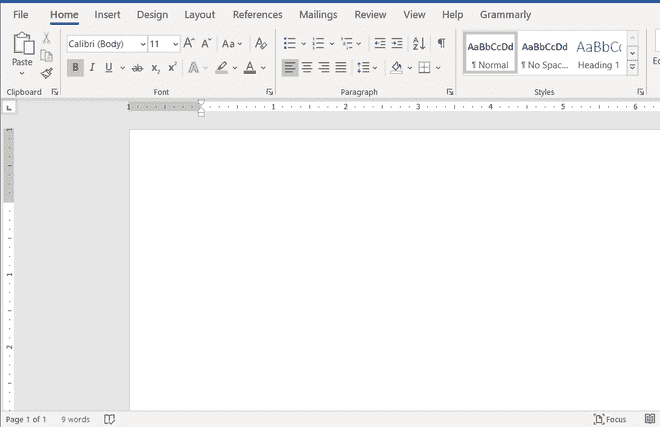
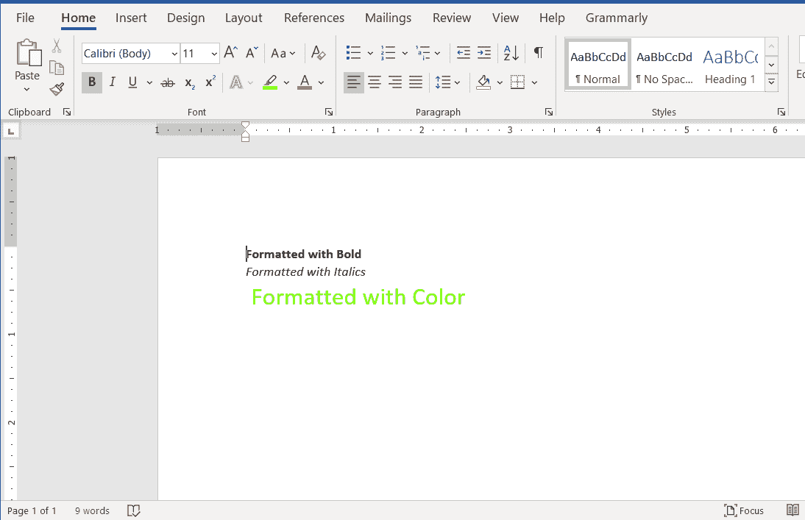

# 如何用 Java 格式化 Word 文档中的文本？

> 原文:[https://www . geesforgeks . org/如何使用 java 格式化 word 文档中的文本/](https://www.geeksforgeeks.org/how-to-format-the-text-in-a-word-document-using-java/)

Apache POI 是由 Apache 软件基金会运营的项目，之前是[雅加达项目](https://jakarta.apache.org/)的子项目，提供纯 Java 库，用于读写微软 Office 格式的文件，如 Word、PowerPoint [、](https://jakarta.apache.org/)和 Excel。首先安装 [Apache](https://www.geeksforgeeks.org/apache-poi-introduction/) ，以便根据基于操作系统(如视窗/Linux 系统)的生态系统指南导入模块。为了使用 java 格式化 Word 文档中的文本，导入库的基本要求是 Apache POI。

**进场:**

1.  使用 Apache POI 包中的[xwpfddocument](https://www.geeksforgeeks.org/java-program-to-write-a-paragraph-in-a-word-document/)创建一个空的文档对象。
2.  创建[文件输出流](https://www.geeksforgeeks.org/creating-a-file-using-fileoutputstream/)对象，将 Word 文档保存在系统中所需的路径/位置。
3.  使用文档中的 [XWPFParagraph](https://www.geeksforgeeks.org/java-program-to-write-a-paragraph-in-a-word-document/) 对象创建段落。
4.  使用 [XWPFRun](https://www.geeksforgeeks.org/java-program-to-write-a-paragraph-in-a-word-document/) 对象创建文本行，并应用格式属性。

**实施:**

1.  创建空白文档。
2.  获取当前工作目录的路径，在同一目录下创建 PDF 文件。
3.  使用上面指定的路径创建文件对象。
4.  使用 [*创建段落()*](https://www.geeksforgeeks.org/java-program-to-align-the-text-in-a-word-document/) 方法创建段落。
5.  线条的格式。
6.  保存对文档的更改。
7.  关闭连接。

样本输入图像:



**例**

## Java 语言(一种计算机语言，尤用于创建网站)

```
// Java Program to format the text
// in a word document

// Importing input output java files
import java.io.*;
// importing Apache POI environment packages
import org.apache.poi.xwpf.usermodel.*;

// Class to format text in Word file
public class GFG {

    // Main driver method
    public static void main(String[] args) throws Exception
    {
        // Step 1: Creating blank document
        XWPFDocument document = new XWPFDocument();

        // Step 2: Getting path of current working directory
        // to create the pdf file in the same directory
        String path = System.getProperty("user.dir");
        path += "/FormattedWord.docx";

        // Step 3: Creating a file object with the path
        // specified
        FileOutputStream out
            = new FileOutputStream(new File(path));

        // Step 4: Create paragraph
        // using createParagrapth() method
        XWPFParagraph paragraph
            = document.createParagraph();

        // Step 5: Formatting lines

        // Line 1
        // Creating object for line 1
        XWPFRun line1 = paragraph.createRun();

        // Formating line1 by setting  bold
        line1.setBold(true);
        line1.setText("Formatted with Bold");
        line1.addBreak();

        // Line 2
        // Creating object for line 2
        XWPFRun line2 = paragraph.createRun();

        // Formating line1 by setting italic
        line2.setText("Formatted with Italics");
        line2.setItalic(true);
        line2.addBreak();

        // Line 3
        // Creating object for line 3
        XWPFRun line3 = paragraph.createRun();

        // Formatting line3 by setting
        // color & font size
        line3.setColor("73fc03");
        line3.setFontSize(20);
        line3.setText(" Formatted with Color");

        // Step 6: Saving changes to document
        document.write(out);

        // Step 7: Closing the connections
        out.close();
        document.close();

        // Print message after program has compiled
        // successfully showcasing formatting text in file
        // successfully.
        System.out.println(
            "Word Document with Formatted Text created successfully!");
    }
}
```

**输出:**在图示的样本输入图像中，根据上述程序进行的更改。



输出