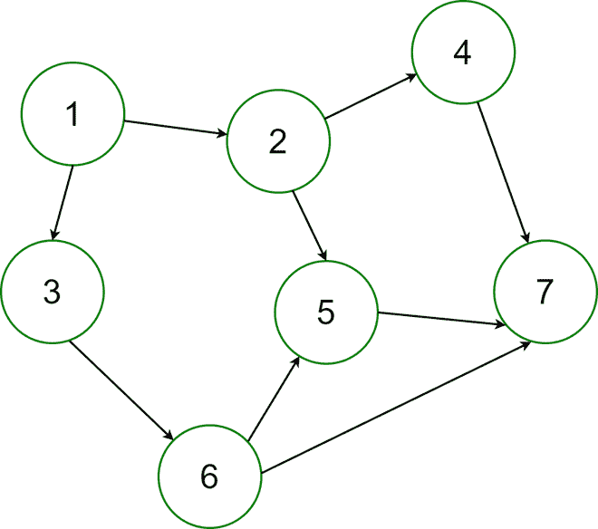

# 如何在 Java 中生成给定边数的随机有向无环图？

> 原文:[https://www . geesforgeks . org/如何在 java 中为给定的边数生成随机有向无环图/](https://www.geeksforgeeks.org/how-to-generate-a-random-directed-acyclic-graph-for-a-given-number-of-edges-in-java/)

一个**有向无环图**是一个没有有向圈的有向图。在有向图中，边是相连的，因此每条边都只有一个方向。一个**有向无环图**表示这个图不是循环的，或者说不可能从图中的一个点开始遍历整个图。每条边都从较早的边指向较晚的边。

为给定数量的边生成一个随机的有向无环图。



有向无环图

**示例:**

```java
Input:
Enter the number of Edges :
20
Output: 
The Generated Random Graph is :
1 -> { Isolated Vertex! }
2 -> { Isolated Vertex! }
3 -> { 18  }
4 -> { 5  }
5 -> { 16 8  }
6 -> { Isolated Vertex! }
7 -> { Isolated Vertex! }
8 -> {  }
9 -> { Isolated Vertex! }
10 -> { Isolated Vertex! }
11 -> { Isolated Vertex! }
12 -> {  }
13 -> { Isolated Vertex! }
14 -> { 18  }
15 -> { Isolated Vertex! }
16 -> {  }
17 -> { 19 3 5 4  }
18 -> {  }
19 -> {  }
20 -> { 12  }

Input:
Enter the number of Edges :
30
Output:  
The Generated Random Graph is :
1 -> { 12 8 7 16 5 11  }       
2 -> { 16  }
3 -> {  }
4 -> { 10  }
5 -> {  }
6 -> { 7  }
7 -> { 5  }
8 -> { 7 12 20  }
9 -> { 16 12  }
10 -> { 3  }
11 -> { 17 14  }
12 -> { 4 3  }
13 -> { 12 5  }
14 -> { 15 17  }
15 -> {  }
16 -> { 20  }
17 -> { 20 13  }
18 -> {  }
19 -> { 12 11  }
20 -> { 18  }
```

**进场:**

*   输入随机有向无环图的边数。
*   在两个随机顶点之间建立一个连接，并检查是否由于这条边产生了任何循环。
*   如果发现任何循环，则丢弃该边，并再次生成随机顶点对。

**实施:**

## Java 语言(一种计算机语言，尤用于创建网站)

```java
// Java program to Generate a Random Directed
// Acyclic Graph for a Given Number of Edges

import java.io.*;
import java.util.*;
import java.util.Random;

public class RandomDAG {

    // The maximum number of vertex for the random graph
    static int maxVertex = 20;

    // Function to check for cycle, upon addition of a new
    // edge in the graph
    public static boolean checkAcyclic(int[][] edge, int ed,
                                       boolean[] check, int v)
    {
        int i;
        boolean value;

        // If the current vertex is visited already, then
        // the graph contains cycle

        if (check[v] == true)

            return false;

        else {

            check[v] = true;

            // For each vertex, go for all the vertex
            // connected to it
            for (i = ed; i >= 0; i--) {

                if (edge[i][0] == v)

            return checkAcyclic(edge, ed, check, edge[i][1]);

            }
        }

        // In case, if the path ends then reassign the
        // vertexes visited in that path to false again
        check[v] = false;

        if (i == 0)
            return true;
        return true;
    }

    // Function to generate random graph
    public static void generateRandomGraphs(int e)
    {

        int i = 0, j = 0, count = 0;
        int[][] edge = new int[e][2];
        boolean[] check = new boolean[21];
        Random rand = new Random();

        // Build a connection between two random vertex
        while (i < e) {

            edge[i][0] = rand.nextInt(maxVertex) + 1;
            edge[i][1] = rand.nextInt(maxVertex) + 1;

            for (j = 1; j <= 20; j++)
                check[j] = false;

            if (checkAcyclic(edge, i, check, edge[i][0]) == true)

                i++;

            // Check for cycle and if found discard this
            // edge and generate random vertex pair again
        }

        System.out.println("The Generated Random Graph is :");

        // Print the Graph
        for (i = 0; i < maxVertex; i++) {

            count = 0;
            System.out.print((i + 1) + " -> { ");

            for (j = 0; j < e; j++) {

                if (edge[j][0] == i + 1) {
                    System.out.print(edge[j][1] + " ");
                    count++;
                }

                else if (edge[j][1] == i + 1) {
                    count++;
                }

                else if (j == e - 1 && count == 0)
                    System.out.print("Isolated Vertex!");
            }

            System.out.print(" }\n");
        }
    }

    public static void main(String args[]) throws Exception
    {
        int e = 4;

        System.out.println("Enter the number of Edges :"+ e);

        // Function to generate a Random Directed Acyclic
        // Graph
        generateRandomGraphs(e);
    }
}
```

**Output**

```java
Enter the number of Edges :4
The Generated Random Graph is :
1 -> { Isolated Vertex! }
2 -> { 10  }
3 -> {  }
4 -> { Isolated Vertex! }
5 -> {  }
6 -> { 11  }
7 -> { Isolated Vertex! }
8 -> { Isolated Vertex! }
9 -> { Isolated Vertex! }
10 -> { 5  }
11 -> {  }
12 -> { Isolated Vertex! }
13 -> { Isolated Vertex! }
14 -> { Isolated Vertex! }
15 -> { 3  }
16 -> { Isolated Vertex! }
17 -> { Isolated Vertex! }
18 -> { Isolated Vertex! }
19 -> { Isolated Vertex! }
20 -> { Isolated Vertex! }

```