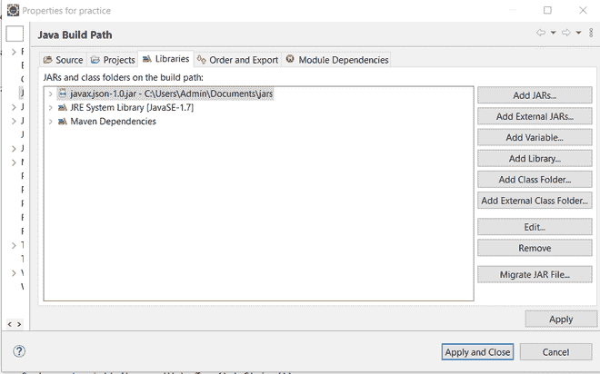

# 如何用 Java 中的 JsonGenerator 生成 JSON？

> 原文:[https://www . geeksforgeeks . org/how-generate-JSON-with-jsongenerator-in-Java/](https://www.geeksforgeeks.org/how-to-generate-json-with-jsongenerator-in-java/)

JavaScript 对象符号(JSON)是一种标准的基于文本的格式，用于表示基于 JavaScript 对象语法的结构化数据。它比 XML 轻量级、灵活、快速，这就是它被广泛用于服务器和客户端之间的数据交换的原因。如果您曾经在 Java 企业应用程序上工作过，那么您将会遇到可能需要为您的应用程序生成和解析 JSON 数据的任务。例如，RESTful 网络服务广泛使用 JSON 作为请求和响应中数据的格式。

以下示例显示了一个具有名称-值对的 JSON 对象:

```
{
   "firstName": "Duke",
   "lastName": "Java",
   "age": 18,
   "streetAddress": "100 Internet Dr",
   "city": "JavaTown",
   "state": "JA",
   "postalCode": "12345",
   "phoneNumbers": [
      { "Mobile": "111-111-1111" },
      { "Home": "222-222-2222" }
   ]
}
```

> Java 提供了一个使用**对象模型**或**流模型**解析、转换和查询 JSON 数据的应用编程接口。

**对象模型**通过创建一个表示内存中 JSON 数据的树来工作。对象模型通过一次导航整个树来生成 JSON 输出，因此允许需要一次访问整个树内容的处理。可以导航、分析或修改树。这种方法被认为是灵活的，但它比流式模型慢，需要更多的内存。

> Java API 提供了 *javax.json* 包，它包含一个读取器接口、一个写入器接口和一个对象模型的模型构建器接口。该包还包含 JSON 元素的其他实用程序类和 Java 类型。

在对象模型中，创建了一个 JSON-object 引用，它代表树的根，可用于导航树或将树作为 JSON 数据写入流。创建的这个 JSON-object 引用可以是 JsonObject 类型，也可以是 JsonArray 类型，两者都是 JsonStructure 的子类型。哪一个取决于文件的格式/内容。

让我们准确清晰地描述它们。

让我们来看看 **JsonObject** 的一些特性

*   用键值对编写。
*   键必须是字符串，值必须是有效的 JSON 类型。
*   JsonObject 以大括号{ }开始和结束。
*   秩序不重要。

JSON 对象的示例代码如下图所示

```
{
    "name" : "GeeksforGeeks",
    "description" : "An educational website"
}
```

让我们来看看 **JsonArray** 的一些特性

*   用于组织相关项目的集合。
*   值的类型可以是字符串、数字、对象、数组、布尔值或 null。
*   JsonArray 以方括号[ ]开始和结束。
*   秩序很重要。

插图:

```
[1, 2, 3, 4]
```

JsonObject 和 JsonArray 也可以用嵌套的方式来表示某种特殊的数据。您可以使用数组中的对象，也可以使用对象中的数组。

```
{
    "employees":[
        {"firstName":"John", "lastName":"Doe"},
        {"firstName":"Anna", "lastName":"Smith"},
        {"firstName":"Peter", "lastName":"Jones"}
    ],
    "positions" : [
        {"department" : "Testing", "role" : "Junior"},
        {"department" : "Testing", "role" : "Senior"},
        {"department" : "Design", "role" : "Junior"}
    ] 
}
```

既然我们已经清楚了基础知识，我们就可以学习如何编码了。

现在让我们开始安装 javax.json API。因此，如果您正在使用一个 Maven 项目，那么将这个依赖项添加到您的 *pom.xml* 文件中:

```
<dependency>
    <groupId>javax.json</groupId>
    <artifactId>javax.json-api</artifactId>
    <version>1.1.4</version>
</dependency>
```

否则，如果您正在创建一个普通的项目，那么将 *javax.json* jar 添加到您的 Libraries 中，或者从[这里](https://repo1.maven.org/maven2/javax/json/javax.json-api/1.1.4/)下载 jar 文件，并按照以下步骤操作

**步骤 1:从给定的 JSON 数据创建对象模型**

如果我们假设我们已经有了一些 JSON 格式的数据，并因此想要将其转换为 java JsonObject，那么我们可以利用 *javax.json.JsonStructure* 。



让我们假设我们有一个 *sample.txt* ，它存储 JSON 数据如下:

```
{
  "firstName": "John",
  "lastName": "Smith",
  "age": 25,
  "address": {
    "streetAddress": "21 2nd Street",
    "city": "New York",
    "state": "NY",
    "postalCode": "10021"
  },

  "phoneNumber":
  [

  {
    "type":"home",
    "number":"212 555-1234"
  },

  {
    "type": "fax",
    "number": "646 555-4567"
  }
  ]
}
```

除了创建一个数据对象之外，我们还需要一种读取数据的方法！

**第二步:**导航。

为了导航数据，我们将创建一个函数*navigate tetree()*，它将把我们创建的 JSON 对象/模型作为输入，对于它遇到的嵌套在 JSON 模型内部的每个对象或数组，它将再次调用导航函数，如果元素是一个值，那么它将打印标准输出。

现在我们可以从这个 *sample.txt* 文件中创建一个 JsonStructure 的代码，如下所示

**例**

## Java 语言(一种计算机语言，尤用于创建网站)

```
// Java Program to create a JsonStructure of an already
// existing data in the JSON format

// Importing required classes
import java.io.FileNotFoundException;
import java.io.FileReader;
import javax.json.Json;
import javax.json.JsonArray;
import javax.json.JsonNumber;
import javax.json.JsonObject;
import javax.json.JsonReader;
import javax.json.JsonString;
import javax.json.JsonStructure;
import javax.json.JsonValue;

// Main class
public class CreateObjectModelFromJSONData {

    // Main driver method
    public static void main(String args[])
        throws FileNotFoundException
    {

        // JsonReader: an interface that reads a JSON object
        // or an array structure from an input source.

        JsonReader reader = Json.createReader(
            new FileReader("sample.txt"));

        // JsonStructure: an interface that is a super type
        // for the two structured types in JSON
        // (objects and arrays)
        JsonStructure jsonst = reader.read();

        // navigateTree method takes two arguments: a JSON
        // element and a key. The key is used only to help
        // print the key-value pairs inside objects.
        // Elements in a tree are represented by the
        // JsonValue type.

        navigateTree(jsonst, null);
    }

    // A JsonValue is one of the following: an object
    // (JsonObject), an array (JsonArray), a number
    // (JsonNumber), a string (JsonString), true
    // (JsonValue.TRUE), false (JsonValue.FALSE), or null
    // (JsonValue.NULL).

    // Method 2
    // To navigate through the model
    // and print the key-value pairs
    public static void navigateTree(JsonValue tree,
                                    String key)
    {
        if (key != null)
            System.out.print("Key " + key + ": ");

        // Switch case

        // Method 3
        // getValueType() returns the value type of
        // this JSON value.
        switch (tree.getValueType()) {

        // Case 1
        case OBJECT:

            System.out.println("OBJECT");
            JsonObject object = (JsonObject)tree;

            for (String name : object.keySet())
                navigateTree(object.get(name), name);

            break;

        // Case 2
        case ARRAY:

            System.out.println("ARRAY");
            JsonArray array = (JsonArray)tree;

            for (JsonValue val : array)
                navigateTree(val, null);

            break;

        // Case 3
        case STRING:

            JsonString st = (JsonString)tree;

            System.out.println("STRING " + st.getString());
            break;

        // Case 4
        case NUMBER:

            JsonNumber num = (JsonNumber)tree;
            System.out.println("NUMBER " + num.toString());

            break;

        // Case 5
        case TRUE:

        // Case 6
        case FALSE:

        // Case 7
        case NULL:

            // Print statement
            System.out.println(
                tree.getValueType().toString());
            break;
        }
    }
}
```

**输出**

```
OBJECT
Key firstName: STRING John
Key lastName: STRING Smith
Key age: NUMBER 25
Key address: OBJECT
Key streetAddress: STRING 21 2nd Street
Key city: STRING New York
Key state: STRING NY
Key postalCode: STRING 10021
Key phoneNumber: ARRAY
OBJECT
Key type: STRING home
Key number: STRING 212 555-1234
OBJECT
Key type: STRING fax
Key number: STRING 646 555-4567
```

**2。从代码创建对象模型**

为了从头开始创建我们自己的对象模型，我们将使用 JSON 类，该类提供了一个创建 JSON 对象生成器的方法 *createObjectBuilder()* 。 *JsonObjectBuilder* 接口充当从头开始创建 JsonObject 模型的构建器。该接口初始化一个空的 JSON 对象模型，并提供向对象模型添加名称/值对以及返回结果对象的方法。此类中的方法可以被链接，以向对象添加多个名称/值对。

**例**

## Java 语言(一种计算机语言，尤用于创建网站)

```
// Java Program to create a Json object from scratch using
// JsonObjectBuilder and navigate it.

// Importing required classes
import javax.json.Json;
import javax.json.JsonArray;
import javax.json.JsonNumber;
import javax.json.JsonObject;
import javax.json.JsonString;
import javax.json.JsonValue;

// Main class
// CreateObjectModelFromCode
public class GFG {

    // Method 1
    // Main driver method
    public static void main(String args[])
    {

        // add() method adds a name/value pair to the JSON
        // object associated with this object builder.
        // build() method returns the JSON object associated
        // with this object builder.
        JsonObject model
            = Json.createObjectBuilder()
                  .add("firstName", "Duke")
                  .add("lastName", "Java")
                  .add("age", 18)
                  .add("streetAddress", "100 Internet Dr")
                  .add("city", "JavaTown")
                  .add("state", "JA")
                  .add("postalCode", "12345")
                  .add("phoneNumbers",
                       Json.createArrayBuilder()
                           .add(Json.createObjectBuilder()
                                    .add("type", "mobile")
                                    .add("number",
                                         "111-111-1111"))
                           .add(Json.createObjectBuilder()
                                    .add("type", "home")
                                    .add("number",
                                         "222-222-2222")))
                  .build();

        // The same navigateTree() method can be used to
        // navigate this model.
        navigateTree(model, null);
    }

    // Method 2
    public static void navigateTree(JsonValue tree,
                                    String key)
    {
        if (key != null)
            System.out.print("Key " + key + ": ");

        // Method 3- getValueType()
        // To get the value types

        // Switch case
        switch (tree.getValueType()) {

        // Case 1
        case OBJECT:

            System.out.println("OBJECT");

            JsonObject object = (JsonObject)tree;

            for (String name : object.keySet())
                navigateTree(object.get(name), name);
            break;

        // Case 2
        case ARRAY:

            System.out.println("ARRAY");

            JsonArray array = (JsonArray)tree;

            for (JsonValue val : array)
                navigateTree(val, null);
            break;

        // Case 3
        case STRING:

            JsonString st = (JsonString)tree;

            System.out.println("STRING " + st.getString());
            break;

        // Case 4
        case NUMBER:

            JsonNumber num = (JsonNumber)tree;

            System.out.println("NUMBER " + num.toString());
            break;

        // Case 5
        case TRUE:

        // Case 6
        case FALSE:

        // Case 7
        case NULL:

            System.out.println(
                tree.getValueType().toString());
            break;
        }
    }
}
```

**输出**

```
OBJECT
Key firstName: STRING Duke
Key lastName: STRING Java
Key age: NUMBER 18
Key streetAddress: STRING 100 Internet Dr
Key city: STRING JavaTown
Key state: STRING JA
Key postalCode: STRING 12345
Key phoneNumbers: ARRAY
OBJECT
Key type: STRING mobile
Key number: STRING 111-111-1111
OBJECT
Key type: STRING home
Key number: STRING 222-222-2222
```

**3。将对象模型写入流**

我们在上面的例子中创建的对象模型可以使用 JsonWriter 类写入一个流。JsonWriter 将 JSON 对象或数组结构写入输出源。这一次我们将把 *sample.txt* 的内容转换成 JsonStructure 后写入输出流。

**例**

## Java 语言(一种计算机语言，尤用于创建网站)

```
// Java Progra to Write the Object Model to an Output Stream

// Importing required classes
import java.io.FileNotFoundException;
import java.io.FileReader;
import java.io.StringWriter;
import javax.json.Json;
import javax.json.JsonObject;
import javax.json.JsonReader;
import javax.json.JsonStructure;
import javax.json.JsonWriter;

// Main class
// WritingObjectModelToAStream
public class GFG {

    // Main driver method
    public static void main(String args[])
        throws FileNotFoundException
    {

        JsonReader reader = Json.createReader(
            new FileReader("sample.txt"));
        JsonStructure jsonst = reader.read();

        StringWriter stWriter = new StringWriter();

        // We use try-with-resources to close the JSON
        // writer automatically

        // Json.createWriter() method takes an output stream
        // as a parameter. JsonWriter.writeObject() method
        // writes the object to the stream.

        // Try block to check for exceptions
        try (JsonWriter jsonWriter
             = Json.createWriter(stWriter)) {
            jsonWriter.writeObject((JsonObject)jsonst);
        }

        // Creating variable jsonData to store the object
        // written to the stream in the form of a String
        String jsonData = stWriter.toString();

        // Print the data string
        System.out.println(jsonData);
    }
}
```

**输出:**在控制台**上，以下内容将被打印成一行**

```
{
"firstName":"John","lastName":"Smith","age":25,
"address":{"streetAddress":"21 2nd Street","city":"New York","state":"NY","postalCode":"10021"},
"phoneNumber":[{"type":"home","number":"212 555-1234"},{"type":"fax","number":"646 555-4567"}]
}
```

**现在细想下一个模型，**

****流模型**使用基于事件的解析器，一次读取一个 JSON 数据元素。流模型通过一次调用一个元素来生成给定流的 JSON 输出。这种方法适用于本地处理，在本地处理中，元素的处理不需要来自其余数据的信息。它的工作方式是解析器生成事件，并在找到键、找到值或到达对象或数组的开头或结尾时停止处理。找到的元素可以根据代码进行处理或丢弃，然后解析器移动到下一个事件。**

**Java API 提供了 *javax.json.stream* 包，它包含一个解析器接口 JsonParser 和一个流模型的生成器接口 JsonGenerator。JsonParser 接口包含以流方式解析 JSON 的方法。接口 JsonGenerator 包含以流方式将 JSON 写入输出源的方法。**

> **在接下来的代码**、**中，我们将使用相同的 *sample.txt* 文件来解析它。**

****1。使用解析器读取 JSON 数据:**我们将使用 JsonParser，它以流式方式提供对 JSON 数据的正向只读访问。JsonParser 使用拉解析编程模型解析 JSON。在这个模型**、**中，客户端代码控制线程并调用 next()方法，在处理完每个元素后将解析器推进到下一个状态。解析器可以生成以下事件:**

```
START_OBJECT, END_OBJECT, START_ARRAY, END_ARRAY, KEY_NAME, VALUE_STRING, VALUE_NUMBER, VALUE_TRUE, VALUE_FALSE, and VALUE_NULL.
```

**在下面的代码中，我们将执行以下步骤:**

1.  **获取字符串形式的 JSON 数据，这样就可以将其传递给解析器对象。**
2.  **通过调用 JSON.createParser 静态方法获得一个解析器实例，并将字符串传递给它。**
3.  **用 JsonParser.hasNext 和 JsonParser.next 方法迭代解析器事件。**
4.  **对每个元素执行本地处理。**

****实施:****

****例****

## **Java 语言(一种计算机语言，尤用于创建网站)**

```
// Java program to Read JSON data using a JsonParser

// Importing required classes
import java.io.FileNotFoundException;
import java.io.FileReader;
import java.io.StringReader;
import java.io.StringWriter;
import javax.json.Json;
import javax.json.JsonObject;
import javax.json.JsonReader;
import javax.json.JsonStructure;
import javax.json.JsonWriter;
import javax.json.stream.JsonParser;

// Main class
// ReadingJSONDataUsingAParser
public class GFG {

    // Main driver method
    public static void main(String args[])
        throws FileNotFoundException
    {

        // Creating object of JsonReader class
        // Creating object of JsonStructure class
        JsonReader reader = Json.createReader(
            new FileReader("sample.txt"));
        JsonStructure jsonst = reader.read();

        StringWriter stWriter = new StringWriter();

        // Try block to check for exceptions
        try (JsonWriter jsonWriter
             = Json.createWriter(stWriter)) {
            jsonWriter.writeObject((JsonObject)jsonst);
        }

        // Step 1
        String jsonData = stWriter.toString();

        // Step 2
        // Json.createParser(): Creates a JSON parser from a
        // character stream.
        JsonParser parser
            = Json.createParser(new StringReader(jsonData));

        // Step 3
        // haNext(): Returns true if there are more parsing
        // states. This method returns false if the parser
        // reaches the end of the JSON text
        while (parser.hasNext()) {

            // JsonParser.Event: An event from JsonParser.
            // next(): Returns the event for the next
            // parsing state.
            JsonParser.Event event = parser.next();

            // Step 4

            // Switch case
            switch (event) {

            // Case 1
            // Start of a JSON array.
            case START_ARRAY:

            // Case 2
            // End of a JSON array.
            case END_ARRAY:

            // Case 3
            // Start of a JSON object.
            case START_OBJECT:

            // Case 4
            // End of a JSON object.
            case END_OBJECT:

            // Case 5
            // False value in a JSON array or object.
            case VALUE_FALSE:

            // Case 6
            // Null value in a JSON array or object.
            case VALUE_NULL:

            // Case 7
            // True value in a JSON array or object.
            case VALUE_TRUE:
                System.out.println(event.toString());
                break;

            // Case 8
            // Name in a name/value pair of a JSON object.
            case KEY_NAME:
                System.out.print(event.toString() + " "
                                 + parser.getString()
                                 + " - ");
                break;

            // Case 9
            // String value in a JSON array or object.
            case VALUE_STRING:

            // Case 10
            // Number value in a JSON array or object.
            case VALUE_NUMBER:
                System.out.println(event.toString() + " "
                                   + parser.getString());
                break;
            }
        }
    }
}
```

 ****输出:****

```
START_OBJECT
KEY_NAME firstName - VALUE_STRING John
KEY_NAME lastName - VALUE_STRING Smith
KEY_NAME age - VALUE_NUMBER 25
KEY_NAME address - START_OBJECT
KEY_NAME streetAddress - VALUE_STRING 21 2nd Street
KEY_NAME city - VALUE_STRING New York
KEY_NAME state - VALUE_STRING NY
KEY_NAME postalCode - VALUE_STRING 10021
END_OBJECT
KEY_NAME phoneNumber - START_ARRAY
START_OBJECT
KEY_NAME type - VALUE_STRING home
KEY_NAME number - VALUE_STRING 212 555-1234
END_OBJECT
START_OBJECT
KEY_NAME type - VALUE_STRING fax
KEY_NAME number - VALUE_STRING 646 555-4567
END_OBJECT
END_ARRAY
END_OBJECT
```

****2。使用生成器**写入 JSON 数据**

**使用 JsonGenerator，我们可以以流式方式将 JSON 数据写入输出源。通过调用 JSON.createGenerator 静态方法获得一个 Json 生成器，该方法将一个编写器或一个输出流作为参数。我们将把 JSON 数据写入一个 *details.txt* 文件。**

****例****

## **Java 语言(一种计算机语言，尤用于创建网站)**

```
// Java Program to Generate JSON data and Store it into a
// file.

// Importing required classes
import java.io.FileWriter;
import java.io.IOException;
import javax.json.Json;
import javax.json.stream.JsonGenerator;

// Main class
// WriteJSONDataUsingGenerator
public class GFG {

    // Main driver method
    public static void main(String args[])
    {

        FileWriter writer = null;

        // Try block to check for exceptions
        try {

            writer = new FileWriter("details.txt");
        }

        // Catch block to handle i/o exceptions
        catch (IOException e) {

            // Print the exceptions along with line number
            // using printStackTrace() method
            e.printStackTrace();
        }

        // Json.createGenerator(): Creates a JSON generator
        // for writing JSON to a character stream.
        JsonGenerator generator
            = Json.createGenerator(writer);

        // writeStartObject(): Writes the JSON name/start
        // object character pair in the current object
        // context. write(): Writes a JSON name/string value
        // pair in the current object context. writeEnd():
        // Writes the end of the current context.
        // writeStartArray(): Writes the JSON name/start
        // array character pair with in the current object
        // context.

        generator.writeStartObject()
            .write("firstName", "John")
            .write("lastName", "Smith")
            .write("age", 25)
            .writeStartObject("address")
            .write("streetAddress", "21 2nd Street")
            .write("city", "New York")
            .write("state", "NY")
            .write("postalCode", "10021")
            .writeEnd()
            .writeStartArray("phoneNumber")
            .writeStartObject()
            .write("type", "home")
            .write("number", "212 555-1234")
            .writeEnd()
            .writeStartObject()
            .write("type", "fax")
            .write("number", "646 555-4567")
            .writeEnd()
            .writeEnd()
            .writeEnd();

        // Closes this generator and frees any resources
        // associated with it using close() method
        generator.close();
    }
}
```

****输出:**在 *details.txt* 文件中，以下数据将被写入一行:**

```
{
"firstName":"John","lastName":"Smith","age":25,
"address":{"streetAddress":"21 2nd Street","city":"New York","state":"NY","postalCode":"10021"},
"phoneNumber":[{"type":"home","number":"212 555-1234"},{"type":"fax","number":"646 555-4567"}]
}
```