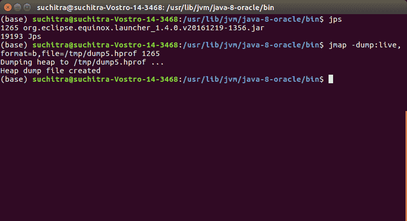
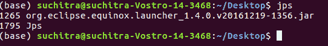
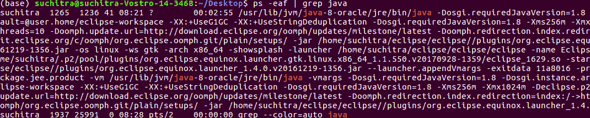
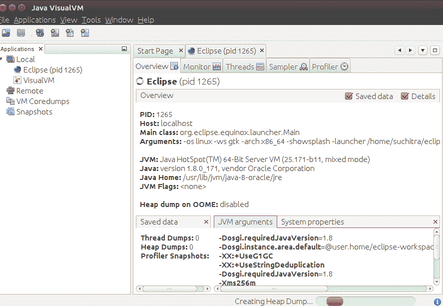
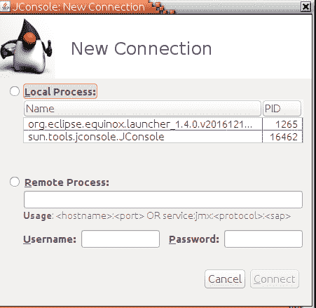
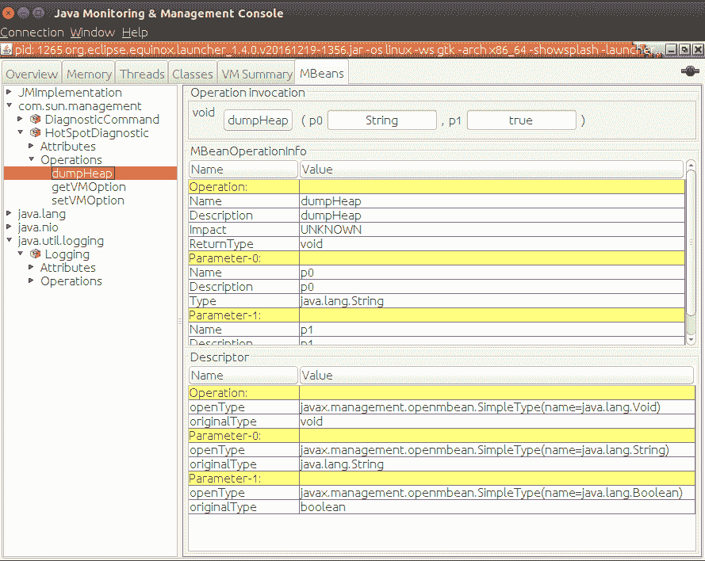
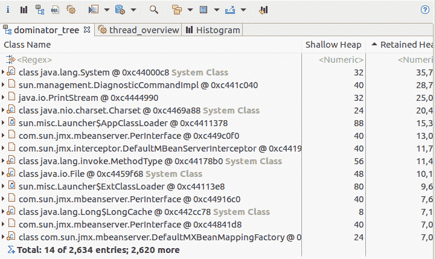
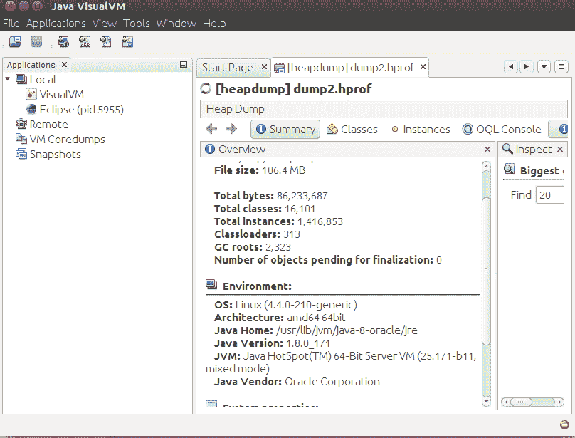
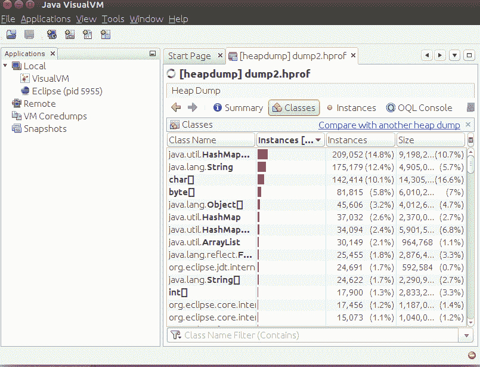

# 如何生成 JVM 堆内存转储？

> 原文:[https://www . geesforgeks . org/如何生成-JVM-堆-内存-转储/](https://www.geeksforgeeks.org/how-to-generate-jvm-heap-memory-dump/)

java 堆转储是在某个时间点存在于 JVM(Java 虚拟机)中的所有 Java 对象的快照。JVM 为堆内存中的类实例或数组对象分配内存。当不再需要或不再引用这些对象时，垃圾收集器会运行并回收这些对象占用的内存空间。

堆转储为二进制格式，有 ***。【hprof 分机***。它可以使用像 JVisualVM 和 Eclipse MAT(内存分析工具)这样的应用程序来打开和分析。我们生成 java 内存堆转储来识别内存泄漏等问题，并优化应用程序中的内存使用。

**<u>方法:</u>**

生成 **<u>一个</u>** java 内存堆转储有不同的方式。JDK 提出了各种生成堆转储的工具。这些工具位于 JDK 主目录下的 bin 文件夹中..让我们讨论如何生成 JVM 堆转储，如下所示:

1.  使用 jmap 命令
2.  在终端上使用 jcmd 命令
3.  使用 JVisualVM 工具
4.  识别 HeapDumpOnOutOfMemory
5.  使用 JMX 控制台
6.  通过编写程序来使用 HotSpotDiagnosticMBean

**方法 1:** 使用地图命令

jmap 是一个在 JDK 主目录的 bin 文件夹中运行的命令。它给出了内存使用的统计数据。结构如下:

**例**

```java
jmap -dump:[live],format=b,file=<file-path> <pid>

live:- This parameter is optional. If set, it prints all those objects that 
have active references.

format = b , which means the heap dump file is in binary format. It is not necessary 
to set this parameter.

file =<file-path> indicates where the heap dump file will be generated.

<pid> :- process id of the java process
```



现在，为了获得正在运行的 java 进程的进程 id，可以使用下面定义的选项之一:

**1.1**

```java
jps
```

我们从安装了 JDK 的 Unix 终端或 Windows 命令提示符下键入此命令。它给出了正在运行的 java 进程的进程标识



jps 命令

**1.2**

```java
ps -eaf| grep java
```

这给出了所有正在运行的 java 进程的进程标识。它只在 Unix 终端上工作



ps -eaf | grep java

**1.3** 在 windows 操作系统中使用任务管理器应用。

**方法 2:** 在终端使用 jcmd 命令

该命令向 JVM 发送****请求，以生成堆转储。它的参数之一是 GC.heap_dump。如下图所示:****

```java
**jcmd <pid> GC.heap_dump <file-path>
<pid> - Process id of java process
<file-path> - Path where the heap dump is to be generated**
```

****

断续器**** 

******方法 3:** 使用 JVisualVM 工具****

****这是一个在 JDK 包装的工具。它有助于监控和排除 java 应用程序的故障。它有一个简单直观的图形用户界面。我们在开始菜单中输入***jvvisualvm***，或者通过 Unix 中的命令提示符或终端窗口进入 JDK 主目录的 bin 目录，输入***jvvisualvm*******

****它启动一个 Java 可视化虚拟机应用程序。在左侧，它显示了当前运行的 java 进程。右键单击要生成堆转储的进程标识。当我们单击堆转储时，它会为选定的进程生成堆转储。在基本信息下，它显示生成堆转储的文件路径。****

********

******方法 4:** 识别 HeapDumpOnOutOfMemory****

****当应用程序遇到 java.lang.OutOfMemoryError 时，捕获堆转储是理想的选择。堆转储有助于识别内存中的活动对象及其占用的内存百分比。****

```java
**-XX:+HeapDumpOnOutOfMemoryError -XX:HeapDumpPath=<file-path>**
```

****在设置了该系统属性的情况下运行 java 应用程序时，JVM 会在遇到 [OutOfMemoryError](https://www.geeksforgeeks.org/understanding-outofmemoryerror-exception-java/) 时拍摄堆转储的快照。****

******方法 5:** 使用 JMX 控制台****

****有一个热点诊断 MBean，它有一个堆转储操作。我们使用***【JMX】***客户端像 ***jconsole*** 来调用 ***MBean*** 操作。通过 JConsole，我们可以通过指定主机和端口号以及用户名/密码来连接到本地 java 进程或远程进程。一旦我们连接到进程 id，jconsole 应用程序就会打开多个选项卡。“概述”选项卡显示堆内存使用情况、线程、类、CPU 使用情况****

****

jconsole–新连接**** ****

jconsole–MBean 选项卡**** 

******方法 6:** 通过编写程序使用 HotSpotDiagnosticMBean****

****我们使用 HotSpotDiagnosticMBean 来调用堆转储操作。我们从 MBean 平台服务器获取 MBean 对象。在下面的例子中，我们使用反射来调用 MBean 对象的 ***heapDump()*** 方法。****

******例******

## ****Java 语言(一种计算机语言，尤用于创建网站)****

```java
**// Java Program Invoking heapDump() Method of MBean Object

// Importing input output classes
import java.io.*;

// Main class
class GFG {

    // Custom string passed as input
    private static final String HOTSPOT_BEAN
        = "com.sun.management:type=HotSpotDiagnostic";

    // Private member variable of this class
    private static volatile Object hotSpotMBean;

    // Invoke this method when heap dump is to be generated
    // @param fileName - name of the heap dump file
    // @param live - indicates if only live objects are to
    // be included in the heap dump

    // Method 1
    // To generate heap dumps
    static void generateHeapDump(String fileName,
                                 boolean live)
    {
        initHotspotMBean();

        // Try block to check if any exceptions occurs
        try {

            Class clazz = Class.forName(
                "com.sun.management.HotSpotDiagnosticMXBean");
            Method m = clazz.getMethod(
                "dumpHeap", String.class, boolean.class);
            m.invoke(hotSpotMBean, fileName, live);
        }

        // Catch block handling runtime exceptions
        catch (RuntimeException re) {
            throw re;
        }
        catch (Exception exp) {
            throw new RuntimeException(exp);
        }
    }

    // Method 2
    private static void initHotspotMBean()
    {

        if (hotSpotMBean == null) {
            synchronized (JavaHeapDump.class)
            {

                if (hotSpotMBean == null) {
                    hotSpotMBean = getHotSpotMbean();
                }
            }
        }
    }

    // Method 3
    // To get the HOtSpotBean from the MBean server
    private static Object getHotSpotMbean()
    {

        Object hotspotBean = null;

        // Try block tocheck for exceptions
        try {

            // Loading using .forName() method
            Class clazz = Class.forName(
                "com.sun.management.HotSpotDiagnosticMXBean");

            MBeanServer mbeanServer
                = ManagementFactory
                      .getPlatformMBeanServer();

            hotspotBean
                = ManagementFactory.newPlatformMXBeanProxy(
                    mbeanServer, HOTSPOT_BEAN, clazz);

            return hotspotBean;
        }

        // Catch block 1
        // Handling exceptions if class not found
        catch (ClassNotFoundException e) {

            // Printthe exception along with line number
            // using printStackTrace() method
            e.printStackTrace();
        }

        // Catch block 2
        // Handling basic I/O exceptions
        catch (IOException e) {

            // Printthe exception along with line number
            // using printStackTrace() method
            e.printStackTrace();
        }

        return hotspotBean;
    }

    // Method 4
    // Main driver method
    public static void main(String[] args)
    {

        // File taken as an input
        String fileName
            = "/home/suchitra/Desktop/suchitra/projects/java-concurrency-examples/JavaHeapDumpGenerator/src/heap1.hprof";

        // Flag variable set to true
        boolean live = true;

        // Switch case
        switch (args.length) {
        case 2:
            live = args[1].equals("true");
        case 1:
            fileName = args[0];
        }

        // Calling Method 1 in main() method to
        // generate heap dumps
        generateHeapDump(fileName, live);
    }
}**
```

> ******注:******
> 
> ****我们通过传递将要生成堆转储的文件路径的命令行参数和可以设置为真或假的活动参数来运行这个应用程序。运行该 java 代码时，它会在 src 文件夹中生成一个 heap1.hprof 文件。这个堆转储可以使用 MAT(内存分析工具)进行分析。这可以作为一个插件从市场安装到 Eclipse 中。****

****

使用 MAT 的堆转储分析**** 

*   ****最后，让我们在 JVM 的帮助下分析堆转储文件。****
*   ****一旦生成堆转储文件，我们就使用像 JVM 这样的工具来分析该文件。打开堆转储时，默认情况下，Java VisualVM 会显示“摘要”视图。“摘要”视图显示进行堆转储的运行环境和其他系统属性。****
*   ****在 JVM 中，我们转到 ***文件- >加载*** 并选择文件夹位置。生成“hprof 文件”,并在下面以图片的形式进行辅助，以便对其有一个合理的理解。****

****

堆转储文件分析–摘要选项卡**** ****

堆转储分析–类选项卡****