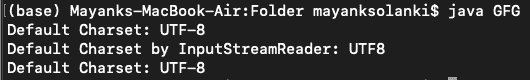

# 如何在 Java 中获取和设置默认字符编码或字符集？

> 原文:[https://www . geesforgeks . org/如何在 java 中获取和设置默认字符编码或字符集/](https://www.geeksforgeeks.org/how-to-get-and-set-default-character-encoding-or-charset-in-java/)

Java 虚拟机(JVM)使用 Java 中的默认字符编码或字符集，在没有**文件的情况下，将字节转换为字符串。在 JVM 启动期间，Java 通过调用**system . getproperty(“file . encoding”，“UTF-8”)**来获取字符编码。在没有 *file.encoding* 属性的情况下，Java 默认使用“UTF-8”字符编码。**

字符编码基本上将字节序列解释为一串特定的字符。相同的字节组合可以表示不同字符编码中的不同字符。因此，规范对字符编码起着重要作用。Java 在其大多数需要字符编码的主要类中缓存字符编码。因此，在使用 [InputStreamReader](https://www.geeksforgeeks.org/inputstreamreader-class-in-java/) 等 Java 包时，调用 system . set property(“file . encoding”，“UTF-16”)可能不会有想要的效果。

**获取默认字符编码或字符集**

在 Java 中有多种检索默认字符集的方法，如下所示:

*   使用“file.encoding”系统属性
*   使用**T2**
*   **使用 [*字符集()*T3】方法](https://www.geeksforgeeks.org/charset-defaultcharset-method-in-java-with-examples/)**

****方法:****

1.  **“file.encoding”系统属性**
2.  **Java . 9 .夏莱斯**
3.  **Code InputStreamReader.getEncoding（）**

**现在，在实现部分调用它们之前，让我们简单介绍一下它们，以便获得默认的字符编码或字符集**

****方法 1:**“file . encoding”系统属性**

**Java 中的 system . getproperty(" file . encoding ")返回应用程序中使用的默认字符集，以防 JVM 是用-Dfile.encoding 属性启动的，或者 JavaScript 没有显式调用 system . setproperty(" file . encoding，encoding ")方法，其中指定了编码类型。**

****方法二:**T2**

**java 包提供了一种静态方法来检索默认字符编码，以便在字节和 Unicode 字符之间进行转换。[*Charset . DefaultCharset()*](https://www.geeksforgeeks.org/charset-defaultcharset-method-in-java-with-examples/)方法返回正在使用的默认字符集。**

****方法 3:** 代码 InputStreamReader.getEncoding()**

**Java 中的 InputStreamReader 包使用了一个方法 [*getEncoding()*](https://www.geeksforgeeks.org/inputstreamreader-class-in-java/) ，返回这个流使用的字符编码的名称。**

****示例:****

## **Java 语言(一种计算机语言，尤用于创建网站)**

```java
// Java Program to Get and Set
// Default Character encoding or Charset

// Importing input output classes
import java.io.ByteArrayInputStream;
import java.io.FileNotFoundException;
import java.io.IOException;
import java.io.InputStream;
import java.io.InputStreamReader;
import java.io.UnsupportedEncodingException;
// Importing Charset class that defines charsets and
// translation between bytes and Unicode characters.
import java.nio.charset.Charset;

// Class 1
// Helper Class for character encoding
public class GFG {

    // Method
    // To
    public static String getCharacterEncoding()
    {

        // Creating an array of byte type chars and
        // passing random  alphabet as an argument.abstract
        // Say alphabet be 'w'
        byte[] byte_array = { 'w' };

        // Creating an object of InputStream
        InputStream instream
            = new ByteArrayInputStream(byte_array);

        // Now, opening new file input stream reader
        InputStreamReader streamreader
            = new InputStreamReader(instream);
        String defaultCharset = streamreader.getEncoding();

        // Returning default character encoding
        return defaultCharset;
    }

    // Main driver method
    public static void main(String args[])
        throws FileNotFoundException,
               UnsupportedEncodingException, IOException
    {

        // Method returns a string of character encoding
        // used by using System.getProperty()
        String defaultencoding
            = System.getProperty("file.encoding");

        System.out.println("Default Charset: "
                           + defaultencoding);

        // Getting character encoding by InputStreamReader
        System.out.println(
            "Default Charset by InputStreamReader: "
            + getCharacterEncoding());

        // Getting character encoding by java.nio.charset
        System.out.println("Default Charset: "
                           + Charset.defaultCharset());
    }
}
```

****输出:****

****

### **设置默认字符编码或字符集**

****方法:**Java 中有多种指定默认字符集值的方式。**

*   **使用 java 系统属性**
*   **使用 JAVA_TOOLS_OPTIONS**

**现在，在实现部分调用它们之前，让我们简单介绍一下它们，以便获得默认的字符编码或字符集**

****方法 1:** 使用 Java 系统属性“file.encoding”**

**在启动 Java 虚拟机时，通过提供文件编码系统属性**

```java
java -Dfile.encoding="UTF-8"  HelloWorld, we can specify UTF-8 charset.
```

****方法 2:** 指定环境变量“ [JAVA_TOOLS_OPTIONS](https://www.geeksforgeeks.org/set-temporary-permanent-paths-java/)**

**如果我们使用一些脚本和工具启动 JVM，那么可以使用环境变量 JAVA_TOOL_OPTIONS 将默认字符集设置为***-Dfile . encoding = " UTF-16 "***或任何其他在机器中启动 JVM 时被程序用完的字符集。作为该方法的输出，控制台显示如下:**

> **"拿起 JAVA _ TOOL _ OPTIONS:-Dfile . encoding = UTF16 "来指示 JAVA_TOOS_OPTIONS 的用法。**

**下面的代码片段指出了使用 JAVA_TOOLS_OPTIONS 的默认字符编码的设置:**

```java
test@system:~/java java HelloWorld
þÿExecuting HelloWorld
Picked up JAVA_TOOL_OPTIONS: -Dfile.encoding=UTF16
```

****示例:****

## **Java 语言(一种计算机语言，尤用于创建网站)**

```java
// Java Program to Get and Set
// Default Character encoding or Charset

// Importing all input output classes
import java.io.ByteArrayInputStream;
import java.io.FileNotFoundException;
import java.io.IOException;
import java.io.InputStream;
import java.io.InputStreamReader;
// Importing Charset class that defines charsets and
// translation between bytes and Unicode characters
import java.io.UnsupportedEncodingException;
import java.nio.charset.Charset;

// Class
// Class to encode characters
public class GFG {

    // Method 1
    // To encode the characters
    public static String getCharacterEncoding()
    {

        // Creating and initializing byte array
        // with some random character say it be N

        // Here N = w
        byte[] byte_array = { 'w' };

        // Creating an object of inputStream
        InputStream instream
            = new ByteArrayInputStream(byte_array);

        // Now, opening new file input stream reader
        InputStreamReader streamreader
            = new InputStreamReader(instream);

        String defaultCharset = streamreader.getEncoding();

        // Returning the default character encoded
        // Here it is for N = 'w'
        return defaultCharset;
    }

    // Method 2
    // Main driver method
    public static void main(String args[])
        throws FileNotFoundException,
               UnsupportedEncodingException, IOException
    {

        // Setting the file encoding explicitly
        // to a new value
        System.setProperty("file.encoding", "UTF-16");

        // Returns a string of character encoding
        // using the getProperty() method
        String defaultencoding
            = System.getProperty("file.encoding");

        // Return the above string of character encoded
        System.out.println("Default Charset: "
                           + defaultencoding);

        // Getting character encoding by InputStreamReader
        // using the getCharacterEncoding() method
        System.out.println(
            "Default Charset by InputStreamReader: "
            + getCharacterEncoding());

        // Getting character encoding by java.nio.charset
        // using the default charset() method
        System.out.println("Default Charset: "
                           + Charset.defaultCharset());
    }
}
```

****输出****

```java
Default Charset: UTF-16
Default Charset by InputStreamReader: UTF8
Default Charset: UTF-8
```

> **缺省字符集编码 UTF-8 由 JVM 保留和缓存，因此不会被指定显式字符编码 UTF-16(即 System.setProperty()**