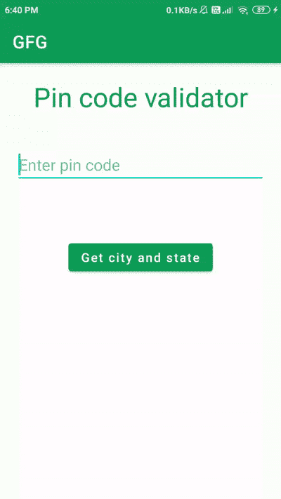

# 如何在安卓中从 Pincode 获取城市和州名？

> 原文:[https://www . geesforgeks . org/如何从安卓密码中获取城市和州名/](https://www.geeksforgeeks.org/how-to-get-city-and-state-name-from-pincode-in-android/)

许多应用程序要求用户在应用程序中添加地址。为了让用户轻松完成这项任务，他们首先提示用户添加密码，然后从密码中获取城市和州名等数据。因此，用户的任务减少到在输入地址的同时添加城市和州名。与许多应用程序一样，许多网站也使用这一功能，首先提示用户添加个人识别码，添加个人识别码后，城市和州字段会自动输入。因此，在本文中，我们将了解如何整合这一功能，并从印度的任何密码中获取城市和州名。密码也被称为邮政编码，用于获取附近邮局的详细信息。这些代码通常用于获取邮局的详细信息，如姓名、城市、州和许多其他详细信息。

### 我们将在本文中构建什么？

我们将构建一个简单的应用程序，在其中我们将输入一个 pin 码，点击一个按钮后，我们将看到城市名称、州和国家等详细信息。下面是 GIF 图像，在这里我们将了解我们将在本文中构建什么。密码由邮局和邮政服务提供。印度邮政是印度最受欢迎的邮政服务运营商之一。因此，在这个项目中，我们将使用印度邮政提供的应用编程接口，它将为我们提供城市、州和国家名称等详细信息。



### 逐步实施

**第一步:在安卓工作室创建新项目**

要在安卓工作室创建新项目，请参考[如何在安卓工作室创建/启动新项目](https://www.geeksforgeeks.org/android-how-to-create-start-a-new-project-in-android-studio/)。注意选择 **Java** 作为编程语言。

**第二步:在你的 build.gradle 文件**中添加下面的依赖项

下面是凌空的依赖，我们将使用它从印度邮政的应用编程接口获取数据。

> 实现‘com . Android .凌空:凌空:1 . 1 . 1’

添加此依赖项后，同步您的项目，现在转向 XML 部分。

**步骤 3:使用 activity_main.xml 文件**

转到 **activity_main.xml** 文件，参考以下代码。下面是 **activity_main.xml** 文件的代码。

## 可扩展标记语言

```java
<?xml version="1.0" encoding="utf-8"?>
<LinearLayout 
    xmlns:android="http://schemas.android.com/apk/res/android"
    xmlns:tools="http://schemas.android.com/tools"
    android:layout_width="match_parent"
    android:layout_height="match_parent"
    android:orientation="vertical"
    tools:context=".MainActivity">

    <!--heading text view-->
    <TextView
        android:layout_width="match_parent"
        android:layout_height="wrap_content"
        android:layout_margin="20dp"
        android:text="Pin code validator"
        android:textAlignment="center"
        android:textColor="@color/purple_500"
        android:textSize="30sp" />

    <!-- edit text for entering our pin code
         we are specifying input type as number-->
    <EditText
        android:id="@+id/idedtPinCode"
        android:layout_width="match_parent"
        android:layout_height="wrap_content"
        android:layout_margin="20dp"
        android:hint="Enter pin code"
        android:importantForAutofill="no"
        android:inputType="number"
        android:maxLines="1"
        android:singleLine="true" />

    <!--button to get the data from pin code-->
    <Button
        android:id="@+id/idBtnGetCityandState"
        android:layout_width="wrap_content"
        android:layout_height="wrap_content"
        android:layout_gravity="center_horizontal"
        android:layout_marginTop="50dp"
        android:text="Get city and state"
        android:textAllCaps="false" />

    <!--text view to display the data
        received from pin code-->
    <TextView
        android:id="@+id/idTVPinCodeDetails"
        android:layout_width="match_parent"
        android:layout_height="wrap_content"
        android:layout_margin="20dp"
        android:padding="10dp"
        android:textAlignment="center"
        android:textAllCaps="false"
        android:textColor="@color/purple_500"
        android:textSize="20sp" />

</LinearLayout>
```

**第四步:使用****MainActivity.java 文件**

转到**文件，参考以下代码。以下是**MainActivity.java**文件的代码。代码中添加了注释，以更详细地理解代码。**

## **Java 语言(一种计算机语言，尤用于创建网站)**

```java
import android.os.Bundle;
import android.text.TextUtils;
import android.view.View;
import android.widget.Button;
import android.widget.EditText;
import android.widget.TextView;
import android.widget.Toast;

import androidx.appcompat.app.AppCompatActivity;

import com.android.volley.Request;
import com.android.volley.RequestQueue;
import com.android.volley.Response;
import com.android.volley.VolleyError;
import com.android.volley.toolbox.JsonObjectRequest;
import com.android.volley.toolbox.Volley;

import org.json.JSONArray;
import org.json.JSONException;
import org.json.JSONObject;

public class MainActivity extends AppCompatActivity {
    // creating variables for edi text, 
    // button and our text views.
    private EditText pinCodeEdt;
    private Button getDataBtn;
    private TextView pinCodeDetailsTV;

    // creating a variable for our string.
    String pinCode;

    // creating a variable for request queue.
    private RequestQueue mRequestQueue;

    @Override
    protected void onCreate(Bundle savedInstanceState) {
        super.onCreate(savedInstanceState);
        setContentView(R.layout.activity_main);

        // initializing our variables.
        pinCodeEdt = findViewById(R.id.idedtPinCode);
        getDataBtn = findViewById(R.id.idBtnGetCityandState);
        pinCodeDetailsTV = findViewById(R.id.idTVPinCodeDetails);

        // initializing our request que variable with request
        // queue and passing our context to it.
        mRequestQueue = Volley.newRequestQueue(MainActivity.this);

        // initialing on click listener for our button.
        getDataBtn.setOnClickListener(new View.OnClickListener() {
            @Override
            public void onClick(View v) {
                // getting string  from EditText.
                pinCode = pinCodeEdt.getText().toString();

                // validating if the text is empty or not.
                if (TextUtils.isEmpty(pinCode)) {
                    // displaying a toast message if the
                    // text field is empty
                    Toast.makeText(MainActivity.this, "Please enter valid pin code", Toast.LENGTH_SHORT).show();
                } else {
                    // calling a method to display 
                    // our pincode details.
                    getDataFromPinCode(pinCode);
                }
            }
        });
    }

    private void getDataFromPinCode(String pinCode) {

        // clearing our cache of request queue.
        mRequestQueue.getCache().clear();

        // below is the url from where we will be getting 
        // our response in the json format.
        String url = "http://www.postalpincode.in/api/pincode/" + pinCode;

        // below line is use to initialize our request queue.
        RequestQueue queue = Volley.newRequestQueue(MainActivity.this);

        // in below line we are creating a 
        // object request using volley.
        JsonObjectRequest objectRequest = new JsonObjectRequest(Request.Method.GET, url, null, new Response.Listener<JSONObject>() {
            @Override
            public void onResponse(JSONObject response) {
                // inside this method we will get two methods 
                // such as on response method
                // inside on response method we are extracting 
                // data from the json format.
                try {
                    // we are getting data of post office
                    // in the form of JSON file.
                    JSONArray postOfficeArray = response.getJSONArray("PostOffice");
                    if (response.getString("Status").equals("Error")) {
                        // validating if the response status is success or failure.
                        // in this method the response status is having error and 
                        // we are setting text to TextView as invalid pincode.
                        pinCodeDetailsTV.setText("Pin code is not valid.");
                    } else {
                        // if the status is success we are calling this method
                        // in which we are getting data from post office object
                        // here we are calling first object of our json array.
                        JSONObject obj = postOfficeArray.getJSONObject(0);

                        // inside our json array we are getting district name,
                        // state and country from our data.
                        String district = obj.getString("District");
                        String state = obj.getString("State");
                        String country = obj.getString("Country");

                        // after getting all data we are setting this data in 
                        // our text view on below line.
                        pinCodeDetailsTV.setText("Details of pin code is : \n" + "District is : " + district + "\n" + "State : "
                                + state + "\n" + "Country : " + country);
                    }
                } catch (JSONException e) {
                    // if we gets any error then it 
                    // will be printed in log cat.
                    e.printStackTrace();
                    pinCodeDetailsTV.setText("Pin code is not valid");
                }
            }
        }, new Response.ErrorListener() {
            @Override
            public void onErrorResponse(VolleyError error) {
                // below method is called if we get 
                // any error while fetching data from API.
                // below line is use to display an error message.
                Toast.makeText(MainActivity.this, "Pin code is not valid.", Toast.LENGTH_SHORT).show();
                pinCodeDetailsTV.setText("Pin code is not valid");
            }
        });
        // below line is use for adding object 
        // request to our request queue.
        queue.add(objectRequest);
    }
}
```

****第五步:在** **清单文件**中添加 **互联网权限****

**导航至**应用程序> AndroidManifest.xml** 文件，并添加以下权限。**

### **输出:**

**<video class="wp-video-shortcode" id="video-536140-1" width="640" height="360" preload="metadata" controls=""><source type="video/mp4" src="https://media.geeksforgeeks.org/wp-content/uploads/20201228185238/Screenrecorder-2020-12-28-18-40-09-5.mp4?_=1">[https://media.geeksforgeeks.org/wp-content/uploads/20201228185238/Screenrecorder-2020-12-28-18-40-09-5.mp4](https://media.geeksforgeeks.org/wp-content/uploads/20201228185238/Screenrecorder-2020-12-28-18-40-09-5.mp4)</video>**