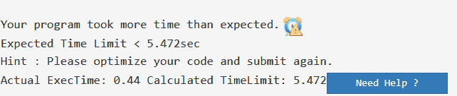
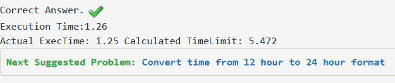

# 如何摆脱 Java TLE 问题

> 原文:[https://www . geesforgeks . org/如何摆脱-java-tle-problem/](https://www.geeksforgeeks.org/how-to-get-rid-of-java-tle-problem/)

很多时候，您已经根据约束编写了正确的 Java 代码，并根据需要进行了尽可能多的优化。但是，你明白吗？？？？。
出现这种情况是由于 Java 使用 Scanner 类进行输入和写输出所花费的时间，与 BufferedReader 和 StringBuffer 类相比，Scanner 类的速度较慢。在此详细阅读扫描仪课程。
来看看一些解决这个 TLE 问题的小技巧(当你的逻辑明显正确的时候)？

> **提示 1 :** 避免使用[扫描仪等级](https://www.geeksforgeeks.org/scanner-class-in-java/)，尽量使用 [BufferedReader 等级](https://www.geeksforgeeks.org/java-io-bufferedreader-class-java/)。
> **提示 2 :** 尽量使用 [StringBuffer 类](https://www.geeksforgeeks.org/stringbuffer-class-in-java/)，以防要打印大量数据。

让我们从 [GeeksforGeeks 练习](https://practice.geeksforgeeks.org/)中拿一个问题来解决 TLE 问题:
T3】问题:T5】隔离一个 0，1 和 2s 的数组
简单来说，问题是，给定一个 0，1 和 2s 的数组。我们必须将数组开头的所有 0、数组中间的所有 1 以及数组最后的所有 2 隔离开来。
示例:

```
Input : 1 1 2 0 0 2 1
Output : 0 0 1 1 1 2 2
```

**进场:** [隔离 0、1、2s](https://www.geeksforgeeks.org/sort-an-array-of-0s-1s-and-2s/)
阵下图为以上进场:
的实施

## Java 语言(一种计算机语言，尤用于创建网站)

```
// Program to segragate the
// array of 0s, 1s and 2s
import java.util.*;
import java.lang.*;
import java.io.*;
class GFG {
    public static void main(String[] args)
    {
        // Using Scanner class to take input
        Scanner sc = new Scanner(System.in);

        // Number of testcase input
        int t = sc.nextInt();

        // Iterating through all the testcases
        while (t-- > 0) {

            // Input n, i.e. size of array
            int n = sc.nextInt();

            int arr[] = new int[n];

            // Taking input of array elements
            for (int i = 0; i < n; i++)
                arr[i] = sc.nextInt();

            // Calling function to segragate
            // input array
            segragateArr(arr, n);

            // printing the modified array
            for (int i = 0; i < n; i++) {
                System.out.print(arr[i] + " ");
            }

            System.out.println();
        }
        sc.close();
    }

    // Function to segragate 0s, 1s and 2s
    public static void segragateArr(int arr[], int n)
    {
        /*
        low : to keep left index
        high : to keep right index
        mid : to get middle element
        */
        int low = 0, high = n - 1, mid = 0;

        // Iterating through the array and
        // segregating elements
        while (mid <= high) {

            // If element at mid is 0
            // move it to left
            if (arr[mid] == 0) {
                int temp = arr[low];
                arr[low] = arr[mid];
                arr[mid] = temp;
                low++;
                mid++;
            }

            // If element at mid is 1
            // nothing to do
            else if (arr[mid] == 1) {
                mid++;
            }

            // If element at mid is 2
            // move it to last
            else {
                int temp = arr[mid];
                arr[mid] = arr[high];
                arr[high] = temp;
                high--;
            }
        }
    }
}
```

根据我们的期望，它应该通过所有的测试用例，并在 [GeeksforGeeks 练习](https://practice.geeksforgeeks.org/problems/sort-an-array-of-0s-1s-and-2s/0)上被接受。但是，当我们在 GeeksforGeeks IDE 上提交这段代码时，它会显示 TLE。



这表明我们已经超出了预期的时间限制。没问题，让我们使用上面给出的提示。

1.  使用 BufferedReader 获取输入。
2.  使用 StringBuffer 保存和打印输出。

**方法:** [隔离 0、1 和 2s 的数组](https://www.geeksforgeeks.org/sort-an-array-of-0s-1s-and-2s/)
下面是隔离 0、1 和 2s 的 Java 代码的实现

## Java 语言(一种计算机语言，尤用于创建网站)

```
// Java program to segragate
// array of 0s, 1s and 2s
import java.io.*;
import java.util.*;

class GFG {
    // Driver Code
    public static void main(String[] args) throws IOException
    {

        // Using BufferedReader class to take input
        BufferedReader br = new BufferedReader(new InputStreamReader(System.in));

        // taking input of number of testcase
        int t = Integer.parseInt(br.readLine());

        while (t-- > 0) {
            // n : size of array
            int n = Integer.parseInt(br.readLine());

            // Declaring array
            int arr[] = new int[n];

            // to read multiple integers line
            String line = br.readLine();
            String[] strs = line.trim().split("\\s+");

            // array elements input
            for (int i = 0; i < n; i++)
                arr[i] = Integer.parseInt(strs[i]);

            // Calling Functions to segregate Array elements
            segragateArr(arr, n);

            // Using string buffer to append each output in a string
            StringBuffer sb = new StringBuffer();
            for (int i = 0; i < n; i++)
                sb.append(arr[i] + " ");

            // finally printing the string
            System.out.println(sb);
        }
        br.close();
    }

    // Function to segragate 0s, 1s and 2s
    public static void segragateArr(int arr[], int n)
    {
        /*
        low : to keep left index
        high : to keep right index
        mid : to get middle element
        */
        int low = 0, high = n - 1, mid = 0;

        // Iterating through the array and
        // segregating elements
        while (mid <= high) {

            // If element at mid is 0
            // move it to left
            if (arr[mid] == 0) {
                int temp = arr[low];
                arr[low] = arr[mid];
                arr[mid] = temp;
                low++;
                mid++;
            }

            // If element at mid is 1
            // nothing to do
            else if (arr[mid] == 1) {
                mid++;
            }

            // If element at mid is 2
            // move it to last
            else {
                int temp = arr[mid];
                arr[mid] = arr[high];
                arr[high] = temp;
                high--;
            }
        }
    }
}
```



太好了。你已经拉平了。
Java TLE 问题？似乎很简单:)。[你现在可以试试了](https://practice.geeksforgeeks.org/problems/sort-an-array-of-0s-1s-and-2s/0)。