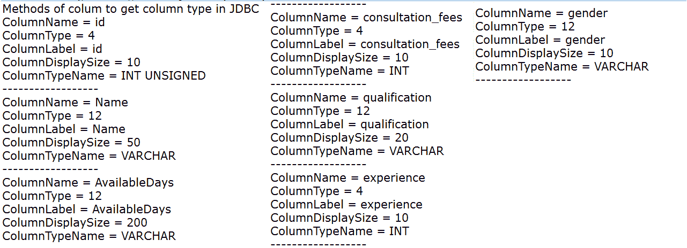

# 如何利用 JDBC 得到表中一列的数据类型？

> 原文:[https://www . geeksforgeeks . org/如何使用 jdbc 获取表的列数据类型/](https://www.geeksforgeeks.org/how-to-get-the-datatype-of-a-column-of-a-table-using-jdbc/)

Java 支持许多数据库，对于每个数据库，我们需要将它们各自的 jar 文件放在构建路径中，以便进行 JDBC 连接。

*   **MySQL**:MySQL-connector-Java-8 . 0 . 22 或类似的不同版本的 MySQL 连接器。在本文中，我们使用的是 mysql-connector-java-8.0.22
*   **SQL Server** : sqljdbc4.jar
*   **Oracle** : ojdbc14.jar
*   **MongoDB** (NoSQL 数据库):mongo-java-driver-3.12.7

首先，需要决定我们使用的是哪个数据库，因此，我们需要添加 jars。对于另一个数据库，如 Progress、Cassandra 等，我们也有 jars，需要将它们包含在构建路径中。针对关系数据库管理系统(MySQL、SQL Server 等)的各种数据处理相关事宜。)我们有一个 java.sql 包。要获取**结果集元数据**对象，我们需要遵循以下步骤。

**1。注册驱动程序**

就数据库而言，情况有所不同。当我们使用 MySQL 时，我们可以通过

```
Class.forName("com.mysql.cj.jdbc.Driver");
or
DriverManager.registerDriver(new com.mysql.cj.jdbc.Driver");
```

**2。获得 MySQL 方式的连接**

*   **test** 是代码中使用的数据库名称。
*   serverTimezone=UTC，如果不提供，我们将有 java.sql.SQLException .服务器时区值 **xxxx** 无法识别或代表多个时区。
*   如果我们想利用时区支持，我们需要通过 serverTimezone 配置属性配置服务器或 JDBC 驱动程序，以使用更具体的时区值。
*   因此，无论是在 MySQL 配置中，我们可以设置，还是像下面这样，我们可以在这里提供凭据是 root/" "即用户名是 root，密码是" "。

> connection connection = drivermanager . getconnection(" JDBC:MySQL://localhost:3306/test？serverTimezone=UTC，" " root " "，" ")；

**3。创建语句对象**

```
Statement st = connection.createStatement();
```

**4。执行查询**

```
String query = "Select * from doctorsdetails";
// Executing the query
ResultSet resultSet = statement.executeQuery(query);
```

**5。获取结果集元数据对象:**

通过调用 getMetaData()方法检索当前结果集的 ResultSetMetadata 对象。下面是 ResultSetMetadata 对象中的方法，它们打印在程序中

*   **int getColumnCount():** 返回一个表的列数。
*   **字符串 getcolumn name(int column number):**返回其索引号作为参数传递的列的名称。
*   **int GetColumnType(int ColumnNumber):**以整数值形式返回列的名称，其索引号作为参数传递。

例如，3 表示 DECIMAL，12 表示 VARCHAR，4 表示 INT。

*   12 表示为 java.sql.Types.VARCHAR
*   4 表示为 java.sql.Types.INTEGER

**下面是 java.sql.Type 的各种数据类型返回的值列表，即 getColumnType()给出了这些结果。**

*   阵列:2003 年
*   Big int: -5
*   二进制:-2
*   位:-7
*   Blob: 2004
*   布尔型:16
*   Char: 1
*   Clob: 2005 年
*   日期:91 年
*   数据链:70
*   小数:3
*   独特:2001 年
*   双人:8 人
*   浮动:6
*   整数:4
*   JavaObject: 2000
*   长 var char: -16
*   Nchar： -15
*   NClob: 2011 年
*   瓦尔查尔:12
*   VarBinary: -3
*   微小 int: -6
*   带时区的时间戳:2014
*   时间戳:93
*   时间:92
*   结构:2002 年
*   SqlXml: 2009
*   斯莫列特:5
*   Rowid: -8
*   参照标示元件:2012
*   参考:2006 年
*   真实:7
*   Nvarchar: -9
*   数字:2
*   Null: 0
*   斯莫列特:5

让我们通过在 MySQL 中创建一个表来检查这一点，并使用 ResultSetMetaData 找到数据类型

让一个名为**doctor 的表格显示 **MySQL** 中 **test** 数据库下的**，

```
CREATE TABLE `doctorsdetails` (
 `id` int(6) unsigned NOT NULL,
 `Name` varchar(50) DEFAULT NULL,
 `AvailableDays` varchar(200) DEFAULT NULL,
 `consultation_fees` int(11) DEFAULT NULL,
 `qualification` varchar(20) DEFAULT NULL,
 `experience` int(11) DEFAULT NULL,
 `gender` varchar(10) DEFAULT NULL,
 PRIMARY KEY (`id`)
) ENGINE=InnoDB DEFAULT CHARSET=latin1;
```

**根据上表， getColumnType()为上表** **的列如下**

<figure class="table">T65T74

| titles for columns | titles for columns | value |
| --- | --- | --- |
| 身份证明（identification） | （同 Internationalorganizations）国际组织 | four |
| name | 可变长字符串 | Twelve |
| Twelve |
| experience | （同 Internationalorganizations）国际组织 | four |
| gender | 可变长字符串 | Twelve |

</figure>

在代码中，让我们使用这些步骤，它们作为注释给出

## Java 语言(一种计算机语言，尤用于创建网站)

```
// Java program to get the column type in JDBC

import java.sql.*;

public class GetColumnTypeInJdbc {

    public static void main(String[] args)
    {
        System.out.println(
            "Methods of column to get column type in JDBC");
        Connection con = null;
        try {
            // We need to have mysql-connector-java-8.0.22
            // or relevant jars in build path of project
            // Class.forName("com.mysql.jdbc.Driver");
            // //Earlier these were supported. If we use ,
            // we will be getting warning messages This
            // driver is the latest one
            // 1\. Register the driver

            Class.forName("com.mysql.cj.jdbc.Driver");

            // 2\. Get the connection
            con = DriverManager.getConnection(
                "jdbc:mysql://localhost:3306/test?serverTimezone=UTC",
                "root", "");
            try {

                // Create statement so that we can execute
                // all of our queries
                // 3\. Create a statement object
                Statement statement = con.createStatement();

                // Query to retrieve records
                String query
                    = "Select * from doctorsdetails";

                // 4\. Executing the query
                ResultSet resultSet
                    = statement.executeQuery(query);

                // 5\. Get the ResultSetMetaData object
                ResultSetMetaData resultSetMetaData
                    = resultSet.getMetaData();

                for (int i = 1;
                     i
                     <= resultSetMetaData.getColumnCount();
                     i++) {
                    System.out.println(
                        "ColumnName = "
                        + resultSetMetaData.getColumnName(
                              i));
                    System.out.println(
                        "ColumnType = "
                        + resultSetMetaData.getColumnType(i)
                        + "   ");
                    System.out.println(
                        "ColumnLabel = "
                        + resultSetMetaData.getColumnLabel(
                              i)
                        + "   ");
                    System.out.println(
                        "ColumnDisplaySize = "
                        + resultSetMetaData
                              .getColumnDisplaySize(i)
                        + "   ");
                    System.out.println(
                        "ColumnTypeName = "
                        + resultSetMetaData
                              .getColumnTypeName(i)
                        + "   ");
                    System.out.println(
                        "------------------");
                }
            }

            // in case of any SQL exceptions
            catch (SQLException s) {
                System.out.println(
                    "SQL statement is not executed!");
            }
        }

        // in case of general exceptions
        // other than SQLException
        catch (Exception e) {
            e.printStackTrace();
        }
        finally {
            // After completing the operations, we
            // need to null resultSet and connection
            resultSet = null;
            con = null;
        }
    }
}
```

在程序执行时，我们将获得如下输出。即类似于上面所示的表格值

