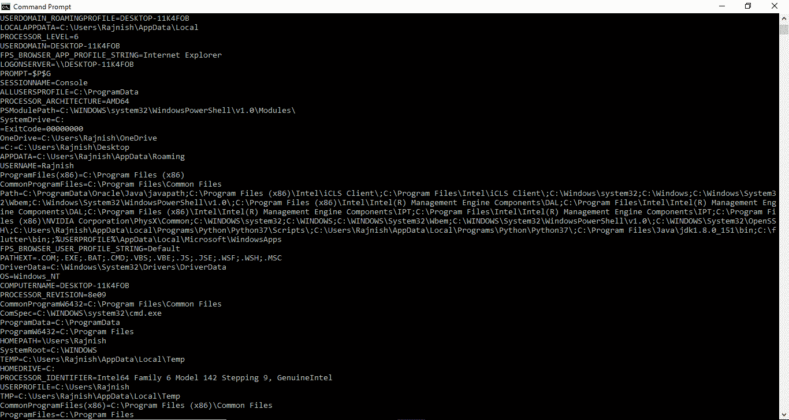
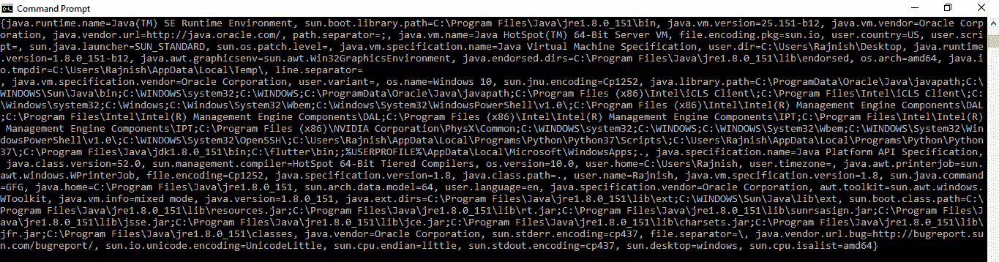

# 如何在 Java 中获取系统属性和环境变量的值？

> 原文:[https://www . geesforgeks . org/如何在 java 中获取系统属性和环境变量的值/](https://www.geeksforgeeks.org/how-to-get-the-value-of-system-property-and-environment-variable-in-java/)

### 如何获取环境变量的值？

Java 中的 [System 类](https://www.geeksforgeeks.org/java-lang-system-class-java/)提供了一个名为 **System.getenv()** 的方法，可以用来获取当前系统中一个环境变量集的值。

**语法:**

```java
public static String getenv(String key);

where key is the Environment variable
whose values we want

```

下面的示例说明了如何使用 System.getenv()获取系统环境变量:

**例 1:获取特定环境变量的值**

```java
// Java program to get the value
// of a specific environment variable
// using System.getenv() method

public class GFG {
    public static void main(String[] args)
    {

        // Get the value of
        // the TEMP environment variable
        System.out.println(System.getenv("TEMP"));

        // Get the value of
        // the OS environment variable
        System.out.println(System.getenv("OS"));

        // Get the value of
        // the JAVA_HOME environment variable
        System.out.println(System.getenv("JAVA_HOME"));
    }
}
```

**输出:**


**例 2:一次获取所有环境变量的值**

```java
// Java program to get the value
// of all environment variables at once
// using System.getenv() method

import java.util.Map;

public class GFG {
    public static void main(String[] args)
    {

        // Get the value of
        // all environment variables at once
        // and store it in Map
        Map<String, String> env
            = System.getenv();

        for (String envName : env.keySet()) {
            System.out.format("%s=%s%n",
                              envName,
                              env.get(envName));
        }
    }
}
```

**输出:**


**注意:**输出将取决于运行上述代码的系统。上面给出了一个示例输出

### 如何获得系统属性的价值？

Java 中的[系统类](https://www.geeksforgeeks.org/java-lang-system-class-java/)有两种方法用来读取系统属性:

*   **[java.lang.System.getProperty(String key):](https://www.geeksforgeeks.org/getproperty-and-getproperties-methods-of-system-class-in-java/)** fetches only those properties – values that you will specify using the key(associated to that particular value that you want).

    **示例:**

    ```java
    // Java Program illustrating the working
    // of getProperty(String key) method

    import java.lang.*;
    import java.util.Properties;

    public class NewClass {
        public static void main(String[] args)
        {
            // Printing Name of the system property
            System.out.println("user.dir: "
                               + System.getProperty(
                                     "user.dir"));

            // Fetches the property set with 'home' key
            System.out.println("home: "
                               + System.getProperty(
                                     "home"));
            // Resulting in Null as no property is present

            // Printing 'name of Operating System'
            System.out.println("os.name: "
                               + System.getProperty(
                                     "os.name"));

            // Printing 'JAVA Runtime version'
            System.out.println("version: "
                               + System.getProperty(
                                     "java.runtime.version"));

            // Printing 'name' property
            System.out.println("name: "
                               + System.getProperty(
                                     "name"));
            // Resulting in Null as no property is present
        }
    }
    ```

    **输出:**

    ```java
    user.dir: /tmp/hsperfdata_bot
    home: null
    os.name: Linux
    version: 1.8.0_101-b13
    name: null

    ```

*   **[java.lang.System.getProperty(String key, String definition):](https://www.geeksforgeeks.org/getproperty-and-getproperties-methods-of-system-class-in-java/)** helps you to create your own key-value sets that you want.

    **示例:**

    ```java
    // Java Program illustrating the working of
    // getProperty(String key, String definition) method

    import java.lang.*;
    import java.util.Properties;

    public class NewClass {
        public static void main(String[] args)
        {

            // Here key = "Hello" and
            // System Property = "Geeks"
            System.out.println("Hello property : "
                               + System.getProperty(
                                     "Hello", "Geeks"));

            // Here key = "Geek" and
            // System Property = "For Geeks"
            System.out.println("System-property :"
                               + System.getProperty(
                                     "System", "For Geeks"));

            // Here key = "Property" and
            // System Property = null
            System.out.println("Property-property :"
                               + System.getProperty(
                                     "Property"));
        }
    }
    ```

    **输出:**

    ```java
    Hello key property : Geeks
    System key property :For Geeks
    Property key property :null

    ```

*   **[java.lang.System.getProperties():](https://www.geeksforgeeks.org/getproperty-and-getproperties-methods-of-system-class-in-java/)** fetches all the properties – values that the JVM on your System gets from the Operating System.

    **示例:**

    ```java
    // Java Program illustrating the working of
    // getProperties() method

    public class GFG {
        public static void main(String[] args)
        {

            System.out.println(System.getProperties())
        }
    }
    ```

    **输出:**
    