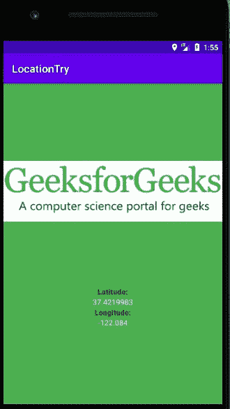
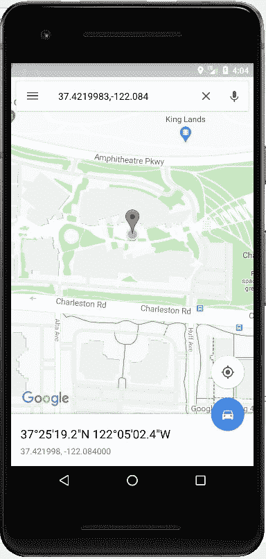

# 如何在安卓中获取用户位置

> 原文:[https://www . geeksforgeeks . org/如何在安卓中获得用户位置/](https://www.geeksforgeeks.org/how-to-get-user-location-in-android/)

安卓系统中的许多应用都使用用户的位置，无论是叫出租车还是送食物和物品。在这里，一个简单的安卓应用程序将返回用户的纬度和经度。一旦知道了纬度和经度，就可以使用以下查询在谷歌地图上看到确切的位置:**https://www.google.com/maps/search/?api=1&查询=，**

> ***注意:**该应用在实际设备上运行完全正常，但可能会在仿真器上显示**错误。所以，请尝试在实际设备上运行它！*

### **接近**

**第一步。获取权限**

由于使用[用户权限](https://www.geeksforgeeks.org/android-how-to-request-permissions-in-android-application/)是一个高度隐私的问题，首先通过请求用户使用他们的位置来获得用户的权限。从安卓 6.0(棉花糖)开始，运行时权限的概念被引入，因此同样的概念将被用于获取权限。以下任何权限都可以用于此目的:

**ACCESS _ rough _ LOCATION:**提供城市街区内的定位精度。

**ACCESS_FINE_LOCATION:** 它提供了更精确的位置。要做到这一点，它需要做一些繁重的工作，因此建议仅在我们需要准确位置时使用它。

如果应用在后台运行时需要**访问用户位置，我们需要在上述权限的基础上增加以下权限:**

我们需要在 [AndroidManifest.xml](https://www.geeksforgeeks.org/application-manifest-file-android/) 中添加所有这些权限。要访问此文件，请选择您的项目视图为 Android，然后单击:

> **app** - > **舱单**->**androidmanifest . XML**。

添加所有权限后， **AndroidManifest.xml** 文件是这样的:

## 可扩展标记语言

```java
<?xml version="1.0" encoding="utf-8"?>
<manifest xmlns:android="http://schemas.android.com/apk/res/android"
    package="com.example.getuserlocation">

    <uses-permission android:name="android.permission.ACCESS_COARSE_LOCATION" />
    <uses-permission android:name="android.permission.ACCESS_FINE_LOCATION" />
    <uses-permission android:name="android.permission.ACCESS_BACKGROUND_LOCATION" />

    <application
        android:allowBackup="true"
        android:icon="@mipmap/ic_launcher"
        android:label="@string/app_name"
        android:roundIcon="@mipmap/ic_launcher_round"
        android:supportsRtl="true"
        android:theme="@style/Theme.GetUserLocation">
        <activity android:name=".MainActivity">
            <intent-filter>
                <action android:name="android.intent.action.MAIN" />

                <category android:name="android.intent.category.LAUNCHER" />
            </intent-filter>
        </activity>
    </application>

</manifest>
```

此外，由于谷歌的游戏服务将用于访问设备的位置，请将其添加到“T2”版本的依赖项中。grade le(app)文件:

> 实现' com . Google . Android . GMS:play-services-location:17 . 0 . 0 '
> 
> testimplementation ' JUnit:JUnit:4.12 '
> 
> andidstimulation ' andidx . test . ext:JUnit:1 . 1 . 1 '
> 
> androidTestImplementation ' androidx . test . espresso:espresso-core:3 . 2 . 0 '

**第二步。设计布局**
由于该应用相当简单，它将只包含**主活动**，因此只有一个主布局。在布局中，添加一个图像视图和两个文本视图，它们将显示用户的纬度和经度。将要显示的纬度和经度将从我们接下来将要讨论的主要活动的逻辑中返回。以下是 **activity_main.xml** 的外观:

## 可扩展标记语言

```java
<?xml version="1.0" encoding="utf-8"?>
<LinearLayout
    xmlns:android="http://schemas.android.com/apk/res/android"
    android:layout_width="match_parent"
    android:layout_height="match_parent"
    android:background="#4caf50"
    android:gravity="center"
    android:orientation="vertical">

    <ImageView
        android:layout_width="wrap_content"
        android:layout_height="wrap_content"
        android:paddingBottom="120dp"
        android:src="@drawable/gfgimage" />

    <TextView
        android:layout_width="wrap_content"
        android:layout_height="wrap_content"
        android:fontFamily="sans-serif-black"
        android:text="Latitude:" />

    <TextView
        android:id="@+id/latTextView"
        android:layout_width="wrap_content"
        android:layout_height="wrap_content"
        android:text="Latitude will be here! "
        android:textColor="#f5f5f5" />

    <TextView
        android:layout_width="wrap_content"
        android:layout_height="wrap_content"
        android:fontFamily="sans-serif-black"
        android:text="Longitude:" />

    <TextView
        android:id="@+id/lonTextView"
        android:layout_width="wrap_content"
        android:layout_height="wrap_content"
        android:text="Longitude will be here! "
        android:textColor="#f5f5f5" />

</LinearLayout>
```

**输出:**


**第三步。书写逻辑**

*   为了研究我们应用程序的主要逻辑，我们将遵循以下要点:
    *   检查我们请求的权限是否已启用。
    *   否则请求权限。
    *   如果权限被接受并且位置被启用，获取用户的最后位置。
*   为了获取用户的最后位置，使用 Java 公共类**fusedlocationprovidercclient**。它实际上是一种定位服务，结合了**全球定位系统定位**和**网络定位**，以实现电池消耗和精度之间的平衡。当用户在室内时，全球定位系统定位用于提供精度，网络定位用于获取位置。
*   结合**fusedlocationprovidercclient**， **LocationRequest** 公共类用于获取最后一个已知位置。在这个**位置请求**对象上，设置多种方法，例如设置位置的精确程度或间隔时间，请求位置。
*   如果需要非常高的精度，使用**优先级 _ 高精度**作为**设定优先级(int)** 方法的参数。对于城市级精度(低精度)，使用**优先级 _ 低功率**。
*   一旦**位置请求**对象准备好，将其设置在**融合位置提供者客户端**对象上，以获得最终位置。

现在我们来看看**MainActivity.java**文件。

## Java 语言(一种计算机语言，尤用于创建网站)

```java
import android.Manifest;
import android.annotation.SuppressLint;
import android.content.Context;
import android.content.Intent;
import android.content.pm.PackageManager;
import android.location.Location;
import android.location.LocationManager;
import android.os.Bundle;
import android.os.Looper;
import android.provider.Settings;
import android.widget.TextView;
import android.widget.Toast;

import androidx.annotation.NonNull;
import androidx.appcompat.app.AppCompatActivity;
import androidx.core.app.ActivityCompat;

import com.google.android.gms.location.FusedLocationProviderClient;
import com.google.android.gms.location.LocationCallback;
import com.google.android.gms.location.LocationRequest;
import com.google.android.gms.location.LocationResult;
import com.google.android.gms.location.LocationServices;
import com.google.android.gms.tasks.OnCompleteListener;
import com.google.android.gms.tasks.Task;

public class MainActivity extends AppCompatActivity {

    // initializing
    // FusedLocationProviderClient
    // object
    FusedLocationProviderClient mFusedLocationClient;

    // Initializing other items
    // from layout file
    TextView latitudeTextView, longitTextView;
    int PERMISSION_ID = 44;

    @Override
    protected void onCreate(Bundle savedInstanceState) {
        super.onCreate(savedInstanceState);
        setContentView(R.layout.activity_main);

        latitudeTextView = findViewById(R.id.latTextView);
        longitTextView = findViewById(R.id.lonTextView);

        mFusedLocationClient = LocationServices.getFusedLocationProviderClient(this);

        // method to get the location
        getLastLocation();
    }

    @SuppressLint("MissingPermission")
    private void getLastLocation() {
        // check if permissions are given
        if (checkPermissions()) {

            // check if location is enabled
            if (isLocationEnabled()) {

                // getting last
                // location from
                // FusedLocationClient
                // object
                mFusedLocationClient.getLastLocation().addOnCompleteListener(new OnCompleteListener<Location>() {
                    @Override
                    public void onComplete(@NonNull Task<Location> task) {
                        Location location = task.getResult();
                        if (location == null) {
                            requestNewLocationData();
                        } else {
                            latitudeTextView.setText(location.getLatitude() + "");
                            longitTextView.setText(location.getLongitude() + "");
                        }
                    }
                });
            } else {
                Toast.makeText(this, "Please turn on" + " your location...", Toast.LENGTH_LONG).show();
                Intent intent = new Intent(Settings.ACTION_LOCATION_SOURCE_SETTINGS);
                startActivity(intent);
            }
        } else {
            // if permissions aren't available,
            // request for permissions
            requestPermissions();
        }
    }

    @SuppressLint("MissingPermission")
    private void requestNewLocationData() {

        // Initializing LocationRequest
        // object with appropriate methods
        LocationRequest mLocationRequest = new LocationRequest();
        mLocationRequest.setPriority(LocationRequest.PRIORITY_HIGH_ACCURACY);
        mLocationRequest.setInterval(5);
        mLocationRequest.setFastestInterval(0);
        mLocationRequest.setNumUpdates(1);

        // setting LocationRequest
        // on FusedLocationClient
        mFusedLocationClient = LocationServices.getFusedLocationProviderClient(this);
        mFusedLocationClient.requestLocationUpdates(mLocationRequest, mLocationCallback, Looper.myLooper());
    }

    private LocationCallback mLocationCallback = new LocationCallback() {

        @Override
        public void onLocationResult(LocationResult locationResult) {
            Location mLastLocation = locationResult.getLastLocation();
            latitudeTextView.setText("Latitude: " + mLastLocation.getLatitude() + "");
            longitTextView.setText("Longitude: " + mLastLocation.getLongitude() + "");
        }
    };

    // method to check for permissions
    private boolean checkPermissions() {
        return ActivityCompat.checkSelfPermission(this, Manifest.permission.ACCESS_COARSE_LOCATION) == PackageManager.PERMISSION_GRANTED && ActivityCompat.checkSelfPermission(this, Manifest.permission.ACCESS_FINE_LOCATION) == PackageManager.PERMISSION_GRANTED;

        // If we want background location
        // on Android 10.0 and higher,
        // use:
        // ActivityCompat.checkSelfPermission(this, Manifest.permission.ACCESS_BACKGROUND_LOCATION) == PackageManager.PERMISSION_GRANTED
    }

    // method to request for permissions
    private void requestPermissions() {
        ActivityCompat.requestPermissions(this, new String[]{
                Manifest.permission.ACCESS_COARSE_LOCATION,
                Manifest.permission.ACCESS_FINE_LOCATION}, PERMISSION_ID);
    }

    // method to check
    // if location is enabled
    private boolean isLocationEnabled() {
        LocationManager locationManager = (LocationManager) getSystemService(Context.LOCATION_SERVICE);
        return locationManager.isProviderEnabled(LocationManager.GPS_PROVIDER) || locationManager.isProviderEnabled(LocationManager.NETWORK_PROVIDER);
    }

    // If everything is alright then
    @Override
    public void
    onRequestPermissionsResult(int requestCode, @NonNull String[] permissions, @NonNull int[] grantResults) {
        super.onRequestPermissionsResult(requestCode, permissions, grantResults);

        if (requestCode == PERMISSION_ID) {
            if (grantResults.length > 0 && grantResults[0] == PackageManager.PERMISSION_GRANTED) {
                getLastLocation();
            }
        }
    }

    @Override
    public void onResume() {
        super.onResume();
        if (checkPermissions()) {
            getLastLocation();
        }
    }
}
```

### **输出:**



**注意:**为了在谷歌地图中看到这个位置，只需将查询表述为:

> https://www.google.com/maps/search/?api=1&query=37.4219983,-122.084

这个会是这样的:

