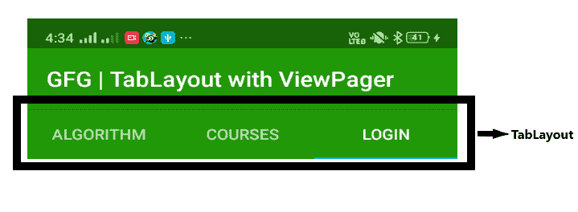

# 如何使用 ViewPager 和 Fragments

在安卓中实现一个 TabLayout

> 原文:[https://www . geeksforgeeks . org/如何使用视图页面和片段实现安卓中的一个表布局/](https://www.geeksforgeeks.org/how-to-implement-a-tablayout-in-android-using-viewpager-and-fragments/)

在本文中，我们将学习如何在应用程序中使用**视图页面**添加 [**表格布局**](https://developer.android.com/reference/com/google/android/material/tabs/TabLayout) 。TabLayout 提供了显示选项卡的水平布局。如果使用 **TabLayout** ，那么与它一起使用的还有 [**Fragment**](https://practice.geeksforgeeks.org/problems/what-is-fragment-in-android) ，因为片段重量轻，如果添加更多的片段，app 可以在单个屏幕上拥有更多的功能。每当用户点击标签时，它将导致一个片段到另一个片段的事务。可视寻呼机用于在标签之间滑动。 **WhatsApp** 、**脸书**等就是一个很好的用 ViewPager 进行 TabLayout 的例子。这就是**表格布局**的样子。

[](https://media.geeksforgeeks.org/wp-content/uploads/20200627044415/Untitled189-1.png)

**进场:**

1.  创建一个**算法片段**右键单击 java 包，
    选择新建- >片段- >选择**片段(空白)**。
2.  按照上述步骤进行**课程片段**和**逻辑片段**。
3.  现在在 **AlgorithmFragment.xml** 文件中添加以下代码。这里，布局中添加了一个文本视图。
4.  现在在 **CourseFragment.xml** 文件中添加以下代码。这里，布局中添加了一个文本视图。
5.  现在在 **LoginFragment.xml** 文件中添加以下代码。这里，布局中添加了一个文本视图。
6.  现在通过扩展**片段页面适配器**类为我们的视图页面创建一个适配器。这节课我们将复习三种方法**getItem()****getCount()**和 **getPageTitle()** 。getItem 方法给出相对于位置的片段，getCount 方法给出存在的片段总数，getPageTitle 方法给出片段的标题。
7.  在**MainActivity.java**文件中添加以下代码。在这个文件中，我们设置了我们的适配器，并用可视寻呼机连接我们的表格输出。

    ## algorithm fragment . XML

    ```java
    <?xml version="1.0" encoding="utf-8"?>
    <FrameLayout
        xmlns:android="http://schemas.android.com/apk/res/android"
        xmlns:tools="http://schemas.android.com/tools"
        android:layout_width="match_parent"
        android:layout_height="match_parent"
        tools:context=".AlgorithmFragment">

        <TextView
            android:textColor="@color/colorPrimary"
            android:textSize="30sp"
            android:gravity="center"
            android:layout_width="match_parent"
            android:layout_height="match_parent"
            android:text="Learn Algorithm\nVisit GFG" />

    </FrameLayout>
    ```

    ## course fragments。

    ```java
    <?xml version="1.0" encoding="utf-8"?>
    <FrameLayout
        xmlns:android="http://schemas.android.com/apk/res/android"
        xmlns:tools="http://schemas.android.com/tools"
        android:layout_width="match_parent"
        android:layout_height="match_parent"
        tools:context=".CourseFragment">

        <TextView
            android:textColor="@color/colorPrimary"
            android:textSize="30sp"
            android:gravity="center"
            android:layout_width="match_parent"
            android:layout_height="match_parent"
            android:text="Select Course by GFG" />

    </FrameLayout>
    ```

    ## loginfragment . XML

    ```java
    <?xml version="1.0" encoding="utf-8"?>
    <FrameLayout
        xmlns:android="http://schemas.android.com/apk/res/android"
        xmlns:tools="http://schemas.android.com/tools"
        android:layout_width="match_parent"
        android:layout_height="match_parent"
        tools:context=".LoginFragment">

        <TextView
            android:textColor="@color/colorPrimary"
            android:textSize="30sp"
            android:gravity="center"
            android:layout_width="match_parent"
            android:layout_height="match_parent"
            android:text="GFG Login Portal" />

    </FrameLayout>
    ```

    ## viewpragadapter。爪哇

    ```java
    package org.geeksforgeeks.gfgtablayout;

    import androidx.annotation.NonNull;
    import androidx.fragment.app.Fragment;
    import androidx.fragment.app.FragmentManager;
    import androidx.fragment.app.FragmentPagerAdapter;

    public class ViewPagerAdapter
     extends FragmentPagerAdapter {

        public ViewPagerAdapter(
    @NonNull FragmentManager fm)
        {
            super(fm);
        }

        @NonNull
        @Override
        public Fragment getItem(int position)
        {
            Fragment fragment = null;
            if (position == 0)
                fragment = new AlgorithmFragment();
            else if (position == 1)
                fragment = new CourseFragment();
            else if (position == 2)
                fragment = new LoginFragment();

            return fragment;
        }

        @Override
        public int getCount()
        {
            return 3;
        }

        @Override
        public CharSequence getPageTitle(int position)
        {
            String title = null;
            if (position == 0)
                title = "Algorithm";
            else if (position == 1)
                title = "Courses";
            else if (position == 2)
                title = "Login";
            return title;
        }
    }
    ```

    ## MainActivity.java

    T4

**输出:**

<video class="wp-video-shortcode" id="video-441550-1" width="320" height="400" preload="metadata" controls=""><source type="video/mp4" src="https://media.geeksforgeeks.org/wp-content/uploads/20200627043138/Record_2020-06-27-04-30-05_f319ad8bc03afd3ba9440f7b04e927961.mp4?_=1">[https://media.geeksforgeeks.org/wp-content/uploads/20200627043138/Record_2020-06-27-04-30-05_f319ad8bc03afd3ba9440f7b04e927961.mp4](https://media.geeksforgeeks.org/wp-content/uploads/20200627043138/Record_2020-06-27-04-30-05_f319ad8bc03afd3ba9440f7b04e927961.mp4)</video>