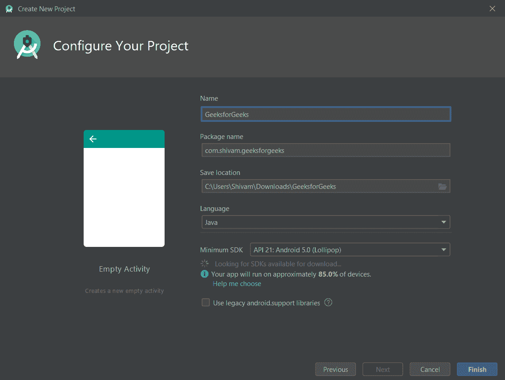
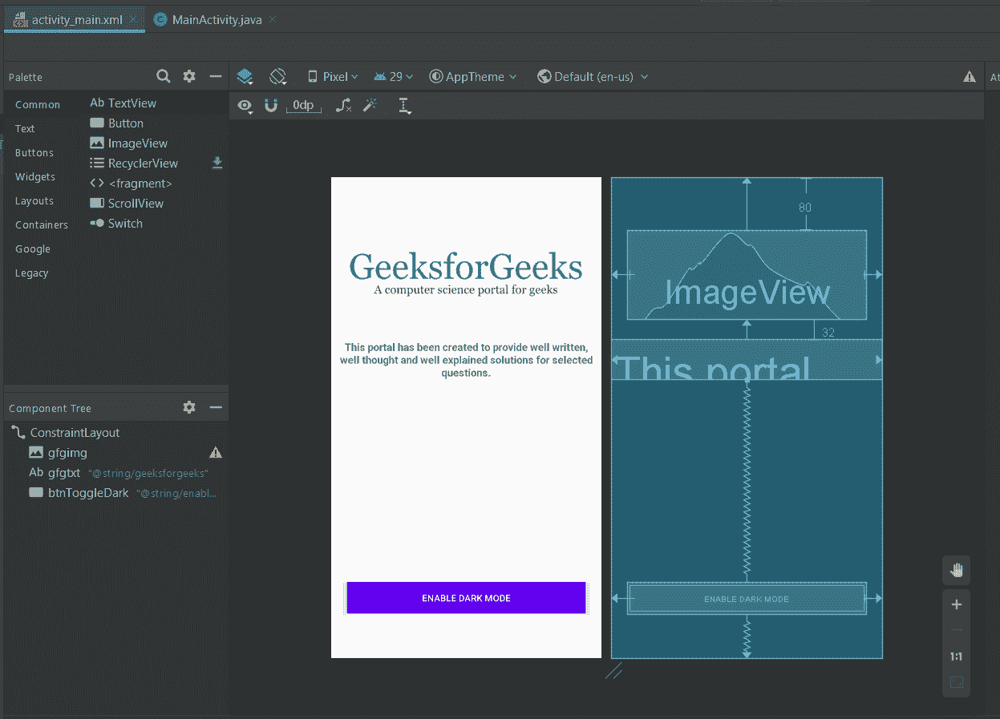
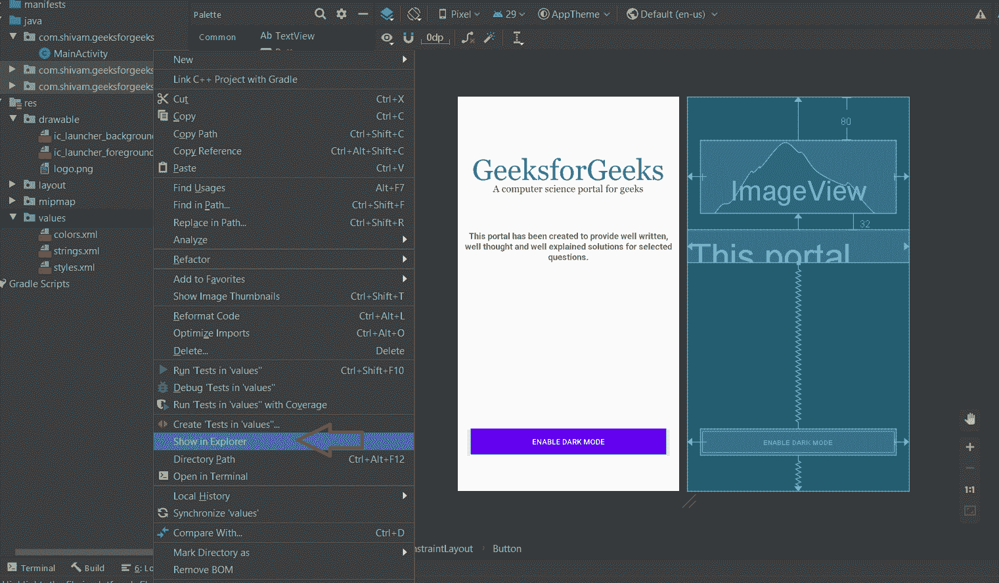
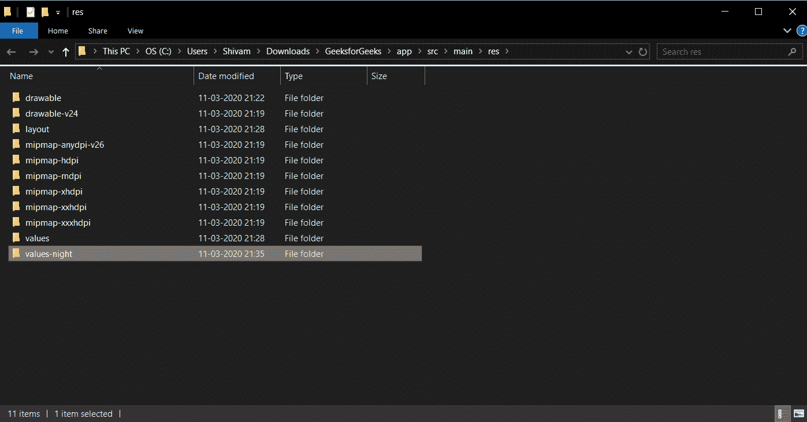
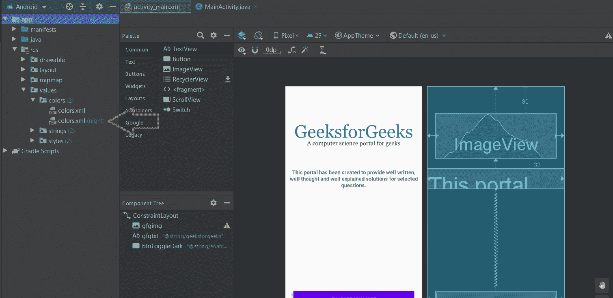
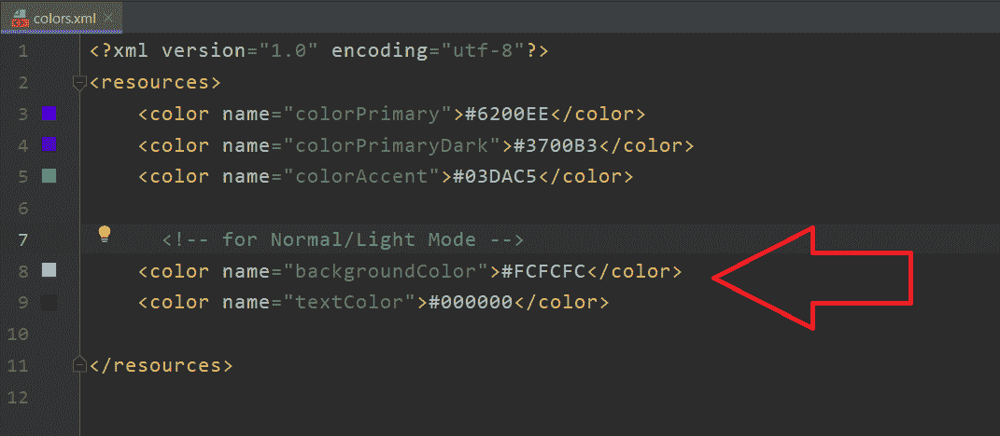
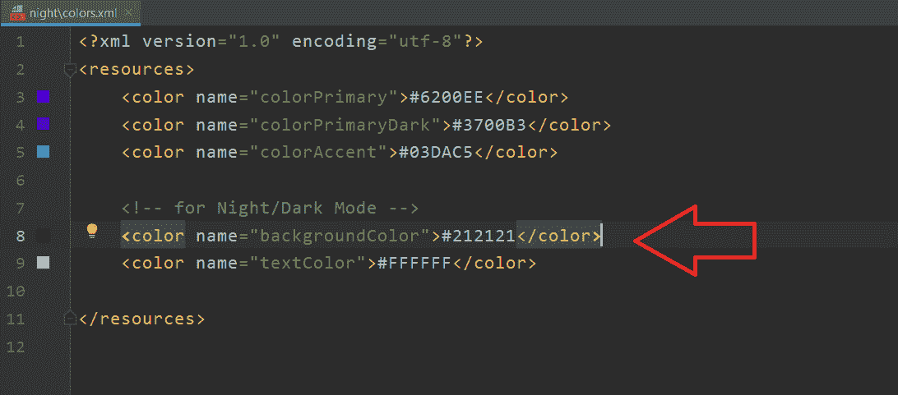
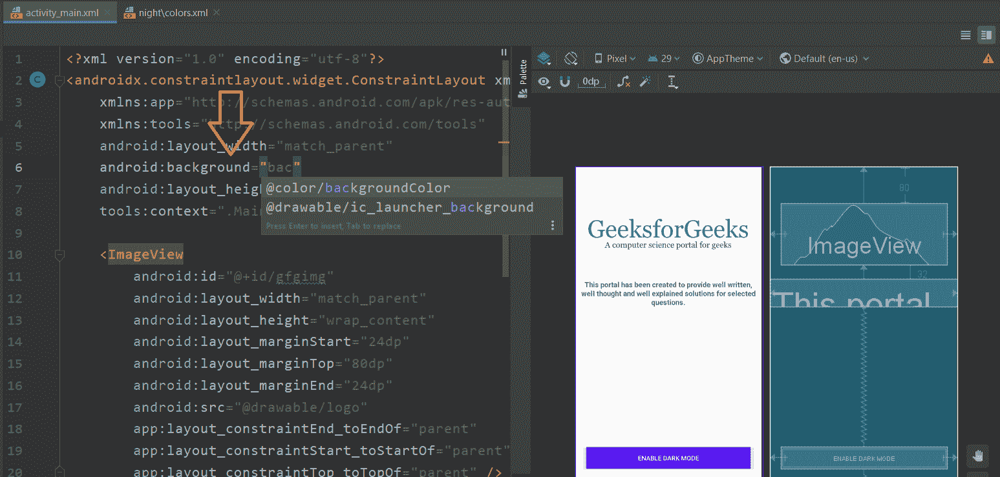
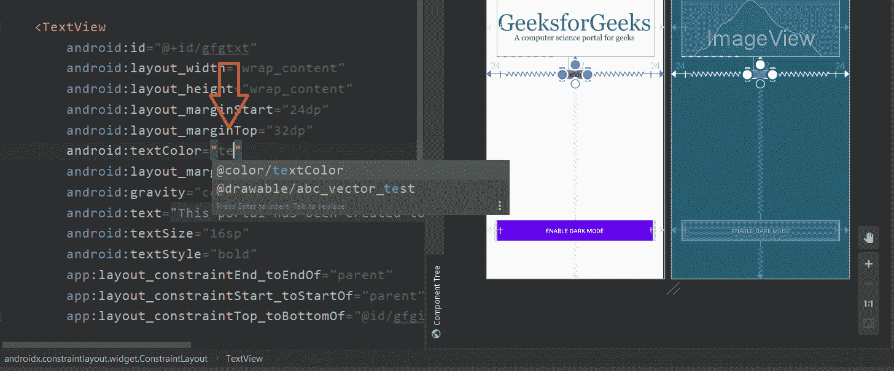
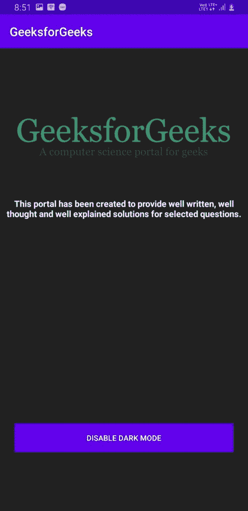

# 如何在安卓 app 中实现暗夜模式

> 原文:[https://www . geeksforgeeks . org/如何实现-安卓中的暗夜模式-app/](https://www.geeksforgeeks.org/how-to-implement-dark-night-mode-in-android-app/)

**亮-暗配色方案**，也称为**暗模式**，是一种补充模式，使用的配色方案是网页内容显示在暗背景上。这种配色方案减少了屏幕发出的光，增强了可读性。切换到黑暗模式可以让网站用户在任何时候都可以转向一种对眼睛友好且节省资源的设计。

黑暗模式或夜间模式最近一直备受关注，因为谷歌已经将其纳入其最新的[安卓版本](https://www.geeksforgeeks.org/how-to-get-the-android-version-of-your-device-using-javascript/)，即**安卓 Q(API Level 29)** ，随后越来越多的应用开始支持黑暗模式，因为它有许多好处:

*   减少电池/电源使用。*   提高低视力用户和对强光敏感的用户的可见度。*   Makes it easier to use device in a low-light.

    ### 如何给你的安卓应用增加黑暗模式？

    1.  创建[新安卓项目](https://www.geeksforgeeks.org/android-how-to-create-start-a-new-project-in-android-studio/)
        [](https://media.geeksforgeeks.org/wp-content/uploads/20200311212041/dark11.png)
    2.  [创建布局](https://www.geeksforgeeks.org/android-ui-layouts/)并添加一个按钮或开关来切换开/关黑暗模式
        [](https://media.geeksforgeeks.org/wp-content/uploads/20200311213018/dark2.png)
    3.  现在右键单击值并选择在浏览器中显示选项
        [](https://media.geeksforgeeks.org/wp-content/uploads/20200311213357/dark3.png)
    4.  现在复制价值观文件夹并将其粘贴到同一目录中，并将其重命名为“价值观-夜晚”
        [](https://media.geeksforgeeks.org/wp-content/uploads/20200311213641/dark4.png)
    5.  现在你会看到 2 个 colors.xml 文件，正常的一个和一个用(night)写给它的
        [](https://media.geeksforgeeks.org/wp-content/uploads/20200312193145/dark5.png)
    6.  现在将这些颜色添加到普通/灯光模式
        [](https://media.geeksforgeeks.org/wp-content/uploads/20200312194435/dark6.png) 的 colors.xml 中
    7.  并将这些颜色添加到 colors . XML(night)
        [](https://media.geeksforgeeks.org/wp-content/uploads/20200312194608/dark7.png)
    8.  给你的主布局添加背景色
        [](https://media.geeksforgeeks.org/wp-content/uploads/20200312202845/dark8.png)
    9.  将文本颜色添加到您的文本视图的
        [](https://media.geeksforgeeks.org/wp-content/uploads/20200312202940/dark9.png)
    10.  现在只需使用**appcompatdelement . setdefaultnightmode(appcompatdelement。MODE_NIGHT_YES)**
        如下图

        ```java
        public class MainActivity
            extends AppCompatActivity {

            private Button btnToggleDark;

            @Override
            protected void onCreate(
                Bundle savedInstanceState)
            {
                super.onCreate(savedInstanceState);
                setContentView(R.layout.activity_main);

                btnToggleDark
                    = findViewById(R.id.btnToggleDark);

                btnToggleDark.setOnClickListener(
                    new View.OnClickListener() {
                        @Override
                        public void onClick(View view)
                        {
                            AppCompatDelegate
                                .setDefaultNightMode(
                                    AppCompatDelegate
                                        .MODE_NIGHT_YES);
                        }
                    });
            }
        }
        ```

    11.  保存应用程序的状态，以便当用户在应用暗/亮模式后重新打开应用程序时，该模式会保留。我们将使用[共享引用](https://www.geeksforgeeks.org/shared-preferences-in-android-with-examples/)来保存应用程序

        ```java
        public class MainActivity
            extends AppCompatActivity {

            private Button btnToggleDark;

            @SuppressLint("SetTextI18n")
            @Override
            protected void onCreate(
                Bundle savedInstanceState)
            {
                super.onCreate(savedInstanceState);
                setContentView(R.layout.activity_main);
                btnToggleDark
                    = findViewById(R.id.btnToggleDark);

                // Saving state of our app
                // using SharedPreferences
                SharedPreferences sharedPreferences
                    = getSharedPreferences(
                        "sharedPrefs", MODE_PRIVATE);
                final SharedPreferences.Editor editor
                    = sharedPreferences.edit();
                final boolean isDarkModeOn
                    = sharedPreferences
                          .getBoolean(
                              "isDarkModeOn", false);

                // When user reopens the app
                // after applying dark/light mode
                if (isDarkModeOn) {
                    AppCompatDelegate
                        .setDefaultNightMode(
                            AppCompatDelegate
                                .MODE_NIGHT_YES);
                    btnToggleDark.setText(
                        "Disable Dark Mode");
                }
                else {
                    AppCompatDelegate
                        .setDefaultNightMode(
                            AppCompatDelegate
                                .MODE_NIGHT_NO);
                    btnToggleDark
                        .setText(
                            "Enable Dark Mode");
                }

                btnToggleDark.setOnClickListener(
                    new View.OnClickListener() {

                        @Override
                        public void onClick(View view)
                        {
                            // When user taps the enable/disable
                            // dark mode button
                            if (isDarkModeOn) {

                                // if dark mode is on it
                                // will turn it off
                                AppCompatDelegate
                                    .setDefaultNightMode(
                                        AppCompatDelegate
                                            .MODE_NIGHT_NO);
                                // it will set isDarkModeOn
                                // boolean to false
                                editor.putBoolean(
                                    "isDarkModeOn", false);
                                editor.apply();

                                // change text of Button
                                btnToggleDark.setText(
                                    "Enable Dark Mode");
                            }
                            else {

                                // if dark mode is off
                                // it will turn it on
                                AppCompatDelegate
                                    .setDefaultNightMode(
                                        AppCompatDelegate
                                            .MODE_NIGHT_YES);

                                // it will set isDarkModeOn
                                // boolean to true
                                editor.putBoolean(
                                    "isDarkModeOn", true);
                                editor.apply();

                                // change text of Button
                                btnToggleDark.setText(
                                    "Disable Dark Mode");
                            }
                        }
                    });
            }
        }
        ```

        的状态

    **输出:**
    [](https://media.geeksforgeeks.org/wp-content/uploads/20200312210758/gfgDarkMode.jpg)