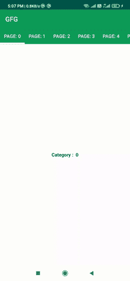

# 如何在安卓系统中实现动态表布局？

> 原文:[https://www . geeksforgeeks . org/how-implementation-dynamic-tabliayout-in-Android/](https://www.geeksforgeeks.org/how-to-implement-dynamic-tablayout-in-android/)

在本文中，我们将了解如何在应用程序中添加带有可视寻呼机的动态表格布局。TabLayout 提供了显示选项卡的水平布局。这里我们将只指定我们想要的标签数量。WhatsApp、脸书等就是一个很好的例子。下面给出了一个 GIF 示例，来了解一下我们将在本文中做什么。注意，我们将使用 **Java** 语言来实现这个项目。



### **分步实施**

**第一步:创建新项目**

要在安卓工作室创建新项目，请参考[如何在安卓工作室创建/启动新项目](https://www.geeksforgeeks.org/android-how-to-create-start-a-new-project-in-android-studio/)。注意选择 **Java** 作为编程语言。

**第二步:添加依赖关系**

导航到**渐变脚本>构建.渐变(模块:应用)**，并在依赖项部分添加以下依赖项。

> 实现' com . Android . support:design:26 . 1 . 0 '

在这个项目中，我们正在**创建**这些文件:

*   一个名为**的 Java 文件**
*   一个名为 **DynamicFragment** 的片段
*   一个活动名称**动态活动**

**步骤 3:使用 DynamicFragmentAdapter.java 文件**

转到 **DynamicFragmentAdapter** 。 **java** 文件并参考以下代码。

```java
// returnthe mNumOfTabs
@Override
public int getCount() {
    return mNumOfTabs;
}
```

下面是 **DynamicFragmentAdapter** 的代码。 **java** 文件。

## Java 语言(一种计算机语言，尤用于创建网站)

```java
import android.os.Bundle;

import androidx.fragment.app.Fragment;
import androidx.fragment.app.FragmentManager;
import androidx.fragment.app.FragmentStatePagerAdapter;

public class DynamicFragmentAdapter extends FragmentStatePagerAdapter {
    private int mNumOfTabs;

    DynamicFragmentAdapter(FragmentManager fm, int NumOfTabs) {
        super(fm);
        this.mNumOfTabs = NumOfTabs;
    }

    // get the current item with position number
    @Override
    public Fragment getItem(int position) {
        Bundle b = new Bundle();
        b.putInt("position", position);
        Fragment frag = DynamicFragment.newInstance();
        frag.setArguments(b);
        return frag;
    }

    // get total number of tabs
    @Override
    public int getCount() {
        return mNumOfTabs;
    }
}
```