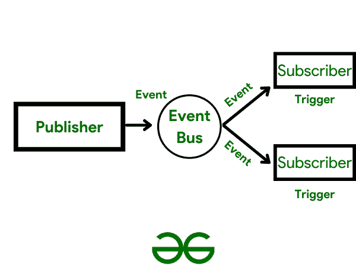

# 如何用 RxJava–RxBus 实现事件总线？

> 原文:[https://www . geesforgeks . org/how-implement-event bus-with-rxjava-rxbus/](https://www.geeksforgeeks.org/how-to-implement-eventbus-with-rxjava-rxbus/)

在 RxJava 之前，我们使用像 Otto、EventBus、startActivityForResult Intent 等总线库来代表当前作业更新其他片段。假设我们开始了第一个活动，然后是另一个，然后是另一个，以此类推，直到第四个活动在前台，另外三个活动在后台。如果我们从前台活动进行任何种类的更改，然后返回后台活动，再次加载数据，用新数据刷新 UI，我们就不再需要这样做；我们不再需要向服务器提出任何进一步的请求。只需创建一个 RxBus 事件，并在您希望收听和更新用户界面的任何地方收听。

**当我们使用 RxJava 实现 EventBus 范式时，我们称之为 RxBus。**

> **注**:请记住这只是一个例子&你一定很熟悉 RxJava 中的主语。



图一。了解 RxJava–RxBus

不用多说，让我们从创建 RxBus 开始。

### 逐步实施

**步骤#1:创建 RxBus**

第一步是创建一个 RXBus，通过它我们将驱动所有的 UI 更改，我们称之为 GfgRxGfgSampleBus()，通过这个，我们可以访问并进行相应的更改。

## Java 语言(一种计算机语言，尤用于创建网站)

```java
public class GfgRxGfgSampleBus {
    public GfgRxGfgSampleBus() {
    }
    private CoursePublications<Object> gfgSampleBus = CoursePublications.create();
    public void send(Object o) {
        gfgSampleBus.onNext(o);
    }
    public Observable<Object> toObservable() {
        return gfgSampleBus;
    }
}
```

现在，我们将在我们的应用程序类或任何其他地方构造一个 RxBus Singleton(单实例)，如:

**步骤#2:在应用程序中创建单例**

下一步是创建一个 Singelton 应用程序，通过这个用 Java 编写的应用程序，我们可以访问上一步创建的 Rx 总线。

## Java 语言(一种计算机语言，尤用于创建网站)

```java
public class GfgSampleApp extends Application {
    private RxSampleBus sampleBus;
    // Declaring an object
    @Override
    public void onCreate() {
        super.onCreate();
        sampleBus = new RxSampleBus();
    }

    public RxSampleBus sampleBus() {
        return sampleBus;
    }
}
```

因此，我们现在可以从任何地方访问 RxBus。我们可以报名参加任何班级的活动。这让我们想到:

**步骤#3:访问注册事件**

现在，我们将访问我们在上一步中创建的注册事件，然后使用接收总线驱动我们需要的用户界面更改，使用一个消费对象，我们将使其成为一个类型事件，只需遵循以下步骤:

## Java 语言(一种计算机语言，尤用于创建网站)

```java
((SampleGfGApp) getApplication())
        .sampleBus()
        .toObservable()
        .subscribe(new Consumer<Object>() {
            @Override
            public void accept(Object gfgObject) throws Exception {
                if (gfgObject instanceof EventTypeOne) {
                    Logger.d("GfG Articles are the best One");
                } else if (gfgObject instanceof EventTypeTwo) {
                    Logger.d("GfG Articles are the best Two");
            }
      }
});
```

### 结论

最后，我们有 RxJava 和 RxBus 的事件总线模式。但是，如果有问题，它将终止，因此检查 [RxRelay](https://www.baeldung.com/rx-relay) 以避免这种情况。