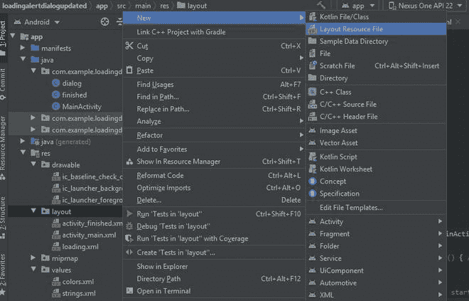

# 如何在安卓系统中实现加载 AlertDialog？

> 原文:[https://www . geesforgeks . org/如何实现加载-alertdialog-in-android/](https://www.geeksforgeeks.org/how-to-implement-loading-alertdialog-in-android/)

**AlertDialog** 定义为当用户执行或提交某个动作时，向用户显示特定消息的小窗口。在本文中，我们将构建一个简单的 android 应用程序，在其中我们将学习如何实现 Loading AlertDialog，这意味着每当用户点击提交按钮时，它都会显示一个带有 loading ProgressBar 的对话框和一条消息，请稍候，过了一段时间后，它会被关闭并显示一条消息。下面给出一个 GIF 示例，了解一下我们在本文中要做什么。注意，我们将使用 **Java** 语言来实现这个项目。

<video class="wp-video-shortcode" id="video-672755-1" width="640" height="360" preload="metadata" controls=""><source type="video/mp4" src="https://media.geeksforgeeks.org/wp-content/uploads/20210902135501/WhatsApp-Video-2021-09-02-at-1.42.17-PM.mp4?_=1">[https://media.geeksforgeeks.org/wp-content/uploads/20210902135501/WhatsApp-Video-2021-09-02-at-1.42.17-PM.mp4](https://media.geeksforgeeks.org/wp-content/uploads/20210902135501/WhatsApp-Video-2021-09-02-at-1.42.17-PM.mp4)</video>

### **分步实施**

**第一步:创建新项目**

要在安卓工作室创建新项目，请参考[如何在安卓工作室创建/启动新项目](https://www.geeksforgeeks.org/android-how-to-create-start-a-new-project-in-android-studio/)。注意选择 **Java** 作为编程语言。

**步骤 2:使用 activity_main.xml 文件**

在这一步中，我们将设计我们的 **activity_main.xml.** 这些是我们将添加到我们的 activity_main.xml 中的以下内容

*   带有极客符号的图像视图。
*   两个[编辑文本](https://www.geeksforgeeks.org/working-with-the-edittext-in-android/)一个用于用户名，一个用于密码字段
*   带有提交文本的[按钮](https://www.geeksforgeeks.org/button-in-kotlin/)。

导航到 **app > res >布局> activity_main.xml** 并将下面的代码添加到该文件中。下面是**activity _ main . XML**文件的代码。

## 可扩展标记语言

```
<?xml version="1.0" encoding="utf-8"?>
<androidx.constraintlayout.widget.ConstraintLayout 
    xmlns:android="http://schemas.android.com/apk/res/android"
    xmlns:app="http://schemas.android.com/apk/res-auto"
    xmlns:tools="http://schemas.android.com/tools"
    android:layout_width="match_parent"
    android:layout_height="match_parent"
    tools:context=".MainActivity">

    <Button
        android:id="@+id/button"
        android:layout_width="wrap_content"
        android:layout_height="wrap_content"
        android:layout_marginBottom="276dp"
        android:text="SUBMIT"
        android:textColor="#0f9d58"
        android:textStyle="bold"
        app:layout_constraintBottom_toBottomOf="parent"
        app:layout_constraintEnd_toEndOf="parent"
        app:layout_constraintHorizontal_bias="0.504"
        app:layout_constraintStart_toStartOf="parent" />

    <EditText
        android:id="@+id/editTextTextPersonName2"
        android:layout_width="wrap_content"
        android:layout_height="wrap_content"
        android:layout_marginTop="52dp"
        android:ems="10"
        android:hint="Password"
        android:inputType="textPassword"
        android:text=""
        android:textAlignment="center"
        android:textColorHint="#0f9d58"
        android:textSize="20dp"
        android:textStyle="bold"
        app:layout_constraintEnd_toEndOf="parent"
        app:layout_constraintStart_toStartOf="parent"
        app:layout_constraintTop_toBottomOf="@+id/editTextTextPersonName3" />

    <EditText
        android:id="@+id/editTextTextPersonName3"
        android:layout_width="wrap_content"
        android:layout_height="wrap_content"
        android:layout_marginTop="180dp"
        android:ems="10"
        android:hint="Username"
        android:inputType="textPersonName"
        android:text=""
        android:textAlignment="center"
        android:textColorHint="#0f9d58"
        android:textSize="20dp"
        android:textStyle="bold"
        app:layout_constraintEnd_toEndOf="parent"
        app:layout_constraintStart_toStartOf="parent"
        app:layout_constraintTop_toTopOf="parent" />

    <ImageView
        android:id="@+id/imageView2"
        android:layout_width="138dp"
        android:layout_height="123dp"
        android:layout_marginTop="10dp"
        android:layout_marginBottom="40dp"
        app:layout_constraintBottom_toTopOf="@+id/editTextTextPersonName3"
        app:layout_constraintEnd_toEndOf="parent"
        app:layout_constraintHorizontal_bias="0.498"
        app:layout_constraintStart_toStartOf="parent"
        app:layout_constraintTop_toTopOf="parent"
        app:layout_constraintVertical_bias="1.0"
        app:srcCompat="@drawable/gfg" />

</androidx.constraintlayout.widget.ConstraintLayout>
```

**第三步:新建布局文件**

在这一步中，我们将创建一个新的布局文件来设计我们的对话框。现在创建一个新的布局文件来设计对话框，包括一个加载进度条和一个带有文本的文本字段，请稍候。要创建新的布局文件，请按照以下步骤操作:**右键单击布局>新建>布局资源文件**并命名为加载，并在其中添加以下代码。



以下是**加载. xm** l 文件的代码:

## 可扩展标记语言

```
<?xml version="1.0" encoding="utf-8"?>
<androidx.constraintlayout.widget.ConstraintLayout
    xmlns:android="http://schemas.android.com/apk/res/android"
    xmlns:app="http://schemas.android.com/apk/res-auto"
    android:layout_width="match_parent"
    android:layout_height="wrap_content"
    android:padding="50dp">

    <ProgressBar
        android:id="@+id/progressBar"
        style="?android:attr/progressBarStyle"
        android:layout_width="80dp"
        android:layout_height="66dp"
        android:layout_marginBottom="24dp"
        app:layout_constraintBottom_toTopOf="@+id/message"
        app:layout_constraintEnd_toEndOf="parent"
        app:layout_constraintHorizontal_bias="0.498"
        app:layout_constraintStart_toStartOf="parent" />

    <TextView
        android:id="@+id/message"
        android:layout_width="150dp"
        android:layout_height="56dp"
        android:text=" Please Wait "
        android:textSize="25sp"
        android:textStyle="bold"
        app:layout_constraintBottom_toBottomOf="parent"
        app:layout_constraintEnd_toEndOf="parent"
        app:layout_constraintHorizontal_bias="0.498"
        app:layout_constraintStart_toStartOf="parent" />

</androidx.constraintlayout.widget.ConstraintLayout>
```