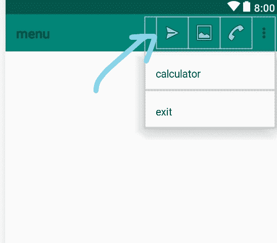
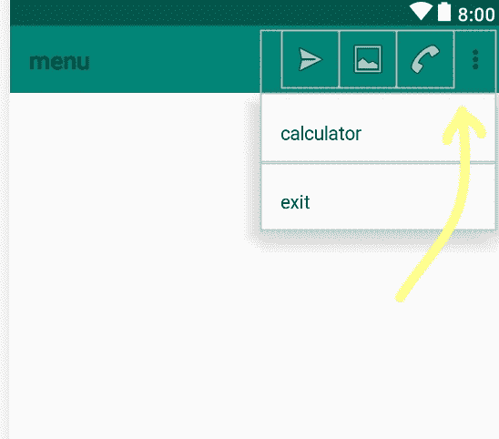

# 如何在安卓中实现选项菜单

> 原文:[https://www . geesforgeks . org/如何实现-选项-安卓菜单/](https://www.geeksforgeeks.org/how-to-implement-options-menu-in-android/)

在[安卓](https://www.geeksforgeeks.org/android-app-development-fundamentals-for-beginners/)中，有三种类型的[菜单](https://www.geeksforgeeks.org/android-menus/)可用于定义我们的安卓应用程序中的一组选项和动作。

安卓应用程序中的菜单如下:

*   安卓选项菜单
*   安卓上下文菜单
*   android 弹出菜单

**安卓选项菜单**是安卓的主菜单。它们可以用于设置、搜索、删除项目等。该项目何时以及如何作为动作项目出现在应用程序栏中由**显示动作**属性决定。**显示动作属性**可以给出的值:

*   **always**: This ensures that the menu will always show in the action bar.

    **语法:**

    ```java
    app:showAsAction="always"

    ```

    **示例:**

    ```java
    <item
            android:id="@+id/message"
            android:icon="@android:drawable/ic_menu_send"
            app:showAsAction="always"   
            android:title="message"
    />
    ```

    [](https://media.geeksforgeeks.org/wp-content/uploads/20200210221505/Screenshot-136_LI.jpg)

*   **never**: This means that the menu will never show, and therefore will be available through the overflow menu

    **语法:**

    ```java
    app:showAsAction="never"

    ```

    **示例:**

    ```java
    <item
            android:id="@+id/exit"  
            app:showAsAction="never" 
            android:title="exit"/>
    ```

    [](https://media.geeksforgeeks.org/wp-content/uploads/20200210221510/Screenshot-137_LI.jpg)

下面是在安卓系统中实现选项菜单的完整代码，如下所示:

## activity_main.xml

```java
<menu 
    xmlns:android="http://schemas.android.com/apk/res/android"
    xmlns:app="http://schemas.android.com/apk/res-auto"
    xmlns:tools="http://schemas.android.com/tools" 
    tools:context=".MainActivity">

    <item
        android:id="@+id/message" 
        android:icon="@android:drawable/ic_menu_send" 
        app:showAsAction="always"   
        android:title="message"/>

    <item
        android:id="@+id/picture" 
        android:icon="@android:drawable/ic_menu_gallery" 
        app:showAsAction="always|withText" 
        android:title="picture"/>

    <item
        android:id="@+id/mode" 
        android:icon="@android:drawable/ic_menu_call" 
        app:showAsAction="always" 
        android:title="mode"/>

    <item
        android:id="@+id/about"
        android:icon="@android:drawable/ic_dialog_info" 
        app:showAsAction="never|withText"
        android:title="calculator"/>

    <item
        android:id="@+id/exit"
        app:showAsAction="never"
        android:title="exit"/>
</menu>
```

## MainActivity.java

```java
package com.example.menu;

import androidx.appcompat.app.AppCompatActivity;
import android.os.Bundle;
import android.view.Menu;
import android.view.MenuItem;
import android.widget.Toast;

import static android.widget.Toast.LENGTH_LONG;

public class MainActivity extends AppCompatActivity {

    @Override
    protected void onCreate(Bundle savedInstanceState)
    {
        super.onCreate(savedInstanceState);
        setContentView(R.layout.main);
    }

    public boolean onCreateOptionsMenu(Menu menu)
    {
        getMenuInflater().inflate(R.menu.menu, menu);
        return true;
    }

    public boolean onOptionsItemSelected(MenuItem item)
    {
        switch (item.getItemId()) {
        case R.id.message:
            Toast
                .makeText(
                    getApplicationContext(),
                    "Shows share icon",
                    Toast.LENGTH_SHORT)
                .show();
            return true;

        case R.id.picture:
            Toast
                .makeText(
                    getApplicationContext(),
                    "Shows image icon",
                    Toast.LENGTH_SHORT)
                .show();
            startActivity(i2);
            return (true);

        case R.id.mode:
            Toast
                .makeText(
                    getApplicationContext(),
                    "Shows call icon",
                    Toast.LENGTH_SHORT)
                .show();
            return (true);

        case R.id.about:
            Toast
                .makeText(
                    getApplicationContext(),
                    "calculator menu",
                    Toast.LENGTH_SHORT)
                .show();
            return (true);

        case R.id.exit:
            finish();
            return (true);
        }
        return (super.onOptionsItemSelected(item));
    }
}
```