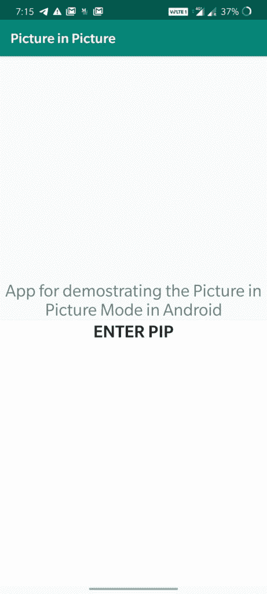
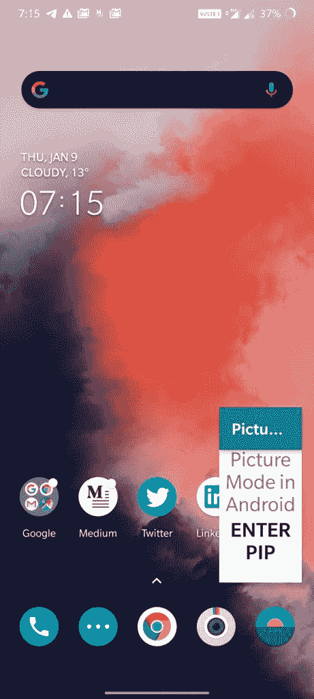

# 如何在安卓系统中实现画中画(PIP)？

> 原文:[https://www . geesforgeks . org/如何实现-画中画-安卓画中画/](https://www.geeksforgeeks.org/how-to-implement-picture-in-picture-pip-in-android/)

本文介绍了如何在[安卓应用](https://www.geeksforgeeks.org/components-android-application/)中实现**画中画**。
我们在**谷歌地图**等很多应用中看到，在使用导航时，当我们关闭应用时，屏幕右下方会出现一个浮动屏幕，如下图所示。该屏幕被称为画中画模式。


**什么是画中画模式？**
PIP 是一种特殊类型的多窗口模式，主要用于需要在屏幕上活跃但不应占用整个屏幕空间的活动，如观看视频、视频通话、导航等。它允许用户在屏幕一角(默认为右下角)的小窗口中观看视频，同时在应用程序之间导航或浏览主屏幕上的内容。Android 8.0 (API 等级 26)及以上允许以 PIP 模式启动活动。
画中画窗口出现在屏幕的最顶层。您可以使用一些特殊的切换将画中画窗口拖到另一个位置。当你点击窗口时，会出现两个特殊的控件:

*   全屏切换(在窗口中央)和
*   关闭按钮(右上角的“X”)。

**下面是画中画模式的实现。**

1.  [在安卓工作室](https://www.geeksforgeeks.org/android-how-to-create-start-a-new-project-in-android-studio/)创建一个安卓项目。
2.  **声明画中画支持:**默认情况下，没有活动启用画中画模式。这需要通过清单文件

    ```
    <activity android:name="VideoActivity"
        android:supportsPictureInPicture="true"
        android:configChanges=
            "screenSize|smallestScreenSize|screenLayout|orientation"
        ...
    ```

    来完成
3.  现在，在布局文件( **activity_main.xml** )中，我们将在活动中有两个组件:
    *   a [文本视图](https://www.geeksforgeeks.org/textview-in-kotlin/)和
    *   一个[按钮](https://www.geeksforgeeks.org/button-in-kotlin/)。
4.  现在，让我们在**MainActivity.java**文件中添加一些代码。在这个应用程序中，我们将通过点击按钮将活动更改为画中画模式。
    *   首先，我们将使用 **getWindowManager()** 获取显示大小。
    *   之后使用功能**企业图片输入图片模式()**，应该会提供一个**图片输入参数。生成器**参数。

下面是相同的代码。

## activity_main.xml

```
<?xml version="1.0" encoding="utf-8"?>
<LinearLayout
    xmlns:android="http://schemas.android.com/apk/res/android"
    xmlns:app="http://schemas.android.com/apk/res-auto"
    xmlns:tools="http://schemas.android.com/tools"
    android:layout_width="match_parent"
    android:layout_height="match_parent"
    android:orientation="vertical"
    android:weightSum="2"
    tools:context=".MainActivity">

    <TextView
        android:id="@+id/text"
        android:layout_width="match_parent"
        android:layout_height="match_parent"
        android:text="App for demonstrating the Picture
                      in Picture mode in Android"
        android:layout_gravity="center"
        android:gravity="center_horizontal|bottom"
        android:textSize="25dp"
        android:layout_weight="1"/>

    <Button
        android:id="@+id/enter_button"
        android:layout_width="match_parent"
        android:layout_height="match_parent"
        android:layout_weight="1"
        android:gravity="center_horizontal"
        android:layout_gravity="center"
        android:text="Enter PIP"
        android:textSize="25dp"
        android:background="#FFF"
        />

</LinearLayout>
```

## MainActivity.java

```
package com.vaibhav.pictureinpicture;

import androidx.appcompat.app.AppCompatActivity;
import android.app.ActionBar;
import android.app.PictureInPictureParams;
import android.content.res.Configuration;
import android.graphics.Point;
import android.os.Bundle;
import android.util.Rational;
import android.view.Display;
import android.view.View;
import android.widget.Button;

public class MainActivity extends AppCompatActivity {

    private Button enter;
    ActionBar actionBar;

    @Override
    protected void onCreate(Bundle savedInstanceState)
    {
        super.onCreate(savedInstanceState);
        setContentView(R.layout.activity_main);

        actionBar = getActionBar();
        enter = findViewById(R.id.enter_button);

        enter.setOnClickListener(new View.OnClickListener() {
            @Override
            public void onClick(View view)
            {
                Display d = getWindowManager()
                                .getDefaultDisplay();
                Point p = new Point();
                d.getSize(p);
                int width = p.x;
                int height = p.y;

                Rational ratio
                    = new Rational(width, height);
                PictureInPictureParams.Builder
                    pip_Builder
                    = new PictureInPictureParams
                          .Builder();
                pip_Builder.setAspectRatio(ratio).build();
                enterPictureInPictureMode(pip_Builder.build());
            }
        });
    }
}
```

**输出:**

*   **按下按钮启用活动的画中画模式。** 
*   **这是活动在画中画模式下的样子。** 