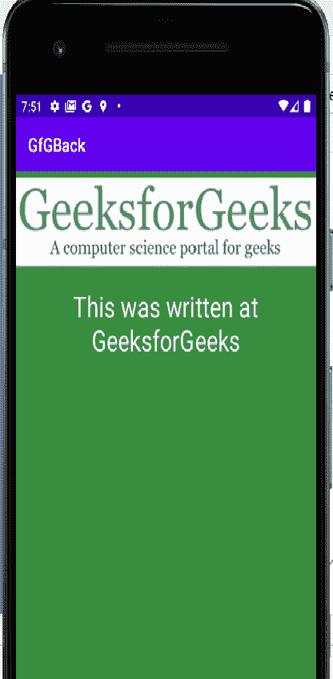

# 如何在安卓系统中实现再次按下 Back 退出？

> 原文:[https://www . geesforgeks . org/如何实现-按下-返回-再次退出-在安卓中/](https://www.geeksforgeeks.org/how-to-implement-press-back-again-to-exit-in-android/)

“**后退**”按钮在许多不同的安卓应用中有许多不同的用途。虽然一些应用程序开发人员使用它来关闭他们的应用程序，但一些人使用它来遍历回应用程序以前的活动。许多应用程序要求用户在一个时间间隔内按两次“后退”按钮才能成功关闭应用程序，这被认为是最佳做法。


**为什么要在 app 中实现这个？**

*   它为应用增加了更好的 UX，为用户提供了满意的体验。
*   如果用户误按了“后退”按钮，它将起到确认的作用。

### 方法

**第一步:新建安卓工作室项目**

请参考本文[如何在 Android Studio](https://www.geeksforgeeks.org/android-how-to-create-start-a-new-project-in-android-studio/) 中创建新项目，详细了解如何创建新的 Android Studio 项目。注意，选择 [**Java**](https://www.geeksforgeeks.org/java/) 作为编程语言。

**第二步:使用 activity_main.xml 文件**

在这个例子中，我们只有一个布局， **activity_main.xml** ，它将包含一个 [**ImageView**](https://www.geeksforgeeks.org/imageview-in-kotlin/) 和一个 [**TextView**](https://www.geeksforgeeks.org/textview-widget-in-android-using-java-with-examples/) 。这就是我们的 **activity_main.xml** 的样子:

## activity_main.xml

```
<?xml version="1.0" encoding="utf-8"?>
<LinearLayout 
    xmlns:android="http://schemas.android.com/apk/res/android"
    xmlns:app="http://schemas.android.com/apk/res-auto"
    xmlns:tools="http://schemas.android.com/tools"
    android:layout_width="match_parent"
    android:layout_height="match_parent"
    tools:context=".MainActivity"
    android:background="#388e3c"
    android:orientation="vertical">

    <ImageView
        android:layout_width="wrap_content"
        android:layout_height="wrap_content"
        android:src="@drawable/gfglog"/>

    <TextView
        android:padding="15dp"
        android:layout_width="wrap_content"
        android:layout_height="wrap_content"
        android:text="This was written at GeeksforGeeks"
        android:textColor="#f5f5f5"
        android:textSize="30sp"
        android:gravity="center_horizontal"/>

</LinearLayout>
```

上面的布局如下所示:



布局输出

**第三步:使用 MainActivity.java 文件**

现在是应用程序的主要部分。要检查“后退”按钮何时被按下，请使用安卓库中的**【onback pressed()**方法。接下来，检查“后退”按钮是否在 2 秒内再次按下，如果是，将关闭应用程序。否则，不要退出。以下是**MainActivity.java**的外观:

## MainActivity.java

```
package org.geeksforgeeks.pressbackexit;

import android.os.Bundle;
import android.widget.Toast;
import androidx.appcompat.app.AppCompatActivity;

public class MainActivity extends AppCompatActivity {
    private long pressedTime;

    @Override
    protected void onCreate(Bundle savedInstanceState) {
        super.onCreate(savedInstanceState);
        setContentView(R.layout.activity_main);
    }

    @Override
    public void onBackPressed() {

        if (pressedTime + 2000 > System.currentTimeMillis()) {
            super.onBackPressed();
            finish();
        } else {
            Toast.makeText(getBaseContext(), "Press back again to exit", Toast.LENGTH_SHORT).show();
        }
        pressedTime = System.currentTimeMillis();
    }
}
```

在上面的代码中，当用户按下一次“后退”按钮时，他们会受到祝酒词的欢迎，要求他们再次按下按钮退出。如果用户在 2 秒钟(2000 毫秒)内再次按下“后退”，则应用程序关闭，否则，我们将停留在那里。

#### **输出:在仿真器上运行**

<video class="wp-video-shortcode" id="video-477955-1" width="640" height="360" preload="metadata" controls=""><source type="video/mp4" src="https://media.geeksforgeeks.org/wp-content/uploads/20200811200701/Android-Emulator---Pixel_2_API_29_5554-2020-08-11-19-48-48_Trim.mp4?_=1">[https://media.geeksforgeeks.org/wp-content/uploads/20200811200701/Android-Emulator---Pixel_2_API_29_5554-2020-08-11-19-48-48_Trim.mp4](https://media.geeksforgeeks.org/wp-content/uploads/20200811200701/Android-Emulator---Pixel_2_API_29_5554-2020-08-11-19-48-48_Trim.mp4)</video>