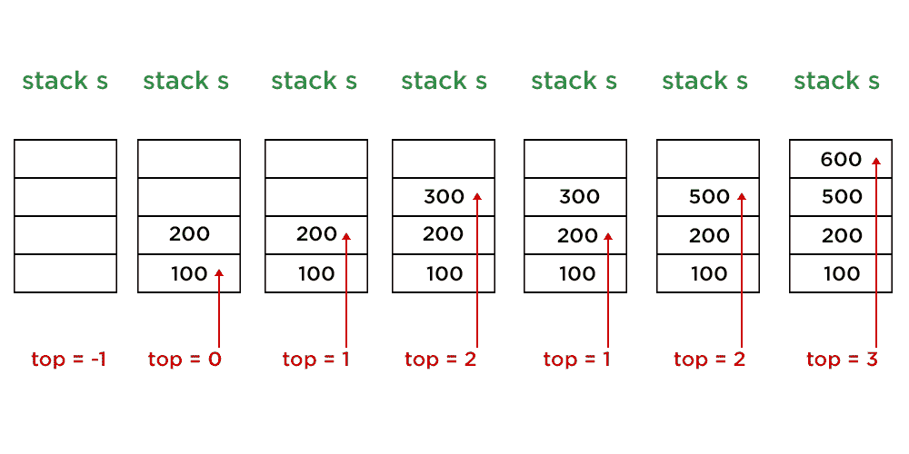

# 如何用数组和泛型在 Java 中实现栈？

> 原文:[https://www . geesforgeks . org/如何使用数组和泛型实现 java 中的堆栈/](https://www.geeksforgeeks.org/how-to-implement-stack-in-java-using-array-and-generics/)

堆栈是基于后进先出概念的线性数据结构。不是只有一个整数堆栈，堆栈可以是字符串，字符，甚至浮点类型。堆栈中有 4 个主要操作，如下所示:

1.  [*推()法*](https://www.geeksforgeeks.org/stack-push-method-in-java/) 将元素 x 添加到堆栈中。
2.  [*pop()方法*](https://www.geeksforgeeks.org/stack-pop-method-in-java/) 移除堆栈中*的最后一个元素*。**
3.  *top()* 方法返回堆栈的最后一个元素。
4.  [*清空()方法*](https://www.geeksforgeeks.org/stack-empty-method-in-java/) 返回*栈是否清空。*

> ***注意:**对于堆栈的所有操作，时间复杂度为 1*

*插图:*

**

*堆栈 1*

```java
*let s = empty stack of Integer type with size 4*
```

*堆栈 2*

```java
*push (100) : top = top + 1 and s[top] = 100*
```

*堆栈 3*

```java
*push (200) : top = top + 1 and s[top] = 200*
```

*堆栈 4*

```java
 *push (300) : top = top + 1 and s[top] = 300*
```

*堆栈 5*

```java
*pop ( )  : top = top - 1*
```

*堆栈 6*

```java
*push (500) : top = top + 1 and s[top] = 500*
```

*堆栈 7*

```java
*push (600) : top = top + 1 and s[top] = 600*
```

> ***注:***
> 
> ```java
> *push (700) : top +1 == size of stack : Stack Overflow ! 
> // Since top = 3 and size of stack  = 4, no more elements can be pushed*
> ```

***实施:***

***例***

## *Java 语言(一种计算机语言，尤用于创建网站)*

```java
*// Java Program to Implement Stack in Java Using Array and
// Generics

// Importing input output classes
import java.io.*;
// Importing all utility classes
import java.util.*;

// user defined class for generic stack
class stack<T> {

    // Empty array list
    ArrayList<T> A;

    // Default value of top variable when stack is empty
    int top = -1;

    // Variable to store size of array
    int size;

    // Constructor of this class
    // To initialize stack
    stack(int size)
    {
        // Storing the value of size into global variable
        this.size = size;

        // Creating array of Size = size
        this.A = new ArrayList<T>(size);
    }

    // Method 1
    // To push generic element into stack
    void push(T X)
    {
        // Checking if array is full
        if (top + 1 == size) {

            // Display message when array is full
            System.out.println("Stack Overflow");
        }
        else {

            // Increment top to go to next position
            top = top + 1;

            // Over-writing existing element
            if (A.size() > top)
                A.set(top, X);

            else

                // Creating new element
                A.add(X);
        }
    }
    // Method 2
    // To return topmost element of stack
    T top()
    {
        // If stack is empty
        if (top == -1) {

            // Display message when there are no elements in
            // the stack
            System.out.println("Stack Underflow");

            return null;
        }

        // else elements are present so
        // return the topmost element
        else
            return A.get(top);
    }

    // Method 3
    // To delete last element of stack
    void pop()
    {
        // If stack is empty
        if (top == -1) {

            // Display message when there are no elements in
            // the stack
            System.out.println("Stack Underflow");
        }

        else

            // Delete the last element
            // by decrementing the top
            top--;
    }

    // Method 4
    // To check if stack is empty or not
    boolean empty() { return top == -1; }

    // Method 5
    // To print the stack
    // @Override
    public String toString()
    {

        String Ans = "";

        for (int i = 0; i < top; i++) {
            Ans += String.valueOf(A.get(i)) + "->";
        }

        Ans += String.valueOf(A.get(top));

        return Ans;
    }
}
// Main Class
public class GFG {

    // main driver method
    public static void main(String[] args)
    {

        // Integer Stack

        // Creating an object of Stack class
        // Declaring objects of Integer type
        stack<Integer> s1 = new stack<>(3);

        // Pushing elements to integer stack - s1

        // Element 1 - 10
        s1.push(10);
        // Element 2 - 20
        s1.push(20);
        // Element 3 - 30
        s1.push(30);

        // Print the stack elements after pushing the
        // elements
        System.out.println(
            "s1 after pushing 10, 20 and 30 :\n" + s1);

        // Now, pop from stack s1
        s1.pop();

        // Print the stack elements after poping few
        // element/s
        System.out.println("s1 after pop :\n" + s1);

        // String Stack

        // Creating an object of Stack class
        // Declaring objects of Integer type
        stack<String> s2 = new stack<>(3);

        // Pushing elements to string stack - s2

        // Element 1 - hello
        s2.push("hello");
        // Element 2 - world
        s2.push("world");
        // Element 3 - java
        s2.push("java");

        // Print string stack after pushing above string
        // elements
        System.out.println(
            "\ns2 after pushing 3 elements :\n" + s2);

        System.out.println(
            "s2 after pushing 4th element :");

        // Pushing another element to above stack

        // Element 4 - GFG
        s2.push("GFG");

        // Float stack

        // Creating an object of Stack class
        // Declaring objects of Integer type
        stack<Float> s3 = new stack<>(2);

        // Pushing elements to float stack - s3

        // Element 1 - 100.0
        s3.push(100.0f);
        // Element 2 - 200.0
        s3.push(200.0f);

        // Print string stack after pushing above float
        // elements
        System.out.println(
            "\ns3 after pushing 2 elements :\n" + s3);

        // Print and display top element of stack s3
        System.out.println("top element of s3:\n"
                           + s3.top());
    }
}*
```

***Output**

```java
s1 after pushing 10, 20 and 30 :
10->20->30
s1 after pop :
10->20

s2 after pushing 3 elements :
hello->world->java
s2 after pushing 4th element :
Stack Overflow

s3 after pushing 2 elements :
100.0->200.0
top element of s3:
200.0
```*