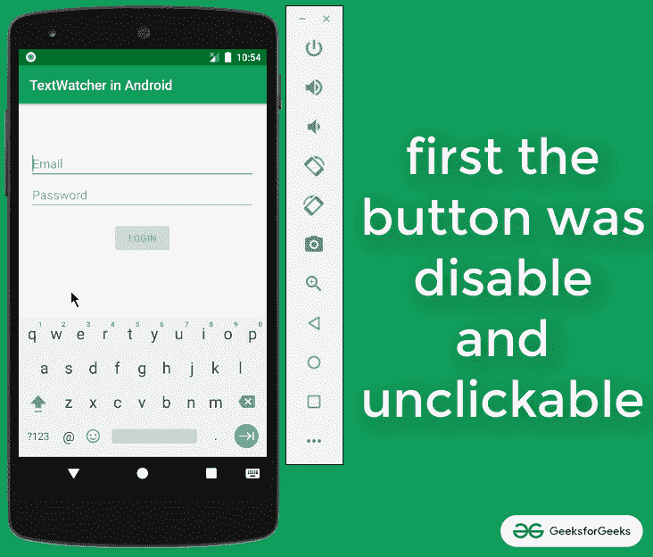
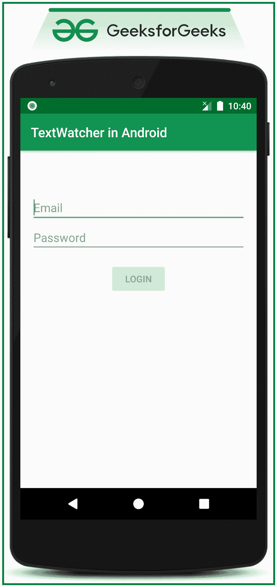

# 如何在安卓系统中实现 TextWatcher？

> 原文:[https://www . geeksforgeeks . org/如何实现-android 中的 text watcher/](https://www.geeksforgeeks.org/how-to-implement-textwatcher-in-android/)

如果有一个包含用户需要填写的登录表单的应用程序，登录按钮应该被禁用(意思是:它不应该是可点击的)。当用户输入表单的凭据时，应该启用按钮为用户单击。因此，在本文中，我们实现了对[编辑文本](https://www.geeksforgeeks.org/edittext-widget-in-android-using-java-with-examples/)字段的文本观察器。看看下面的图片，了解什么是文本观察器，以及它如何增加用户交互性。注意，我们将使用 **Java** 语言来实现这个项目。



### **在安卓系统中实现文本观察器的步骤**

**步骤 1:创建一个空的活动项目**

*   创建一个空的活动安卓工作室项目。参考[安卓|如何在安卓工作室创建/启动新项目？](https://www.geeksforgeeks.org/android-how-to-create-start-a-new-project-in-android-studio/)
*   注意选择 **Java** 作为编程语言。

**步骤 2:使用 activity_main.xml**

*   实现两个编辑文本字段，一个用于电子邮件，一个用于密码。
*   在 activity_main.xml 文件中调用以下代码。

## 可扩展标记语言

```java
<?xml version="1.0" encoding="utf-8"?>
<RelativeLayout 
    xmlns:android="http://schemas.android.com/apk/res/android"
    xmlns:tools="http://schemas.android.com/tools"
    android:layout_width="match_parent"
    android:layout_height="match_parent"
    tools:context=".MainActivity"
    tools:ignore="HardcodedText">

    <!--this is the email edittext field-->
    <EditText
        android:id="@+id/etEmail"
        android:layout_width="match_parent"
        android:layout_height="wrap_content"
        android:layout_marginStart="16dp"
        android:layout_marginTop="64dp"
        android:layout_marginEnd="16dp"
        android:hint="Email"
        android:inputType="textEmailAddress" />

    <!--this is the email password field-->
    <EditText
        android:id="@+id/etPassword"
        android:layout_width="match_parent"
        android:layout_height="wrap_content"
        android:layout_below="@id/etEmail"
        android:layout_marginStart="16dp"
        android:layout_marginEnd="16dp"
        android:hint="Password"
        android:inputType="textPassword" />

    <!--login button which set to be false for the enabled attribute-->
    <Button
        android:id="@+id/loginButton"
        android:layout_width="wrap_content"
        android:layout_height="wrap_content"
        android:layout_below="@id/etPassword"
        android:layout_centerHorizontal="true"
        android:layout_marginTop="16dp"
        android:enabled="false"
        android:text="LOGIN" />

</RelativeLayout>
```

**输出 UI:**



**步骤 3:使用 MainAcitvity.java 文件**

*   我们也可以分别处理两个编辑文本。但是在这种情况下，为了减少代码行，实现了回调侦听器 TextWatcher，并为每个编辑文本将回调侦听器对象传递给 addTextChangedListener 方法。
*   调用下面的代码在**MainActivity.java**文件内添加注释以便更好的理解。

## Java 语言(一种计算机语言，尤用于创建网站)

```java
import androidx.appcompat.app.AppCompatActivity;
import android.os.Bundle;
import android.text.Editable;
import android.text.TextWatcher;
import android.widget.Button;
import android.widget.EditText;

public class MainActivity extends AppCompatActivity {

    // two edit text fields
    EditText etEmail, etPassword;

    // one login button
    Button bLogin;

    // implement the TextWatcher callback listener
    private TextWatcher textWatcher = new TextWatcher() {
        @Override
        public void beforeTextChanged(CharSequence s, int start, int count, int after) {

        }

        @Override
        public void onTextChanged(CharSequence s, int start, int before, int count) {
            // get the content of both the edit text
            String emailInput = etEmail.getText().toString();
            String passwordInput = etPassword.getText().toString();

            // check whether both the fields are empty or not
            bLogin.setEnabled(!emailInput.isEmpty() && !passwordInput.isEmpty());
        }

        @Override
        public void afterTextChanged(Editable s) {

        }
    };

    @Override
    protected void onCreate(Bundle savedInstanceState) {
        super.onCreate(savedInstanceState);
        setContentView(R.layout.activity_main);

        // register all the UI elements 
          // with their appropriate IDs
        etEmail = findViewById(R.id.etEmail);
        etPassword = findViewById(R.id.etPassword);
        bLogin = findViewById(R.id.loginButton);

        // set the TextChange Listener for both 
          // the edit text fields
        etEmail.addTextChangedListener(textWatcher);
        etPassword.addTextChangedListener(textWatcher);
    }
}
```

### **输出:在仿真器上运行**

<video class="wp-video-shortcode" id="video-515967-1" width="640" height="360" preload="metadata" controls=""><source type="video/mp4" src="https://media.geeksforgeeks.org/wp-content/uploads/20201119225726/Untitled-Project.mp4?_=1">[https://media.geeksforgeeks.org/wp-content/uploads/20201119225726/Untitled-Project.mp4](https://media.geeksforgeeks.org/wp-content/uploads/20201119225726/Untitled-Project.mp4)</video>