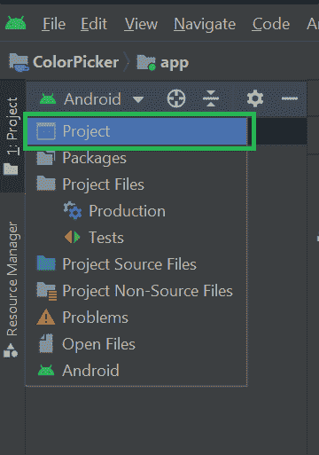

# 如何在安卓系统中实现 YoutubePlayerView 库？

> 原文:[https://www . geeksforgeeks . org/how-implement-youtubelayereview-library-in-Android/](https://www.geeksforgeeks.org/how-to-implement-youtubeplayerview-library-in-android/)

如果您希望在应用程序中显示 YouTube 视频，而不将用户从应用程序重定向到 YouTube，那么这个库对您的使用非常有帮助。在这个库的帮助下，你可以简单地在你的应用程序内部的视频 id 的帮助下播放来自 YouTube 的视频，而无需将你的用户重定向到 YouTube。现在我们将在我们的安卓应用程序中看到这个库的实现。注意，我们将使用 **Java** 语言来实现这个项目。

### **分步实施**

**第一步:创建新项目**

要在安卓工作室创建新项目，请参考[如何在安卓工作室创建/启动新项目](https://www.geeksforgeeks.org/android-how-to-create-start-a-new-project-in-android-studio/)。注意选择 **Java** 作为编程语言。

**第二步:在安卓工作室**的 libs 文件夹里面添加 jar 文件

从链接[这里](https://github.com/ChaitanyaMunje/YoutubePlayerView/blob/master/app/libs/YouTubeAndroidPlayerApi.jar)下载 jar 文件。要添加此文件，请在如下图所示的“T2”项目模式下打开您的安卓项目。



然后转到 **你的项目名称> app > libs** 右键点击并粘贴下载的 JAR 文件。你也可以参考下图。


> **注意:**你也可以参考这篇文章[如何在安卓工作室导入外部 JAR 文件？](https://www.geeksforgeeks.org/how-to-import-external-jar-files-in-android-studio/)

**步骤 3:现在在你的 build.gradle 文件**中添加依赖项

添加这种依赖关系。导航至**你的应用名称>应用>，你将看到 build.gradle 文件**。在该文件中，在依赖项部分添加依赖项。

> implementation ' com . pierresfrancescosoffritti . androidyoutubelayer:core:10 . 0 . 3 '

现在点击**“立即同步”**选项，添加该库后，您将在右上角看到该选项。之后，我们准备将 YouTube 视频播放器集成到应用程序中。

**第 4 步:使用 activity_main.xml 文件**

现在把左上角的项目标签改成安卓。之后导航至**应用>资源>布局>活动 _main.xml** 。在这里，我们将创建一个简单的按钮，它将重定向到一个新的活动，我们将在那里播放我们的 YouTube 视频。下面是 **activity_main.xml** 文件的 XML 代码片段。

## 可扩展标记语言

```
<?xml version="1.0" encoding="utf-8"?>
<RelativeLayout 
    xmlns:android="http://schemas.android.com/apk/res/android"
    xmlns:tools="http://schemas.android.com/tools"
    android:layout_width="match_parent"
    android:layout_height="match_parent"
    tools:context=".MainActivity">

    <!--Button which is used to navigate 
        to video player screen-->
    <Button
        android:id="@+id/idBtnPlayVideo"
        android:layout_width="wrap_content"
        android:layout_height="wrap_content"
        android:layout_centerInParent="true"
        android:text="Play Youtube Video"
        android:textColor="@color/white" />
</RelativeLayout>
```

**第五步:创建一个新的空活动**

现在我们将创建一个新的活动，在那里我们将展示我们的 YouTube 视频播放器。要创建新活动，请导航至**应用程序> java >您的应用程序的包名称，然后右键单击它>新建>活动>空活动>为您的活动命名，并确保其语言保持为 Java** 。现在您的新活动已经创建。(这里我们给活动命名为**视频播放活动**)。

**第六步:在新活动**内实现 YoutubePlayerView

下面是**activity _ video _ player . XML**文件的代码。

## 可扩展标记语言

```
<?xml version="1.0" encoding="utf-8"?>
<androidx.constraintlayout.widget.ConstraintLayout 
    xmlns:android="http://schemas.android.com/apk/res/android"
    xmlns:app="http://schemas.android.com/apk/res-auto"
    xmlns:tools="http://schemas.android.com/tools"
    android:layout_width="match_parent"
    android:layout_height="match_parent"
    tools:context=".VideoPlayerActivity">

    <!--Youtube Player view which will
        play our youtube video-->
    <com.pierfrancescosoffritti.androidyoutubeplayer.core.player.views.YouTubePlayerView
        android:id="@+id/videoPlayer"
        android:layout_width="match_parent"
        android:layout_height="match_parent"
        app:layout_constraintBottom_toBottomOf="parent"
        app:layout_constraintEnd_toEndOf="parent"
        app:layout_constraintStart_toStartOf="parent"
        app:layout_constraintTop_toTopOf="parent"
        app:showFullScreenButton="false">
    </com.pierfrancescosoffritti.androidyoutubeplayer.core.player.views.YouTubePlayerView>

</androidx.constraintlayout.widget.ConstraintLayout>
```

**步骤 7:使用 VideoPlayerActivity.java 文件**

在处理 VideoPlayerActivity.java 文件之前，让我们看看如何获取任何 YouTube 视频的视频 id。打开 YouTube，在你的应用中搜索任何你想播放的视频。在浏览器中播放视频。在浏览器的顶部，会有一个地址栏，你可以在那里看到该视频的网址。例如，这里我们取了下面的网址。

> https://www.youtube.com/watch?v=vG2PNdI8axo

在上面的网址中，视频标识位于最左边，即 v =符号之后是您的视频标识。在上面的例子中，视频 ID 将是

> **VG 2 pndi 8 轴**

这样，我们可以获得任何视频的网址。现在克 o 到了**文件并参考以下代码。以下是**VideoPlayerActivity.java**文件的代码。代码中添加了注释，以更详细地理解代码。**

## **Java 语言(一种计算机语言，尤用于创建网站)**

```
import android.os.Bundle;
import android.view.Window;
import android.view.WindowManager;

import androidx.annotation.NonNull;
import androidx.appcompat.app.AppCompatActivity;

import com.pierfrancescosoffritti.androidyoutubeplayer.core.player.PlayerConstants;
import com.pierfrancescosoffritti.androidyoutubeplayer.core.player.YouTubePlayer;
import com.pierfrancescosoffritti.androidyoutubeplayer.core.player.listeners.AbstractYouTubePlayerListener;
import com.pierfrancescosoffritti.androidyoutubeplayer.core.player.views.YouTubePlayerView;

public class VideoPlayerActivity extends AppCompatActivity {
    // id of the video 
    // which we are playing.
    String video_id = "vG2PNdI8axo";

    @Override
    protected void onCreate(Bundle savedInstanceState) {
        super.onCreate(savedInstanceState);

        // below two lines are used to set our 
        // screen orientation in landscape mode.
        requestWindowFeature(Window.FEATURE_NO_TITLE);
        getWindow().setFlags(WindowManager.LayoutParams.FLAG_FULLSCREEN, 
                             WindowManager.LayoutParams.FLAG_FULLSCREEN);

        setContentView(R.layout.activity_video_player);

        // below line of code is 
        // to hide our action bar.
        getSupportActionBar().hide();

        // declaring variable for youtubeplayer view
        final YouTubePlayerView youTubePlayerView = findViewById(R.id.videoPlayer);

        // below line is to place your youtube player in a full screen mode (i.e landscape mode)
        youTubePlayerView.enterFullScreen();
        youTubePlayerView.toggleFullScreen();

        // here we are adding observer to our youtubeplayerview.
        getLifecycle().addObserver(youTubePlayerView);

        // below method will provides us the youtube player
        // ui controller such as to play and pause a video 
        // to forward a video
        // and many more features.
        youTubePlayerView.getPlayerUiController();

        // below line is to enter full screen mode.
        youTubePlayerView.enterFullScreen();
        youTubePlayerView.toggleFullScreen();

        // adding listener for our youtube player view.
        youTubePlayerView.addYouTubePlayerListener(new AbstractYouTubePlayerListener() {
            @Override
            public void onReady(@NonNull YouTubePlayer youTubePlayer) {
                // loading the selected video into the YouTube Player
                youTubePlayer.loadVideo(video_id, 0);
            }

            @Override
            public void onStateChange(@NonNull YouTubePlayer youTubePlayer,
                                      @NonNull PlayerConstants.PlayerState state) {
                // this method is called if video has ended,
                super.onStateChange(youTubePlayer, state);
            }
        });
    }
}
```

****步骤 8:使用 MainActivity.java 文件****

**转到**MainActivity.java**文件，参考以下代码。以下是**MainActivity.java**文件的代码。代码中添加了注释，以更详细地理解代码。**

## **Java 语言(一种计算机语言，尤用于创建网站)**

```
import android.content.Intent;
import android.os.Bundle;
import android.view.View;
import android.widget.Button;
import androidx.appcompat.app.AppCompatActivity;

public class MainActivity extends AppCompatActivity {
    // variable for our button
    Button playBtn;

    @Override
    protected void onCreate(Bundle savedInstanceState) {
        super.onCreate(savedInstanceState);
        setContentView(R.layout.activity_main);

        // Initialize our Button
        playBtn = findViewById(R.id.idBtnPlayVideo);

        // we have set onclick listener for our button
        playBtn.setOnClickListener(new View.OnClickListener() {
            @Override
            public void onClick(View v) {
                // we have declared an intent to open new activity.
                Intent i = new Intent(MainActivity.this, VideoPlayerActivity.class);
                startActivity(i);
            }
        });
    }
}
```

****第九步:在清单文件**中添加互联网权限**

**导航到**应用程序> AndroidManifest.xml** 文件，在那里您必须添加以下权限。**

**与此同时，您将在应用程序标签中看到活动部分，它将视频播放器的活动屏幕方向添加到横向模式。**

> **android:screenOrientation= "横向">**

**下面是完整的 **AndroidManifest.xml** 文件的代码:**

## **可扩展标记语言**

```
<?xml version="1.0" encoding="utf-8"?>
<manifest xmlns:android="http://schemas.android.com/apk/res/android"
    package="com.gtappdevelopers.youtubeplayerview">

    <!--For internet usage-->
    <uses-permission android:name="android.permission.INTERNET"/>
    <uses-permission android:name="android.permission.ACCESS_NETWORK_STATE"/>

    <application
        android:allowBackup="true"
        android:icon="@mipmap/ic_launcher"
        android:label="@string/app_name"
        android:roundIcon="@mipmap/ic_launcher_round"
        android:supportsRtl="true"
        android:theme="@style/Theme.YoutubePlayerView">
        <!--Here my activity name was VideoPlayerActivity-->
        <activity android:name=".VideoPlayerActivity"
            android:screenOrientation="landscape">
        </activity>

        <activity android:name=".MainActivity">
            <intent-filter>
                <action android:name="android.intent.action.MAIN" />

                <category android:name="android.intent.category.LAUNCHER" />
            </intent-filter>
        </activity>
    </application>

</manifest>
```

### **输出:在真实设备上运行应用程序**

**<video class="wp-video-shortcode" id="video-529990-1" width="640" height="360" preload="metadata" controls=""><source type="video/mp4" src="https://media.geeksforgeeks.org/wp-content/uploads/20201214160612/Screenrecorder-2020-12-14-15-53-30-976.mp4?_=1">[https://media.geeksforgeeks.org/wp-content/uploads/20201214160612/Screenrecorder-2020-12-14-15-53-30-976.mp4](https://media.geeksforgeeks.org/wp-content/uploads/20201214160612/Screenrecorder-2020-12-14-15-53-30-976.mp4)</video>**

****查看下方 GitHub 链接上的项目:**[https://github.com/ChaitanyaMunje/YoutubePlayerView](https://github.com/ChaitanyaMunje/YoutubePlayerView)**