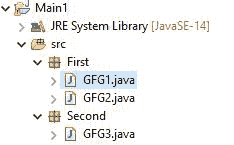
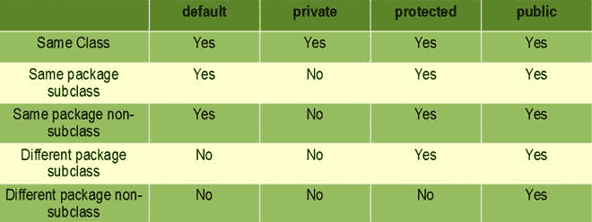

# 如何在 Java 中导入自定义类？

> 原文:[https://www . geesforgeks . org/如何导入自定义 java 类/](https://www.geeksforgeeks.org/how-to-import-custom-class-in-java/)

Java 语言是所有编程语言中最流行的语言之一。使用 java 编程语言有几个优点，无论是出于安全目的还是构建大型分发项目。使用 Java 的优势之一是它试图借助类、继承、多态等概念将语言中的每个概念与现实世界联系起来。在本文中，我们将讨论如何将自定义类从一个项目导入到另一个项目或同一项目中。

**自定义类**由用户为特定目的创建。这些类不在项目的系统库中。考虑如下所示的项目结构:



**结构格式:**

```java
ProjectName:Main1
             |
             |
             First(package)[ GFG1.java , GFG2.java ] (classes)
             |
             Second(package)[GFG3.java] (class)
```

> **注意:**为了理解这个概念，必须通过 java 中的[访问修饰符](https://www.geeksforgeeks.org/access-modifiers-java/)来理解类、成员和方法的范围的概念。



在这里，我们将按如下方式对这两种结构类型进行检查，稍后将在下面进一步实现:

1.  同一包中的自定义类
2.  来自另一个包的自定义类

实现:为同一个项目导入类

同一项目中的类可以导入到同一项目中的任何其他类中，而不需要项目的特定类中的任何 import 语句。因为默认情况下，所有的类成员和方法都是默认修饰符，根据默认修饰符的范围，它们可以在同一个包/同一个包子类中访问，而无需导入类。参考上表。

**例 1:**GFG1.java

## Java 语言(一种计算机语言，尤用于创建网站)

```java
// Package of the class
package First;

public class GFG1 {

    int a;
    int b;
    // Creating constructor
    GFG1(int a, int b)
    {
        this.a = a;
        this.b = b;
    }
    // Function to add the members of the class
    int add() { return this.a + this.b; }
}
```

**例 2:**GFG2.java

## Java 语言(一种计算机语言，尤用于创建网站)

```java
// Package first
package First;

public class GFG2 {

    public static void main(String[] args)
    {
        // Creating of instance of second class present
        // in the same project
        GFG1 ob = new GFG1(1, 2);
        System.out.println("Addition " + ob.add());
    }
}
```

**输出:**

```java
Addition 3
```

让我们继续讨论下一步我们将从另一个包导入定制类的地方。

**实施:**

只有当需要导入的特定类被标记为公共的，并且它的成员和方法应该是公共的，以便它们可以在它的包之外使用时，才在不同的包之间导入类。

**例 1:** 二级包装

## Java 语言(一种计算机语言，尤用于创建网站)

```java
package Second;

class GFG3 {
    int a;
    int b;
    // Creating constructor
    public GFG3(int a, int b)
    {
        this.a = a;
        this.b = b;
    } // Function to subtract the values
    public int subtract() { return this.a - this.b }
}
```

```java
Above second package class is imported to the class of first package
Structure:
Second:(Package)
 |
    GFG3
First:(Package)
 |
    GFG2
```

**例 2:** 首包类

## Java 语言(一种计算机语言，尤用于创建网站)

```java
package First;
// Importing class of second package
import Second.GFG3;

public class GFG2 {

    public static void main(String[] args)
    {
        // Creating reference of the GFG1 class that is
        // present in the same project
        GFG1 ob = new GFG1(1, 2);
        System.out.println("Addition " + ob.add());

        // Creating the reference fo the GFG3 class that is
        // present in the other project
        GFG3 ob1 = new GFG3(2, 1);
        System.out.println("Subtract " + ob1.subtract());
    }
}
```

**输出:**

```java
Addition 3
Subtract 1
```