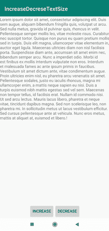
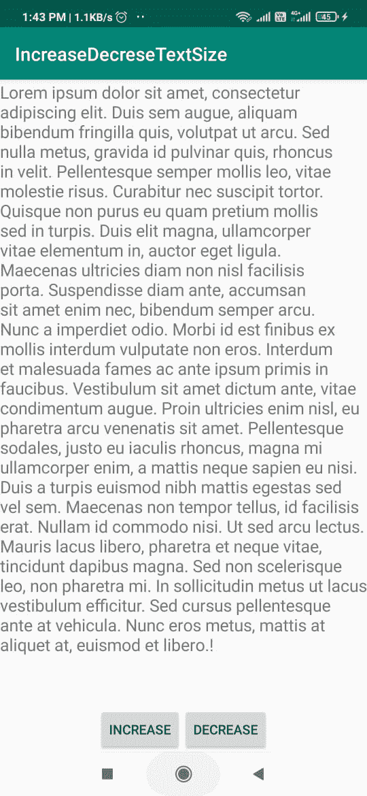

# 如何在安卓中通过编程增加或减少 TextView 字体大小？

> 原文:[https://www . geesforgeks . org/如何增加或减少-textview-font-size-in-Android-programming/](https://www.geeksforgeeks.org/how-to-increase-or-decrease-textview-font-size-in-android-programmatically/)

在这个 App 中，我们将学习如何在安卓中通过编程增加或减少 [TextView](https://www.geeksforgeeks.org/textview-widget-in-android-using-java-with-examples/) 字体大小。就像我们已经看到的，在许多应用程序中，我们有时想要放大文本。所以基本上我们要实现它。下面给出了一个 GIF 示例，来了解一下我们将在本文中做什么。注意，我们将使用 **Java** 语言来实现这个项目。



### **分步实施**

**第一步:创建新项目**

要在安卓工作室创建新项目，请参考[如何在安卓工作室创建/启动新项目](https://www.geeksforgeeks.org/android-how-to-create-start-a-new-project-in-android-studio/)。注意选择 **Java** 作为编程语言。

**步骤 2:使用 activity_main.xml 文件**

这里我们基本上是创建两个[按钮](https://www.geeksforgeeks.org/button-in-kotlin/)来增加和减少文本大小。还有一个[文本视图](https://www.geeksforgeeks.org/textview-widget-in-android-using-java-with-examples/)，包含罗兰伊普斯姆虚拟文本。下面是**activity _ main . XML**文件的代码。

## 可扩展标记语言

```
<?xml version="1.0" encoding="utf-8"?>
<RelativeLayout
    xmlns:android="http://schemas.android.com/apk/res/android"
    xmlns:app="http://schemas.android.com/apk/res-auto"
    xmlns:tools="http://schemas.android.com/tools"
    android:layout_width="match_parent"
    android:layout_height="match_parent"
    tools:context=".MainActivity">

    <LinearLayout
        android:id="@+id/wrapper"
        android:layout_width="match_parent"
        android:layout_height="wrap_content"
        android:layout_alignParentBottom="true"
        android:gravity="center_horizontal"
        android:orientation="horizontal">

        <Button
            android:id="@+id/increase"
            android:layout_width="wrap_content"
            android:layout_height="wrap_content"
            android:text="Increase" />

        <Button
            android:id="@+id/decrease"
            android:layout_width="wrap_content"
            android:layout_height="wrap_content"
            android:text="Decrease" />
    </LinearLayout>

    <ScrollView
        android:id="@+id/scroll"
        android:layout_width="match_parent"
        android:layout_height="wrap_content"
        android:layout_above="@id/wrapper"
        android:layout_centerInParent="true">

        <LinearLayout
            android:layout_width="match_parent"
            android:layout_height="wrap_content"
            android:orientation="vertical">

        </LinearLayout>
    </ScrollView>

    <TextView
        android:id="@+id/tv_text"
        android:layout_width="wrap_content"
        android:layout_height="wrap_content"
        android:layout_alignParentEnd="true"
        android:layout_marginTop="1dp"
        android:layout_marginEnd="0dp"
        android:text="Lorem ipsum dolor sit amet, consectetur adipiscing elit. Duis sem augue,
                      aliquam bibendum fringilla quis, volutpat ut arcu. Sed nulla metus, gravida
                      id pulvinar quis, rhoncus in velit. Pellentesque semper mollis leo,
                      vitae molestie risus. Curabitur nec suscipit tortor. Quisque non purus eu
                      quam pretium mollis sed in turpis. Duis elit magna, ullamcorper vitae elementum
                      in, auctor eget ligula. Maecenas ultricies diam non nisl facilisis porta.
                      Suspendisse diam ante, accumsan sit amet enim nec, bibendum semper arcu.
                      Nunc a imperdiet odio. Morbi id est finibus ex mollis interdum vulputate non
                      eros. Interdum et malesuada fames ac ante ipsum primis in faucibus. Vestibulum 
                      sit amet dictum ante, vitae condimentum augue. Proin ultricies enim nisl,
                      eu pharetra arcu venenatis sit amet. Pellentesque sodales, justo eu iaculis
                      rhoncus, magna mi ullamcorper enim, a mattis neque sapien eu nisi. Duis a 
                      turpis euismod nibh mattis egestas sed vel sem. Maecenas non tempor tellus,
                      id facilisis erat. Nullam id commodo nisi. Ut sed arcu lectus. Mauris lacus 
                      libero, pharetra et neque vitae, tincidunt dapibus magna. Sed non scelerisque 
                      leo, non pharetra mi. In sollicitudin metus ut lacus vestibulum efficitur.
                      Sed cursus pellentesque ante at vehicula. Nunc eros metus, mattis at aliquet at,
                      euismod et libero.!"
        app:layout_constraintBottom_toBottomOf="parent"
        app:layout_constraintLeft_toLeftOf="parent"
        app:layout_constraintRight_toRightOf="parent"
        app:layout_constraintTop_toTopOf="parent" />

</RelativeLayout>
```

**我们的活动看起来是这样的:**



activity_main.xml

**第三步:使用****MainActivity.java 文件**

转到**MainActivity.java**文件，参考以下代码。以下是**MainActivity.java**文件的代码。代码中添加了注释，以更详细地理解代码。

## Java 语言(一种计算机语言，尤用于创建网站)

```
import android.os.Bundle;
import android.util.TypedValue;
import android.view.View;
import android.widget.Button;
import android.widget.TextView;

import androidx.appcompat.app.AppCompatActivity;

public class MainActivity extends AppCompatActivity {

    Button increase, decrease;
    private float ourFontsize = 14f;
    TextView text;

    @Override
    protected void onCreate(Bundle savedInstanceState) {
        super.onCreate(savedInstanceState);
        setContentView(R.layout.activity_main);
        increase = findViewById(R.id.increase);
        decrease = findViewById(R.id.decrease);
        text = findViewById(R.id.tv_text);
        increase.setOnClickListener(new View.OnClickListener() {
            @Override
            public void onClick(View v) {
                // increasing the size by 4 unit
                ourFontsize += 4f;
                // assigning new textsize to our text
                text.setTextSize(TypedValue.COMPLEX_UNIT_SP, ourFontsize);
            }
        });
        decrease.setOnClickListener(new View.OnClickListener() {
            @Override
            public void onClick(View v) {
                // decreasing the size by 4 unit
                ourFontsize -= 4f;
                // assigning new textsize to our text
                text.setTextSize(TypedValue.COMPLEX_UNIT_SP, ourFontsize);
            }
        });
    }
}
```

### 输出:

<video class="wp-video-shortcode" id="video-559312-1" width="640" height="360" preload="metadata" controls=""><source type="video/mp4" src="https://media.geeksforgeeks.org/wp-content/uploads/20210212134959/WhatsApp-Video-2021-02-12-at-1.44.17-PM.mp4?_=1">[https://media.geeksforgeeks.org/wp-content/uploads/20210212134959/WhatsApp-Video-2021-02-12-at-1.44.17-PM.mp4](https://media.geeksforgeeks.org/wp-content/uploads/20210212134959/WhatsApp-Video-2021-02-12-at-1.44.17-PM.mp4)</video>