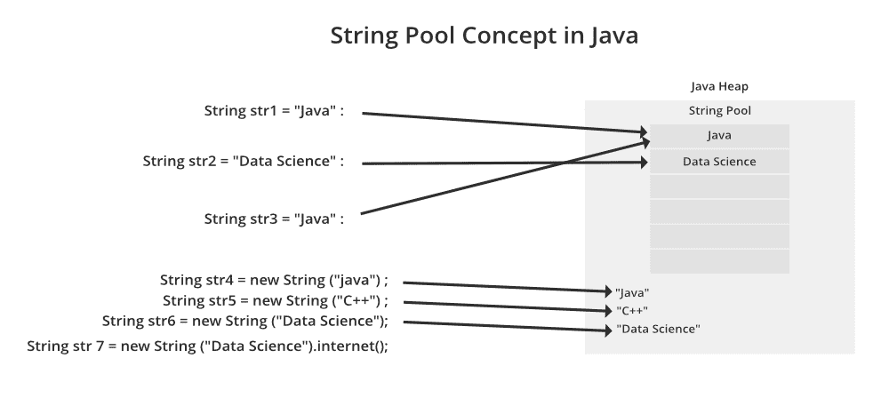
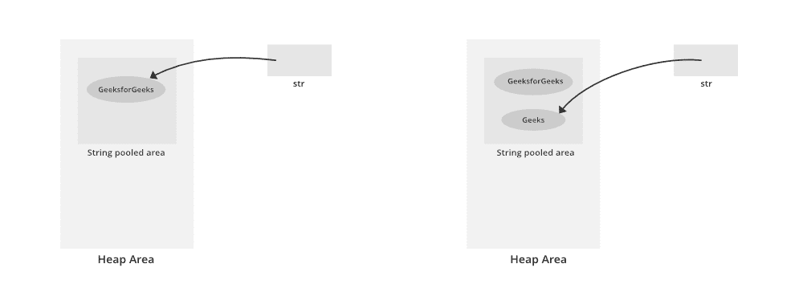
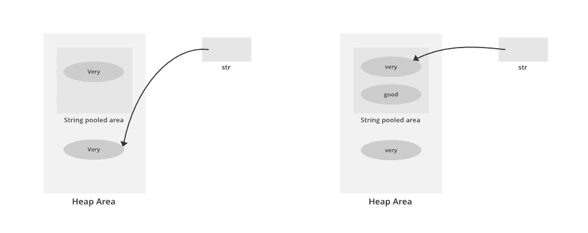

# 如何在 Java 中初始化和比较字符串？

> 原文:[https://www . geesforgeks . org/如何在 java 中初始化和比较字符串/](https://www.geeksforgeeks.org/how-to-initialize-and-compare-strings-in-java/)

众所周知，字符串在 java 中是不可变的，因此它产生了两种初始化方式，就像我们在 java 中有[字符串池](https://www.geeksforgeeks.org/string-constant-pool-in-java/)的概念一样。

**方式:**用 Java 初始化字符串

1.  直接初始化
2.  间接初始化



**方式 1:直接初始化(字符串常量)**

在此方法中，将在内存堆区域内的字符串池区域中创建一个字符串常量对象。由于是**常量**，我们不能修改，即 String 类是不可变的。

插图:

```
String str = "GeeksForGeeks"; 

str = "geeks"; // This statement will make str 
               // point to new String constant("geeks")
               // rather than modifying the previous 
               // String constant.
```



来自左翼媒体

```
String str = "GeeksForGeeks"; 
```

从上面的正确媒体

```
str = "geeks"; 
```

> **注意:**如果我们再次写 **str = "GeeksForGeeks"** 作为下一行，那么它首先检查给定的 String 常量是否存在于 String 池区域中。如果它存在，那么字符串将指向它，否则创建一个新的字符串常量。

**方式二:**对象初始化(动态)

在此方法中，将在堆区域中创建一个字符串对象(不像在大写的字符串池区域中那样)。我们不能修改它(就像大写一样)。同样使用相同的值，在字符串池区域中也会创建一个字符串常量，但是该变量将只指向堆区域中的字符串对象。

插图:

```
String str = new String("very");
str = "good";     
```

我们可以从中得出如下结论:

在下面媒体的左边

```
String str = new String("very"); 
```

在右下方的媒体中如下所示:

```
str = "good" 
```



现在，这是一个直接赋值，因此在字符串池区域中创建一个值为“good”的字符串常量，字符串将指向该常量。

> **注意:**如果我们再次写 **str = new String(“非常”)**，那么它将创建一个值为“非常”的新对象，而不是指向堆区域中具有相同值的可用对象。但是如果我们写 **str =“非常”**，那么它将指向值为“非常”的字符串常量对象，该对象出现在字符串池区域中。

**方法:**比较字符串及其引用

1.  **等于()方法:**比较字符串的**值**是否相等。返回类型是布尔值。几乎在所有情况下，您都可以使用 useObjects.equals()。
2.  **==运算符:**它比较**参考值而不是**。返回类型是布尔值。==在您知道正在处理内部字符串的罕见情况下使用。
3.  **compareTo()方法:**它按字典顺序比较值，并返回一个整数值，该整数值描述第一个字符串是否小于、等于或大于第二个字符串。例如，如果 str1 和 str2 是两个字符串变量，则如下所示:
    *   **str1 == str2 :** 返回 0
    *   **str1 > str2 :** 返回正值
    *   **str1 < str2 :** 返回负值

> **注意:**由 **compareTo** 方法返回的正负值是两个字符串中第一个不匹配字符的差值。

**实现:**我们将通过下面的例子讨论如何与字符串进行比较来证明上面所说的

**示例:**

## Java 语言(一种计算机语言，尤用于创建网站)

```
// Java program to Illustrate Comparison of Two Strings

// Main class
public class GFG {

    // Main driver method
    public static void main(String[] args)
    {
        // Custom input strings to compare
        String s1 = "Ram";
        String s2 = "Ram";
        String s5 = "Shyam";

        String s3 = new String("Ram");
        String s4 = new String("Ram");

        // Checking whether strings are equal or not
        // with help of equals() method
        System.out.println(
            " Comparing strings with equals:");
        System.out.println(s1.equals(s2));
        System.out.println(s1.equals(s3));
        System.out.println(s1.equals(s5));

        String nulls1 = null;
        String nulls2 = null;

        // NullPointerException will be throws if
        // we try to compare nulls strings
        // System.out.println(nulls1.equals(nulls2));

        // Comparing strings using == operator
        System.out.println(" Comparing strings with ==:");
        System.out.println(s1 == s2);
        System.out.println(s1 == s3);
        System.out.println(s3 == s4);
        System.out.println(nulls1 == nulls2);

        // Comparing strings via compareTo() method
        System.out.println(
            " Comparing strings via compareTo() Method :");
        System.out.println(s1.compareTo(s3));
        System.out.println(s1.compareTo(s5));

        // NullPointerException if we try to compare strings
        // with usage of compareTo() method
        // System.out.println(nulls1.compareTo(nulls2));
    }
}
```

**Output**

```
 Comparing strings with equals:
true
true
false
 Comparing strings with ==:
true
false
false
true
 Comparing strings via compareTo() Method :
0
-1
```

本文由**高拉夫·米格拉尼**供稿。如果你喜欢 GeeksforGeeks 并想投稿，你也可以使用[write.geeksforgeeks.org](http://www.write.geeksforgeeks.org)写一篇文章或者把你的文章邮寄到 review-team@geeksforgeeks.org。看到你的文章出现在极客博客主页上，帮助其他极客。如果你发现任何不正确的地方，或者你想分享更多关于上面讨论的话题的信息，请写评论。