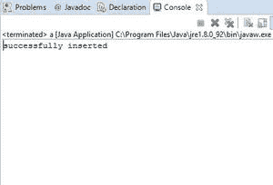

# 如何使用 JDBC 连接向表中插入记录？

> 原文:[https://www . geeksforgeeks . org/如何使用 jdbc 连接将记录插入到表中/](https://www.geeksforgeeks.org/how-to-insert-records-to-a-table-using-jdbc-connection/)

在向表中插入内容之前，我们需要将 java 应用程序连接到数据库。Java 有自己的应用编程接口，使用 JDBC 驱动程序进行数据库连接的 JDBC 应用编程接口。在 JDBC 之前，[使用的是 ODBC](https://www.geeksforgeeks.org/odbc-full-form/) API，但它是用 C 写的，这意味着它依赖于平台。JDBC API 提供了应用程序到 JDBC 的连接，JDBC 驱动程序提供了管理器到驱动程序的连接。

【Java 程序与数据库连接的步骤

**1。加载驱动程序:**首先，在程序中使用驱动程序之前，首先需要加载或注册驱动程序。注册在你的程序中只需完成一次。您可以通过以下两种方式之一注册驱动程序:

*   **Class.forName():** 这里我们在运行时将驱动程序的类文件加载到内存中。不需要使用新的或创建的对象。以下示例使用 Class.forName()加载 Oracle 驱动程序–

```
Class.forName(“oracle.jdbc.driver.OracleDriver”);

```

*   **driver manager . register driver():**driver manager 是一个带有静态成员寄存器的 Java 内置类。这里我们在编译时调用驱动类的构造函数。以下示例使用 DriverManager.registerDriver()来注册 Oracle 驱动程序–

```
DriverManager.registerDriver(new oracle.jdbc.driver.OracleDriver())

```

**2。创建连接:**加载驱动程序后，使用以下命令建立连接:

```
Connection con = DriverManager.getConnection(url,user,password)

```

**用户**:可以访问您的 SQL 命令提示符的用户名。
**密码:**可以访问您的 SQL 命令提示符的密码。

**con:** 是对连接接口的引用。
**网址**:统一资源定位器。它可以按如下方式创建:

```
String url = “ jdbc:oracle:thin:@localhost:1521:xe”

```

其中 oracle 是使用的数据库，thin 是使用的驱动程序，@localhost 是存储数据库的 IP 地址，1521 是端口号，xe 是服务提供商。上面的 3 个参数都是字符串类型的，需要程序员在调用函数之前声明。这一点的使用可以参考最终代码。

**3。创建语句:**一旦建立了连接，您就可以与数据库交互。 **JDBCStatement** 、 **CallableStatement** 和 **PreparedStatement** 接口定义了使您能够发送 SQL 命令和从数据库接收数据的方法。

JDBC 声明的用法如下:

```
Statement st = con.createStatement();

```

这里 **con** 是对上一步使用的连接接口的引用。

**4。执行查询:**现在是执行查询最重要的部分。这里的查询是一个 SQL 查询。现在我们知道我们可以有多种类型的查询。其中一些如下:

*   在数据库中更新/插入表的查询。
*   检索数据的查询。

语句接口的 executeQuery()方法用于执行从数据库中检索值的查询。此方法返回 ResultSet 的对象，该对象可用于获取表的所有记录。
语句接口的 executeUpdate(SQL 查询)方法用于执行更新/插入的查询。

**示例:**

```
int m = st.executeUpdate(sql);
if (m==1)
    System.out.println("inserted successfully : "+sql);
else
    System.out.println("insertion failed");

```

这里的 SQL 是字符串类型的 SQL 查询

**5。关闭连接:**最后我们已经将数据发送到指定位置，现在我们即将完成任务。通过关闭连接，语句和结果集的对象将自动关闭。连接接口的 close()方法用于关闭连接。

**示例:**

```
con.close();

```

## Java 语言(一种计算机语言，尤用于创建网站)

```
// Java program to insert records to a table using JDBC

import java.io.*;
import java.sql.*;

public class Database {

    // url that points to mysql database, 'db' is database
    // name
    static final String url
        = "jdbc:mysql://localhost:3306/db";

    public static void main(String[] args)
        throws ClassNotFoundException
    {
        try {
            // this Class.forName() method is user for
            // driver registration with name of the driver
            // as argument

            // we have used MySQL driver
            Class.forName("com.mysql.jdbc.Driver");

            // getConnection() establishes a connection. It
            // takes url that points to your database,
            // username and password of MySQL connections as
            // arguments
            Connection conn = DriverManager.getConnection(
                url, "root", "1234");

            // create.Statement() creates statement object
            // which is responsible for executing queries on
            // table
            Statement stmt = conn.createStatement();

            // executeUpdate() is used for INSERT, UPDATE,
            // DELETE statements.It returns number of rows
            // affected by the execution of the statement
            int result = stmt.executeUpdate(
                "insert into student(Id,name,number) values('1','rachel','45')");

            // if result is greater than 0, it means values
            // has been added
            if (result > 0)
                System.out.println("successfully inserted");

            else
                System.out.println(
                    "unsucessful insertion ");

            // closing connection
            conn.close();
        }

        catch (SQLException e) {
            System.out.println(e);
        }
    }
}
```

驱动程序、驱动管理器()、连接()、语句()、结果集()是 JDBC 应用编程接口提供的类。

*   如果插入成功，输出将是:成功插入
*   如果插入不成功，输出将是:插入不成功

