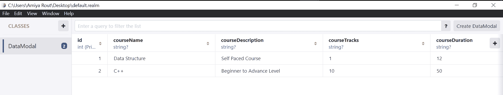
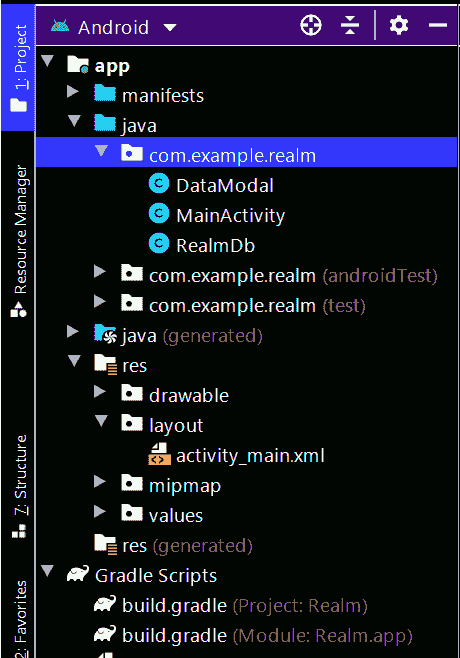

# 如何在安卓中安装数据并添加到领域数据库？

> 原文:[https://www . geesforgeks . org/如何在 android 中安装和添加数据到领域数据库/](https://www.geeksforgeeks.org/how-to-install-and-add-data-to-realm-database-in-android/)

**领域数据库**是由 [MongoDb](https://www.geeksforgeeks.org/mongodb-an-introduction/) 提供的一项服务，用于在本地存储用户设备中的数据。在这种帮助下，数据可以很容易地存储在用户的设备中，并且可以很容易地访问。我们可以使用这个数据库将数据存储在用户的设备中。这是一个由 4 篇文章组成的系列，我们将在其中用 Android 中的**领域数据库**执行基本的 **CRUD(创建、读取、更新和删除)**操作。我们将在本系列中介绍以下 4 篇文章:

1.  **如何在安卓中安装数据并添加到领域数据库？**
2.  [如何在安卓中读取领域数据库的数据？](https://www.geeksforgeeks.org/how-to-read-data-from-realm-database-in-android/)
3.  [如何在安卓中更新数据到领域数据库？](https://www.geeksforgeeks.org/how-to-update-data-in-realm-database-in-android/)
4.  [安卓如何删除领域数据库中的数据？](https://www.geeksforgeeks.org/how-to-delete-data-in-realm-database-in-android/)

在本文中，我们将了解如何在安卓系统中安装和添加数据到领域数据库。

### 数据如何存储在领域数据库中？

数据以表的形式存储在领域数据库中。当我们将这些数据存储在我们的领域数据库中时，它是以类似于电子表格的表格形式排列的。下面是我们存储在领域数据库中的领域数据库的表示。


### 我们将在本文中构建什么？

我们将构建一个简单的应用程序，将数据添加到 Realm 数据库中。我们将创建一个数据库，用于添加课程名称、课程描述和课程持续时间。我们将把所有这些数据保存在我们的领域数据库中。下面给出了一个示例视频，以了解我们将在本文中做什么。注意，我们将使用 **Java** 语言来实现这个项目。

<video class="wp-video-shortcode" id="video-580194-1" width="640" height="360" preload="metadata" controls=""><source type="video/mp4" src="https://media.geeksforgeeks.org/wp-content/uploads/20210319214045/20210319_213900.mp4?_=1">[https://media.geeksforgeeks.org/wp-content/uploads/20210319214045/20210319_213900.mp4](https://media.geeksforgeeks.org/wp-content/uploads/20210319214045/20210319_213900.mp4)</video>

### **分步实施**

**第一步:创建新项目**

在安卓工作室创建新项目请参考 [<u>【如何在安卓工作室创建/启动新项目】</u>](https://www.geeksforgeeks.org/android-how-to-create-start-a-new-project-in-android-studio/) 。注意选择 **Java** 作为编程语言。

**步骤 2:在** **项目级 build.gradle 文件**的依赖项部分添加依赖项

导航到**应用程序>渐变脚本> build.gradle(项目)**，并在依赖项部分添加类路径依赖项。你可以在下面的部分看到依赖性。

```
dependencies {
        classpath "com.android.tools.build:gradle:4.1.2"

        // add below dependency
        classpath "io.realm:realm-gradle-plugin:10.3.1"

        // NOTE: Do not place your application dependencies here; they belong
        // in the individual module build.gradle files
}
```

添加后，现在导航到 build.gradle (Module)并将下面的代码添加到其中。在这个文件上面添加插件。

```
apply plugin: 'realm-android'     
```

之后，在依赖项部分上方添加下面的代码。

```
realm {
    syncEnabled = true
}
```

现在同步您的项目，现在我们将创建一个新的 java 类。以下是[构建.梯度](https://www.geeksforgeeks.org/android-build-gradle/)(模块)文件的完整代码:

## Java 语言(一种计算机语言，尤用于创建网站)

```
plugins {
    id 'com.android.application'
}

apply plugin: 'realm-android'

android {
    compileSdkVersion 30
    buildToolsVersion "30.0.3"
    ndkVersion '21.3.6528147'

    defaultConfig {
        applicationId "com.example.realm"
        minSdkVersion 23
        targetSdkVersion 30
        versionCode 1
        versionName "1.0"

        testInstrumentationRunner "androidx.test.runner.AndroidJUnitRunner"
    }

    buildTypes {
        release {
            minifyEnabled false
            proguardFiles getDefaultProguardFile('proguard-android-optimize.txt'), 'proguard-rules.pro'
        }
    }
    compileOptions {
        sourceCompatibility JavaVersion.VERSION_1_8
        targetCompatibility JavaVersion.VERSION_1_8
    }
}

realm {
    syncEnabled = true
}

dependencies {
    implementation 'androidx.appcompat:appcompat:1.2.0'
    implementation 'com.google.android.material:material:1.3.0'
    implementation 'androidx.constraintlayout:constraintlayout:2.0.4'
    testImplementation 'junit:junit:4.+'
    androidTestImplementation 'androidx.test.ext:junit:1.1.2'
    androidTestImplementation 'androidx.test.espresso:espresso-core:3.3.0'
}
```

**步骤 3:创建一个新的 java 类来初始化 realmDatabase**

导航到**应用> java >你的应用的包名>右键点击它>新建> Java 类**并将其命名为 **RealmDb** 并添加下面的代码。

## Java 语言(一种计算机语言，尤用于创建网站)

```
import android.app.Application;

import io.realm.Realm;
import io.realm.RealmConfiguration;

public class RealmDb extends Application {
    @Override
    public void onCreate() {
        super.onCreate();

        // on below line we are
        // initializing our realm database.
        Realm.init(this);

        // on below line we are setting realm configuration
        RealmConfiguration config =
                new RealmConfiguration.Builder()
                        // below line is to allow write
                        // data to database on ui thread.
                        .allowWritesOnUiThread(true)
                        // below line is to delete realm
                        // if migration is needed.
                        .deleteRealmIfMigrationNeeded()
                        // at last we are calling a method to build.
                        .build();
        // on below line we are setting
        // configuration to our realm database.
        Realm.setDefaultConfiguration(config);
    }
}
```

**第四步:在 AndroidManifest.xml 文件**中定义这个类

导航至**应用程序> AndroidManifest.xml** 文件，并在<应用程序>标签中添加以下行。

> Android:name = " . real MDB "

现在，我们将开始使用 **activity_main.xml.**

**第 5 步:使用 activity_main.xml 文件**

导航到**应用程序> res >布局> activity_main.xml** 并将下面的代码添加到该文件中。下面是 **activity_main.xml** 文件的代码。

## 可扩展标记语言

```
<?xml version="1.0" encoding="utf-8"?>
<LinearLayout
    xmlns:android="http://schemas.android.com/apk/res/android"
    xmlns:tools="http://schemas.android.com/tools"
    android:layout_width="match_parent"
    android:layout_height="match_parent"
    android:orientation="vertical"
    tools:context=".MainActivity">

    <!--Edit text to enter course name-->
    <EditText
        android:id="@+id/idEdtCourseName"
        android:layout_width="match_parent"
        android:layout_height="wrap_content"
        android:layout_margin="10dp"
        android:hint="Enter course Name" />

    <!--edit text to enter course duration-->
    <EditText
        android:id="@+id/idEdtCourseDuration"
        android:layout_width="match_parent"
        android:layout_height="wrap_content"
        android:layout_margin="10dp"
        android:hint="Enter Course Duration" />

    <!--edit text to display course tracks-->
    <EditText
        android:id="@+id/idEdtCourseTracks"
        android:layout_width="match_parent"
        android:layout_height="wrap_content"
        android:layout_margin="10dp"
        android:hint="Enter Course Tracks" />

    <!--edit text for course description-->
    <EditText
        android:id="@+id/idEdtCourseDescription"
        android:layout_width="match_parent"
        android:layout_height="wrap_content"
        android:layout_margin="10dp"
        android:hint="Enter Course Description" />

    <!--button for adding new course-->
    <Button
        android:id="@+id/idBtnAddCourse"
        android:layout_width="match_parent"
        android:layout_height="wrap_content"
        android:layout_margin="10dp"
        android:text="Add Course"
        android:textAllCaps="false" />

</LinearLayout>
```

**第 6 步:创建一个模态类来存储我们的数据**

导航到**应用> java >你的应用的包名>右键点击它>新建> Java 类**并将其命名为 **DataModal** 并添加下面的代码。

## Java 语言(一种计算机语言，尤用于创建网站)

```
import io.realm.RealmObject;
import io.realm.annotations.PrimaryKey;

public class DataModal extends RealmObject {
    // on below line we are creating our variables
    // and with are using primary key for our id.
    @PrimaryKey
    private long id;
    private String courseName;
    private String courseDescription;
    private String courseTracks;
    private String courseDuration;

    // on below line we are
    // creating an empty constructor.
    public DataModal() {
    }

    // below line we are
    // creating getter and setters.
    public String getCourseTracks() {
        return courseTracks;
    }

    public void setCourseTracks(String courseTracks) {
        this.courseTracks = courseTracks;
    }

    public long getId() {
        return id;
    }

    public void setId(long id) {
        this.id = id;
    }

    public String getCourseName() {
        return courseName;
    }

    public void setCourseName(String courseName) {
        this.courseName = courseName;
    }

    public String getCourseDescription() {
        return courseDescription;
    }

    public void setCourseDescription(String courseDescription) {
        this.courseDescription = courseDescription;
    }

    public String getCourseDuration() {
        return courseDuration;
    }

    public void setCourseDuration(String courseDuration) {
        this.courseDuration = courseDuration;
    }
}
```

**第 7 步:使用****MainActivity.java 文件**

转到**MainActivity.java**文件，参考以下代码。以下是**MainActivity.java**文件的代码。代码中添加了注释，以更详细地理解代码。

## Java 语言(一种计算机语言，尤用于创建网站)

```
import android.os.Bundle;
import android.text.TextUtils;
import android.view.View;
import android.widget.Button;
import android.widget.EditText;
import android.widget.Toast;

import androidx.appcompat.app.AppCompatActivity;

import io.realm.Realm;

public class MainActivity extends AppCompatActivity {

    // creating variables for our edit text
    private EditText courseNameEdt, courseDurationEdt, courseDescriptionEdt, courseTracksEdt;
    private Realm realm;

    // creating a strings for storing
    // our values from edittext fields.
    private String courseName, courseDuration, courseDescription, courseTracks;

    @Override
    protected void onCreate(Bundle savedInstanceState) {
        super.onCreate(savedInstanceState);
        setContentView(R.layout.activity_main);

        // initializing our edittext and buttons
        realm = Realm.getDefaultInstance();
        courseNameEdt = findViewById(R.id.idEdtCourseName);
        courseDescriptionEdt = findViewById(R.id.idEdtCourseDescription);
        courseDurationEdt = findViewById(R.id.idEdtCourseDuration);

        // creating variable for button
        Button submitCourseBtn = findViewById(R.id.idBtnAddCourse);
        courseTracksEdt = findViewById(R.id.idEdtCourseTracks);
        submitCourseBtn.setOnClickListener(new View.OnClickListener() {
            @Override
            public void onClick(View v) {

                // getting data from edittext fields.
                courseName = courseNameEdt.getText().toString();
                courseDescription = courseDescriptionEdt.getText().toString();
                courseDuration = courseDurationEdt.getText().toString();
                courseTracks = courseTracksEdt.getText().toString();

                // validating the text fields if empty or not.
                if (TextUtils.isEmpty(courseName)) {
                    courseNameEdt.setError("Please enter Course Name");
                } else if (TextUtils.isEmpty(courseDescription)) {
                    courseDescriptionEdt.setError("Please enter Course Description");
                } else if (TextUtils.isEmpty(courseDuration)) {
                    courseDurationEdt.setError("Please enter Course Duration");
                } else if (TextUtils.isEmpty(courseTracks)) {
                    courseTracksEdt.setError("Please enter Course Tracks");
                } else {
                    // calling method to add data to Realm database..
                    addDataToDatabase(courseName, courseDescription, courseDuration, courseTracks);
                    Toast.makeText(MainActivity.this, "Course added to database..", Toast.LENGTH_SHORT).show();
                    courseNameEdt.setText("");
                    courseDescriptionEdt.setText("");
                    courseDurationEdt.setText("");
                    courseTracksEdt.setText("");
                }
            }
        });
    }

    private void addDataToDatabase(String courseName, String courseDescription, String courseDuration, String courseTracks) {

        // on below line we are creating
        // a variable for our modal class.
        DataModal modal = new DataModal();

        // on below line we are getting id for the course which we are storing.
        Number id = realm.where(DataModal.class).max("id");

        // on below line we are
        // creating a variable for our id.
        long nextId;

        // validating if id is null or not.
        if (id == null) {
            // if id is null
            // we are passing it as 1.
            nextId = 1;
        } else {
            // if id is not null then
            // we are incrementing it by 1
            nextId = id.intValue() + 1;
        }
        // on below line we are setting the
        // data entered by user in our modal class.
        modal.setId(nextId);
        modal.setCourseDescription(courseDescription);
        modal.setCourseName(courseName);
        modal.setCourseDuration(courseDuration);
        modal.setCourseTracks(courseTracks);

        // on below line we are calling a method to execute a transaction.
        realm.executeTransaction(new Realm.Transaction() {
            @Override
            public void execute(Realm realm) {
                // inside on execute method we are calling a method
                // to copy to real m database from our modal class.
                realm.copyToRealm(modal);
            }
        });
    }
}
```

现在运行您的应用程序，并查看应用程序的输出。在本文中，您只能将数据添加到我们的数据库中。在下一篇文章中，我们将看一看阅读这些数据。

**输出:**

<video class="wp-video-shortcode" id="video-580194-2" width="640" height="360" preload="metadata" controls=""><source type="video/mp4" src="https://media.geeksforgeeks.org/wp-content/uploads/20210319214045/20210319_213900.mp4?_=2">[https://media.geeksforgeeks.org/wp-content/uploads/20210319214045/20210319_213900.mp4](https://media.geeksforgeeks.org/wp-content/uploads/20210319214045/20210319_213900.mp4)</video>

成功执行代码后，在编辑文本中输入所需的数据。最重要的是，如果你想知道**如何在安卓工作室查看和定位领域数据库，那么请参考这篇** [<u>文章</u>](https://www.geeksforgeeks.org/how-to-view-and-locate-realm-database-in-android-studio/) **。**下面你可以看到这是数据是如何存储在**领域**数据库中的。



**下面是完成安装添加操作后的完整项目文件结构:**

