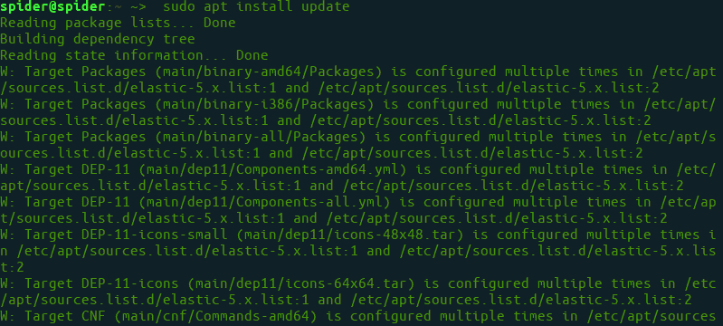
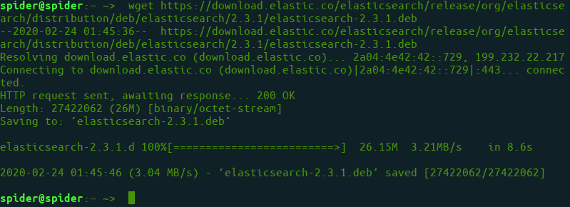
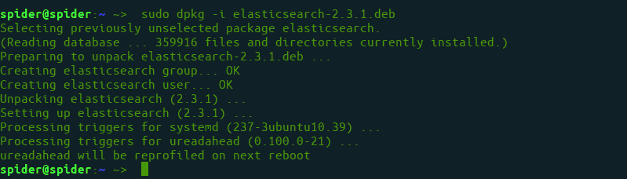
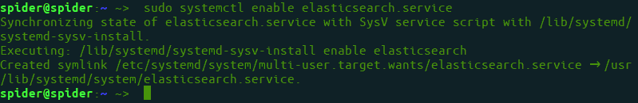
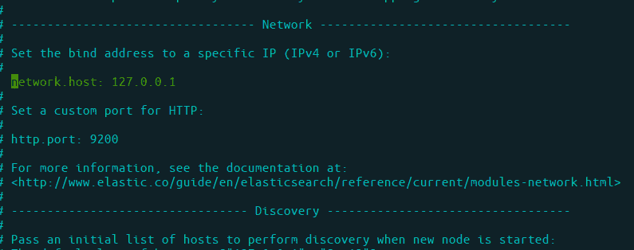

# 如何在 Ubuntu 上安装和配置 Elasticsearch？

> 原文:[https://www . geeksforgeeks . org/如何安装和配置-elasticsearch-on-ubuntu/](https://www.geeksforgeeks.org/how-to-install-and-configure-elasticsearch-on-ubuntu/)

Elasticsearch 是一个基于 Apache 的 Lucene 库的跨平台搜索引擎。它提供了一个分布式、支持多租户的全文搜索引擎，具有 HTTP web 接口和无模式的 JSON 文档。是用 [Java](https://www.geeksforgeeks.org/java/) 写的。

**先决条件:**[Ubuntu 上的 Java 安装](https://www.geeksforgeeks.org/setting-environment-java/)

**步骤 1:** 首先，使用以下命令更新您的系统:

```java
$sudo apt install update
```



**第二步:**下载*。deb 文件*用于弹性搜索。

> $ wget https://download . flexfield . co/flexfield search/release/org/flexfield search/distribution/deb/flexfield search/2 . 3 . 1/flexfield search-2 . 3 . 1 . deb



**第三步:**用 dpkg commond 安装*。deb* 文件。

```java
$sudo dpkg -i elasticsearch-2.3.1.deb
```



**步骤 4:** 启用弹性搜索服务

```java
$sudo systemctl enable elasticsearch.service
```



**步骤 5:** 设置弹性搜索的网络配置。开文件

```java
$sudo nano /etc/elasticsearch/elasticsearch.yml
```

并将 IP 设置为本地主机

```java
...
network.host: 127.0.0.1
...

```



**第 6 步:**现在，重启服务。

```java
$sudo systemctl restart elasticsearch
```

**第 7 步:**使用和测试弹性搜索

```java
$curl -X GET 'http://localhost:9200'
```

*卷曲输出*

```java
{
  "name" : "Node-1",
  "cluster_name" : "mycluster1",
  "version" : {
    "number" : "2.3.1",
    "build_hash" : "bd980929010aef404e7cb0843e61d0665269fc39",
    "build_timestamp" : "2016-04-04T12:25:05Z",
    "build_snapshot" : false,
    "lucene_version" : "5.5.0"
  }
}

```