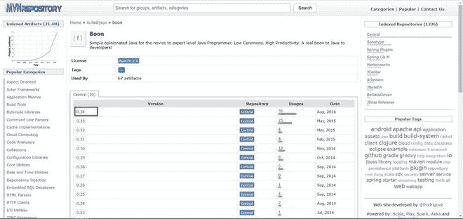
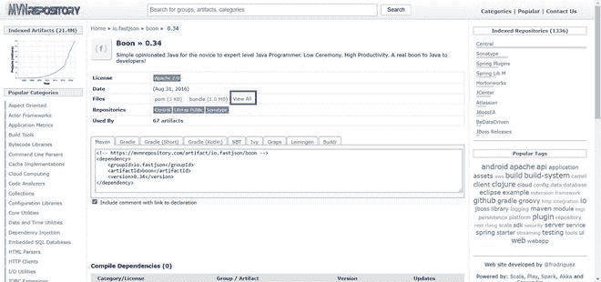
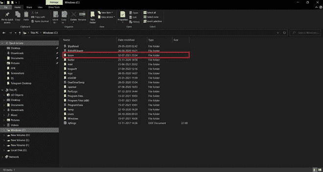
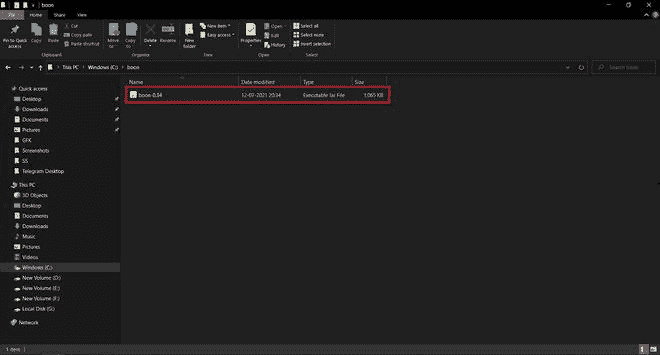
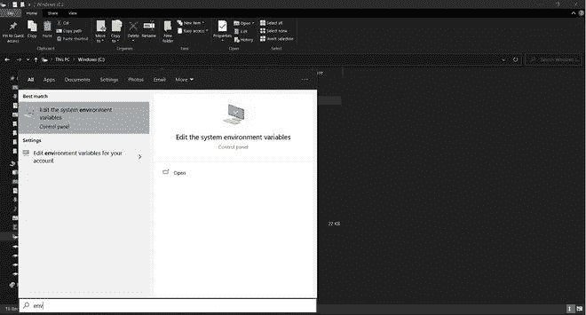
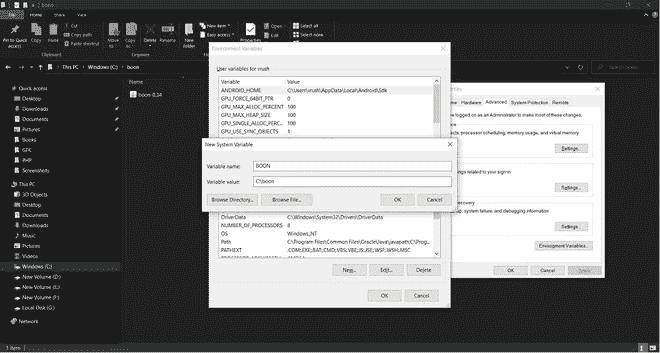
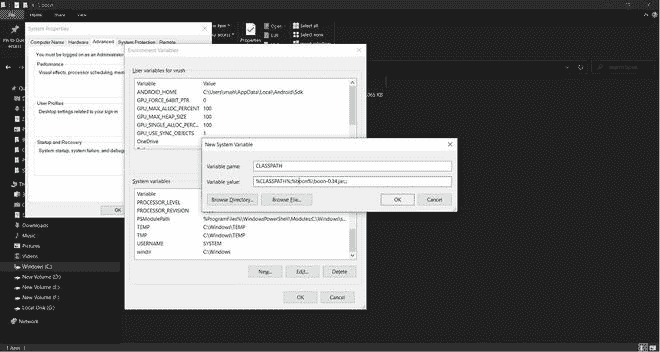

# 如何安装 Boon 并用 Java 应用程序进行配置？

> 原文:[https://www . geesforgeks . org/如何用 java 应用程序安装和配置它/](https://www.geeksforgeeks.org/how-to-install-boon-and-configuring-it-with-java-application/)

**Boon** 是一款基于 java 的工具，用于快速高效地对 JSON 进行编码或解码。Boon 是一个不太为人所知的 Java JSON API，Boon 也被用作 Groovy 中的标准 JSON API。Boon 是用于轻松处理数据的通用工具包之一。Boon 包含对象映射器，可以将 JSON 解析成自定义对象或 Java 映射。

我们可以通过在您的 Java 应用程序中包含 Boon JAR 文件来使用 Boon JSON 解析器。我们可以通过将 Boon 作为 Maven 依赖项添加到您的 Java 应用程序中，或者通过从中央 Maven 存储库中下载 Boon JAR 并将其手动包含在您的 Java 应用程序的类路径中来实现这些。我们将在接下来的主题中介绍所有这些内容。

设置布恩有 **2 种方法，下面列出，稍后会用视觉辅助工具深入讨论。具体如下:**

1.  下载布恩 JAR 文件
2.  作为马文依赖者的恩惠

**方法 1:** 下载布恩 JAR 文件

**第一步:**下载布恩档案

**1.1** 访问给定链接:[https://mvnrepository.com/artifact/io.fastjson/boon](https://mvnrepository.com/artifact/io.fastjson/boon)，现在你会看到各种版本的布恩。


**1.2** 点击最新版本。



**1.3** 然后点击全部查看。(这将显示各种 Boon 文件的列表)



**1.4** 点击**恩-0.34.jar** ，会下载 jar 文件


**1.5** 在 c 盘创建一个名为 boon 的文件夹



**1.6** 将 boon jar 文件粘贴到其中，现在我们可以开始设置 boon 了。



**步骤 2:** 设置福利环境

**2.1** 点击开始，打开“编辑系统环境变量”。



**2.2** 点击**环境变量** - >在**系统变量**下，点击**新建**选项，然后添加变量名为 **BOON** ，变量值为 BOON 文件夹的路径，点击确定。



**2.3** 设置类路径变量点击**新增**添加类路径，然后将变量名设置为**类路径**，变量值设置为**% class path；% boon % \ boon-0.34 . jar；。；**点击**确定**。



**方法二**:布恩为马文依赖

> **注意:**此方法只能在使用已经创建的 Maven 项目时使用。

**2.1** 打开 pom.xml 文件(pom.xml 示例如下)

```
<project xmlns="http://maven.apache.org/POM/4.0.0" 
         xmlns:xsi="http://www.w3.org/2001/XMLSchema-instance" 
         xsi:schemaLocation="http://maven.apache.org/POM/4.0.0 
                             https://maven.apache.org/xsd/maven-4.0.0.xsd">
  <modelVersion>4.0.0</modelVersion>
  <groupId>BoonTest</groupId>
  <artifactId>BoonTest</artifactId>
  <version>0.0.1-SNAPSHOT</version>
  <build>
    <sourceDirectory>src</sourceDirectory>
    <plugins>
      <plugin>
        <artifactId>maven-compiler-plugin</artifactId>
        <version>3.8.1</version>
        <configuration>
          <release>15</release>
        </configuration>
      </plugin>
    </plugins>
  </build>
  <dependencies>
      <dependency>
       <groupId>org.apache.logging.log4j</groupId>
       <artifactId>log4j-api</artifactId>
       <version>2.11.0</version>
    </dependency>
  </dependencies>
</project>
```

**2.2** 在<依赖项>标签下添加以下代码

```
<dependency>
   <groupId>io.fastjson</groupId>
   <artifactId>boon</artifactId>
   <version>0.34</version>
</dependency>
```

现在，pom.xml 我们看起来像这样。

```
<project xmlns="http://maven.apache.org/POM/4.0.0" 
         xmlns:xsi="http://www.w3.org/2001/XMLSchema-instance" 
         xsi:schemaLocation="http://maven.apache.org/POM/4.0.0 
                             https://maven.apache.org/xsd/maven-4.0.0.xsd">
  <modelVersion>4.0.0</modelVersion>
  <groupId>BoonTest</groupId>
  <artifactId>BoonTest</artifactId>
  <version>0.0.1-SNAPSHOT</version>
  <build>
    <sourceDirectory>src</sourceDirectory>
    <plugins>
      <plugin>
        <artifactId>maven-compiler-plugin</artifactId>
        <version>3.8.1</version>
        <configuration>
          <release>15</release>
        </configuration>
      </plugin>
    </plugins>
  </build>
  <dependencies>
     <!-- Included Boon Dependency here-->
    <dependency>
          <groupId>io.fastjson</groupId>
          <artifactId>boon</artifactId>
          <version>0.34</version>
      </dependency>
      <dependency>
       <groupId>org.apache.logging.log4j</groupId>
       <artifactId>log4j-api</artifactId>
       <version>2.11.0</version>
    </dependency>
  </dependencies>
</project>
```

> **注意:**确保在版本标签中使用正确的版本号。

**boon–object mapper**

现在我们已经成功地在我们的系统中设置了布恩。它的时代更了解布恩功能。一旦我们安装了布恩，您就可以开始使用布恩对象映射器类将 JSON 解析成对象。对象映射器类提供了读写 JSON 的功能，可以读写普通旧 Java 对象，也可以读写通用 JSON 树模型。

**例**

## Java 语言(一种计算机语言，尤用于创建网站)

```
// Java Program to Illustrate Boon ObjectMapper Functionality
// by parsing JSON into objects
// Using the Boon ObjectMapper class

// Importing JsonFactory and ObjectMapper classes
// from org.boon package
import org.boon.json.JsonFactory;
import org.boon.json.ObjectMapper;

// Class 1
// Main class
public class MyBoon {

    // Main driver method
    public static void main(String args[])
    {

        // Setting up ObjectMapper
        ObjectMapper mapper = JsonFactory.create();

        // Creating json string to be parse
        String jsonString
            = "{\"empDesignation\":\"SDE\",\"empName\":\"Sam\", \"empDesignation\":100}";

        // json will be mapped to object
        Employee employee
            = mapper.readValue(jsonString, Employee.class);

        // Print and display employee credentials
        System.out.println(employee);
    }
}

// Class 2
// Helper class
// Getter and Setter Class for Employee
class Employee {

    // Member variables of this class
    private int empID;
    private String empName;
    private String empDesignation;

    // Constructor of this class
    public Employee() {}

    // Method 1
    // To get employee ID
    public int getempID() { return empID; }

    // Method 2
    // To allocate temporary ID of the employee
    public void setempID(int empID)
    {

        // This keyword refers to current object itself
        this.empID = empID;
    }

    // Method 3
    // To get employee name
    public String getempName() { return empName; }

    // Method 4
    // To set employee name
    public void setempName(String empName)
    {
        this.empName = empName;
    }

    // Method 5
    // To get designation of the employee
    public String getDesignation()
    {
        return empDesignation;
    }

    // Method 6
    // To set temporary designation of employee
    public void setempDesignation(String empDesignation)
    {
        this.empDesignation = empDesignation;
    }

    // Method 7
    public String toString()
    {
        return "Employee [ empID: " + empID
            + ", empName: " + empName
            + ", empDesignation: " + empDesignation + " ]";
    }
}
```

**输出:**

```
Employee [ empID: 100, empName: Sam, empDesignation: SDE]
```