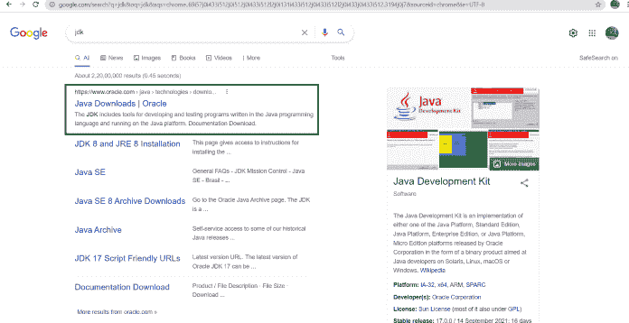
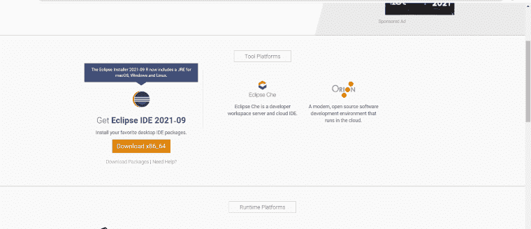
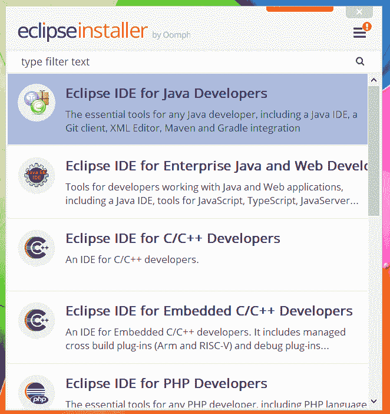
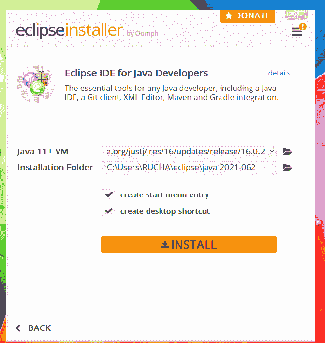

# 如何为 Java 安装 Eclipse IDE？

> 原文:[https://www . geesforgeks . org/如何安装-eclipse-ide-for-java/](https://www.geeksforgeeks.org/how-to-install-eclipse-ide-for-java/)

已经有许多软件，如 IntelliJ IDEA、Eclipse 等，其中大多数开发人员倾向于使用开源软件 Eclipse。主要用于 **JAVA** 应用开发。我们还可以用它来开发各种编程语言的应用程序，如 C、C++、C#、Python、JavaScript 等。

**安装 Eclipse IDE 的步骤:**

1.  下载并安装 JDK(这是一个先决条件的重要步骤)
2.  [前往 eclipse 网站下载，选择版本](https://www.eclipse.org/downloads)作为操作系统和 bits 要求。
3.  打开下载的文件扩展名，并遵循标准软件安装过程。
4.  根据开发人员的语言需求选择软件包。
5.  一个新的窗口将被重新启动，如果不重新启动 eclipse。
6.  转到新项目并创建类，java 应用程序(或程序)可以在其中运行。

> **注意:**一定要提到配置 eclipse，因为它非常重要，随着开发达到一个微妙的水平，这在以后会有很大帮助。小心地迈出第一步，因为它消除了随后出现的混乱。

让我们用视觉辅助工具来讨论上面讨论的步骤，以便以后更容易下载和配置。因此，为了安装集成开发环境，应该遵循以下步骤:

**第一步:**要在工作区运行 Eclipse，首先需要下载并安装 **JDK** (Java 开发工具包)。打开你的默认浏览器，搜索“JDK 下载”，点击 oracle.com 链接。甲骨文为您提供最新版本的 JDK。您可以根据需要的配置从这里下载。

在您的工作区安装 JDK 之后，我们可以安装 Eclipse IDE。

**步骤 2:** 单击链接“https://www.eclipse.org/downloads'”，根据您的 Windows32 或 64 位版本选择兼容的 IDE 版本。

**第三步:**下载完成后，打开下载的文件，从屏幕上打开的弹出窗口中选择 RUN。

**第 4 步:**现在从这里开始，我们必须为 Java 开发者’选择包。并给出 IDE 的目录路径，以便进一步处理。

> 通过接受协议，您可以完成安装。完成安装需要一些时间。您也可以在主屏幕上创建快捷方式。

**第五步:**现在你已经准备好在 Eclipse 中做 Java 编程’了。我们可以走了。