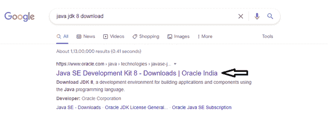
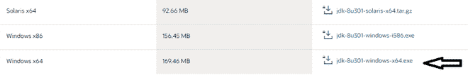
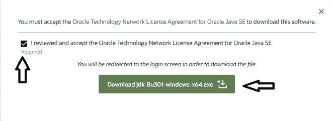
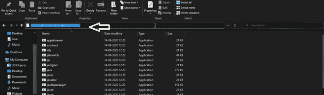
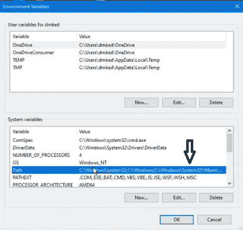
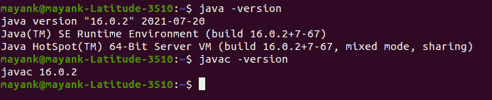

# 如何在 Windows 中安装 Java 小程序查看器？

> 原文:[https://www . geesforgeks . org/how-install-Java-applet-viewer-in-window/](https://www.geeksforgeeks.org/how-to-install-java-applet-viewer-in-windows/)

Applet viewer 是一个运行 Java 小程序的命令行程序。它包含在软件开发工具包中。它帮助您在浏览器中运行小程序之前测试它。小程序是一种特殊类型的应用程序，作为 HTML 页面的一部分，可以存储在网页中并在网络浏览器中运行。小程序的代码被传输到系统，然后浏览器的 Java 虚拟机(JVM)执行该代码并显示输出。所以为了运行小程序，浏览器应该启用 Java。要创建一个小程序，我们需要定义一个继承小程序的类。我们通常使用网络浏览器来运行小程序。并不总是必须打开网页浏览器才能运行小程序。

**共同特征特征**

*   更小，增量 JRE 下载和更快的小程序启动。
*   小程序在浏览器的单独进程中运行，每个小程序可以选择在单独的 JVM 实例中运行，因此一个行为不当的小程序不会影响其他小程序或浏览器。
*   小程序可以传递参数来控制行为，例如设置大的初始堆大小以避免内存不足的异常。
*   小程序现在可以从网络浏览器中拖出，作为单独的应用程序运行。

**程序:**

现在，让我们讨论在可视化辅助工具的帮助下，在 java 中安装 java applet viewer 的顺序步骤。下面我们将从头开始提供如下步骤:

**第一步:**搜索下载 JDK 最新版本。下面我们下载的是版本 8，但是随着 java 的快速发展，我们已经有了 Oracle 最新的版本 16。

**第二步:**点击 oracle docs 提供的浏览器中的链接。

> **注**:我们确实有 Open JDK 和 ORacle JDK，就 java 开发而言，我们必须始终采用 Oracle JDK >

**第三步:**向下滚动页面&找到 windows x64 下载链接

**第五步:**接受&下载文件。

**步骤 6:** 每次按下&安装，最后按下完成，就像安装任何 windows 应用程序一样。

**步骤 7:** 现在迁移到 c 盘。然后是程序文件，然后是 java 文件夹，然后是 JDK 1.8.0-251 &然后是 bin 文件夹然后复制文件夹地址随身携带。

**第 8 步:**然后从你的开始按钮打开环境变量。然后你必须在路径部分粘贴地址。只需双击路径&然后创建一个新的并粘贴地址。最后，按“确定”

**第九步:**最后在开始菜单写“cmd”打开命令提示符。那里写 java 版本。它将清楚地显示已安装的版本。

**第十步:**极客现在你可以开始了，因为它已经可以使用了。