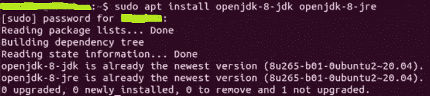
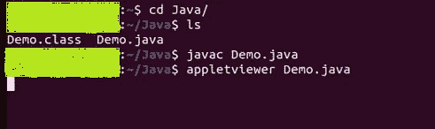
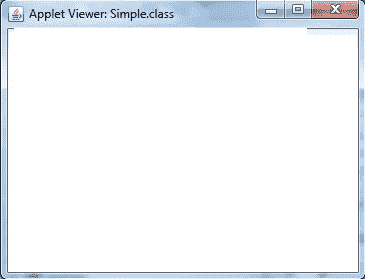

# 如何在 Linux 上安装 Java 小程序查看器？

> 原文:[https://www . geesforgeks . org/how-install-Java-applet-viewer-on-Linux/](https://www.geeksforgeeks.org/how-to-install-java-applet-viewer-on-linux/)

Applet viewer 是一个运行 java applet 的命令行程序。它帮助您在浏览器中运行小程序之前测试它。小程序的代码被传输到系统，然后浏览器的 Java 虚拟机执行这些代码。

在本文中，我们将研究在 Linux 上安装 Java Applet Viewer 的过程。

### **在 Linux 上安装 Java 小程序查看器:**

按照以下步骤在 Linux 上安装 Java 小程序查看器:

**第一步:**要安装 Java Applet Viewer，需要先下载 Java JDK 8。因为 Java 只给小程序到 JDK 版本 9。

**步骤 2:** 打开终端，执行以下命令:

```java
 sudo apt install openjdk-8-jdk openjdk-8-jre 
```

该命令将安装 Java JDK 8。或者如果您已经安装了它，它将给出以下输出。



**第三步:**编写一个小程序示例代码。您也可以编写以下代码。将它以 Demo.java 的名字保存在一个也是 Java 的文件夹中。

## Java 语言(一种计算机语言，尤用于创建网站)

```java
import java.awt.*;
import java.applet.*;

public class Demo extents Applet
{
  public void init()
  {
        setForeground(Color.white);
        setBackground(Color.blue);
  }
  public void paint(Graphics g)
  {
    g.drawString("Welcome To Java Applet",40,50);
  }
}
```

**第四步:**逐一编写以下命令，执行小程序程序。

```java
cd Java/
ls
Demo.class Demo.java
javac Demo.java
appletviewer Demo.java
```



**第五步:**结果，程序将被执行&给出输出。



因此，Java 小程序查看器成功安装。