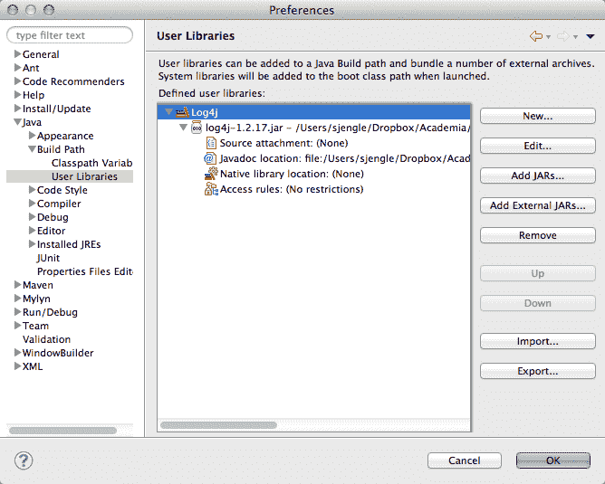
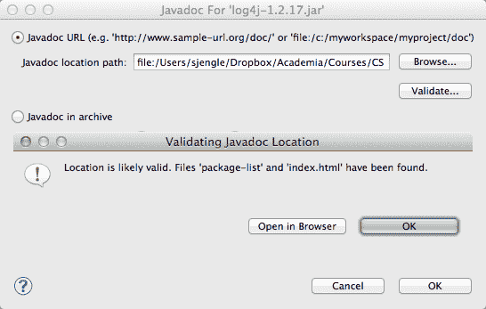
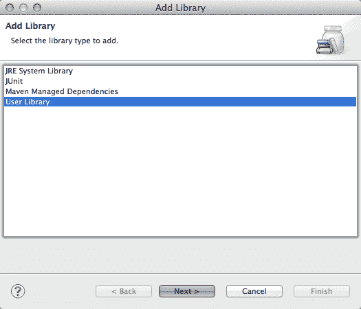
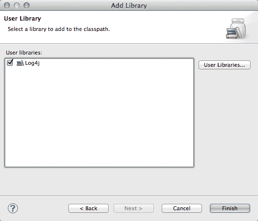

# 如何安装 Java 库？

> 原文:[https://www . geesforgeks . org/how-install-Java-libraries/](https://www.geeksforgeeks.org/how-to-install-java-libraries/)

**Java 库**是一些其他程序员编写的类的集合，我们可以通过下载这些类在代码中使用。Java 库允许您读取和修改应用程序生成的字节码。Java 世界中一些流行的字节码库是“javassist”和“Cglib Nodep” [Eclipse](https://www.geeksforgeeks.org/eclipse-vs-intellij-idea-vs-netbeans-for-java-development/) 是一个开源社区，而不是最好的开源 IDE，其项目专注于构建一个可扩展的开发平台、运行时和应用框架，用于在整个软件生命周期中构建、部署和管理软件。

> **注意:**在这里，大多数用户在安装库之后确实倾向于忘记设置路径，所以我们将在我们将要覆盖的地方将其分成两半
> 
> *   上半年安装 java 库
> *   配置生成路径

### A.JAVA 库的安装

下面是安装 java 库要遵循的顺序步骤。

**步骤 1:** 从其网站下载并提取库

**步骤 2:** 您需要找到库的 jar 文件以及存储 API 文档的位置。一旦知道了文件的位置，就可以向 Eclipse 添加一个用户库。

**第三步:**在 Eclipse 中打开“首选项”窗口。导航到“Java 构建路径用户库”，然后在左侧单击“新建”按钮，输入文件名，然后单击“确定”按钮。

**第四步:**之后需要点击“添加外部 JARs”按钮，添加 jar 文件。浏览库所需的 jar 文件，然后单击“打开”按钮。

**第五步:**前往选择“Javadoc 位置”条目，点击“编辑”按钮。

**第 6 步:**浏览到包含 API 文档的文件夹或目录，点击“验证”按钮。

**第 7 步:**点击“确定”，直到完全退出“首选项”窗口。

> **注意:**一旦成功添加了用户库，就需要将用户库添加到项目的构建路径中。

### **B.** 配置构建路径

**步骤 1** :右键单击项目，选择“构建路径添加库…”。

**第二步**:对话框弹出窗口，选择“用户库”，点击“下一步”按钮。

**第三步:**选择要添加的用户库，点击“完成”。

现在，您可以看到默认 Java 类文件下的项目目录中列出的库。

> **注意:**需要这个库的每个项目都需要这样做。