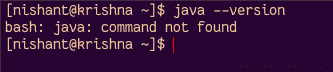
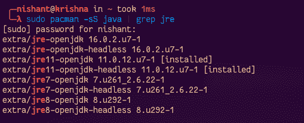
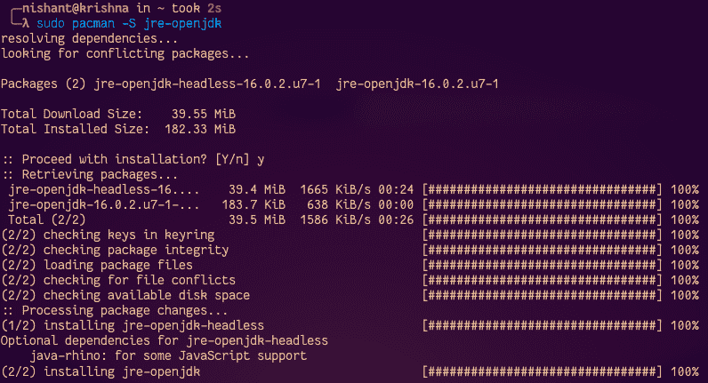
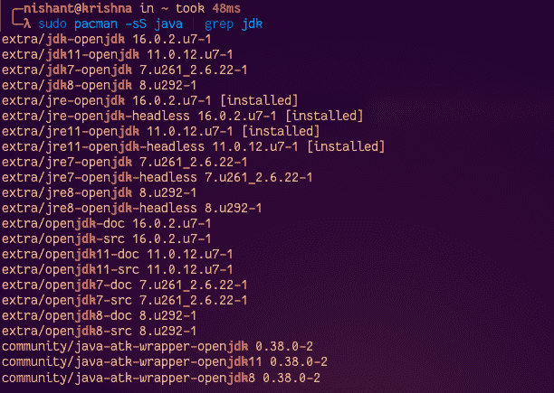
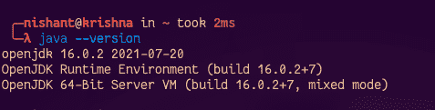

# 如何在 Arch Linux 上安装 Java？

> 原文:[https://www . geesforgeks . org/how-install-Java on-arch-Linux/](https://www.geeksforgeeks.org/how-to-install-java-on-arch-linux/)

**Java** 是最流行的编程语言之一。如今，许多应用程序都在使用 Java。Java 由 **JRE** (Java 运行时环境)和 **JDK** (Java 开发工具包)组成。JRE 是 Java 运行时环境，它提供了运行和编译 Java 程序的库。JDK 提供编译器(javac)来编译 Java 程序和其他工具。

**程序:**

现在让我们看看如何在 Arch Linux 上安装 JAVA。

1.  检查系统上是否安装了 Java
2.  在 Arch Linux 中安装 JRE
3.  在 Arch Linux 中安装 JDK
4.  验证是否安装了 Java

现在，让我们详细讨论这些步骤，以及为了更好地理解而与视觉辅助工具一起使用的命令，如下所示:

**步骤 1:** 检查系统上是否安装了 java

首先，我们必须检查系统上是否安装了 java。并检查 Arch Linux 系统上安装了哪个版本。因此，为了检查 java 是否已安装，我们可以使用如下命令:

```java
java --version
```



如果上面的命令由于没有找到命令而给出输出，那么在 Arch Linux 系统上没有安装 Java。否则，您将看到安装了哪个版本的 JDK 和 JRE。

**步骤 2:** 在 Arch Linux 中安装 JRE

现在我们必须在系统上安装 JRE 包。因此，首先我们将搜索哪些版本可供下载。要搜索可下载的 JRE 版本，请使用以下命令:

```java
sudo pacman -sS java | grep jre
```



现在我们要安装最新版本的 JRE。要安装最新版本的 JRE，请使用以下命令:

```java
sudo pacman -S jre-openjdk
```



运行上述命令后，它将要求继续安装或不安装，然后只需按 y 键。现在您已经成功安装了 JRE。

**步骤 3:** 在 Arch Linux 中安装 JDK

现在我们必须在系统上安装 JDK。首先，让我们使用以下命令检查可用的下载版本:

```java
sudo pacman -sS java | grep jdk
```



现在我们必须安装最新版本的 JDK。要安装最新版本的 JDK，请运行以下命令:

```java
sudo pacman -S jdk-openjdk
```


运行上述命令后，会询问是否继续，然后按 y 键。现在我们已经成功地将其安装在 Arc Linux 系统上。

**步骤 4:** 验证是否安装了 Java，可以运行如下命令:

```java
java --version
```

