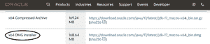
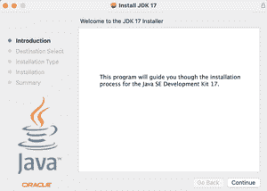
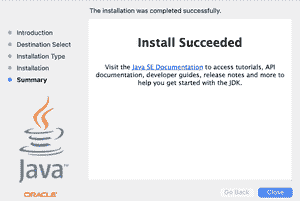
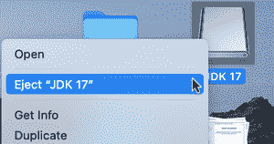
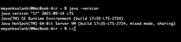
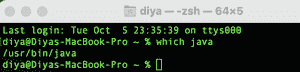
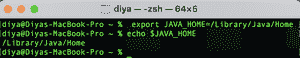
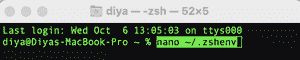
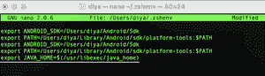
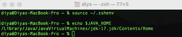

# 如何在 MacOS 上安装 Java？

> 原文:[https://www.geeksforgeeks.org/how-to-install-java-on-macos/](https://www.geeksforgeeks.org/how-to-install-java-on-macos/)

**Java** 是一种通用语言，最初由太阳微系统公司的**詹姆斯·高斯林**开发。Java 是一种高级的、面向对象的编程语言，它被发明来具有很少可行的实现依赖。编译后的 Java 代码可以在所有支持 Java 的平台上运行，而无需重新编译，这使得程序员更容易，因为他们只需编写一次代码，就可以在任何地方运行。最新版本的 Java 是**Java 17；** Java 11 和 8 是目前支持的截至 2021 年 9 月的长期支持(LTS)版本。

> **注**:Java 17 是最新版本，这意味着 Oracle 会长期支持这个版本。卓越支持将持续到 2026 年 9 月，扩展支持将持续到 2029 年 9 月。

**下载安装**

**方式:**基本上有以下两种方式:

1.  从甲骨文网站下载
2.  通过[自制](https://www.geeksforgeeks.org/homebrew-installation-on-macos/)使用终端

这里我们将讨论第一种方法，在这种方法中，可以从[甲骨文的](https://www.oracle.com/java/technologies/downloads/#jdk17-mac)官方网站下载 java，并通过以下步骤进行安装:

**第一步:**点击下载选项下载 Java 17，如下图所示，在需要下载*的地方点击**。**dmg '*一并进行下载程序。



> **提示:**你也可以选择下载 x64 压缩存档，然后解压到你的 Mac。但是在 mac 中，由于 macOS ocosystem 的内部限制，在下载任何应用程序时，建议下载完整的文件，而不是压缩文件。

**第二步:**打开 **DMG** 文件- >双击上一步下载的 JDK 包，开始在你的 Mac 上安装 Oracle JDK 17。它将安装 DMG 磁盘，并显示如图所示的安装程序。查看甲骨文 JDK 公司更新的许可协议。



**第三步:**点击***继续按钮- >选择目的地- >安装- >输入您的密码*** 即可获得安装 java 17 的权限。

> **注意:**您可以通过单击返回按钮来更改安装位置。它不允许我更改大苏尔上的安装位置。



**第 4 步**:现在通过右键单击卸载如图所示的 DMG 映像，基本上我们正在删除我们在 Windows 中不太可能做的设置



**第五步:**确认安装，我们可以查看 JDK 版本，如下图所示。以上就是在苹果电脑上安装甲骨文 JDK 17 的全部内容。

```
java -version
```



### 如何在 macOS 上设置/更改 Java 的路径？

我们需要特别注意和小心，因为这对于理解任何机器上的 java 都非常有用。现在我们需要改变 Java 在 Mac 上的路径，为此需要遵循以下步骤:

**第一步:**开放终端- >类型:**【哪个爪哇】**。它应该显示类似/usr/bin/java 的内容。



> JAVA_HOME 是目录的完整路径，该目录包含一个名为“bin”的子目录，其中包含 JavaJava。对于 Mac OSX，它是/图书馆/Java/家庭

**第二步:**在终端中使用这个命令设置 JAVA_HOME，你不再需要记住只是在上面施压然后继续

```
export JAVA_HOME=/Library/Java/Home
```

**步骤 3:** 要确认路径，请编写以下命令

```
echo $JAVA_HOME 
```



**步骤 4:** 您现在应该能够运行您的应用程序了

> **注意:**这只是为这个会话设置了 JAVA_HOME。如果你想让它永久存在，你必须把这个命令添加到你的 **~/。Zhen ov**或 **~/。zshrc** 文件与 macOS 10.15 Catalina 以及更高版本一样，zsh 是默认的 Terminal shell。为此，请遵循以下说明:

**步骤 5:** 打开端子并键入:

```
nano ~/.zshenv
```



> 还可以使用您选择的任何其他终端命令行文本编辑器

**第六步:**把这个加到**的末尾~ ~/。zshenv 文件**

```
export JAVA_HOME=$(/usr/libexec/java_home)
```



**第七步:**保存并退出 nano (ctrl-x，选项-a，回车)

**第 8 步:**获取文件并打印$JAVA_HOME。

```
source ~/.zshenv
echo $JAVA_HOME
```

如果我们确实看到下面的命令，那么我们已经成功地设置了您的 JAVA_HOME 环境变量

```
/Library/Java/JavaVirtualMachines/jdk-17.jdk/Contents/Home
```

