# 如何在 Linux 中安装 JDK？

> 原文:[https://www.geeksforgeeks.org/how-to-install-jdk-in-linux/](https://www.geeksforgeeks.org/how-to-install-jdk-in-linux/)

[Java](https://www.geeksforgeeks.org/java-tutorial/) 是一种非常流行的通用编程语言，非常接近 flow Oop 的理论，可以在任何平台上独立运行，但是它的运行时环境依赖于平台[**JVM(Java Virtual Machine)**](https://www.geeksforgeeks.org/jvm-works-jvm-architecture/)又称。其首先将 Java 文件字节码和字节码解释为机器语言。这里我们将在基于 Debian 的 Ubuntu 操作系统中安装 JDK。

### **分步安装:**

**第一步**:打开浏览器，导航到[这个链接。](https://www.oracle.com/java/technologies/javase-downloads.html)

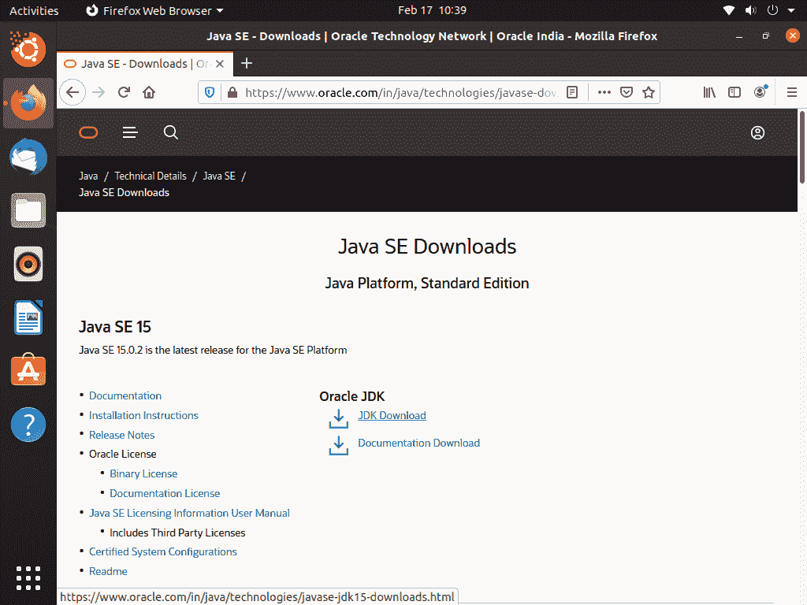

**第二步**:向下滚动，点击 JDK 下载链接。

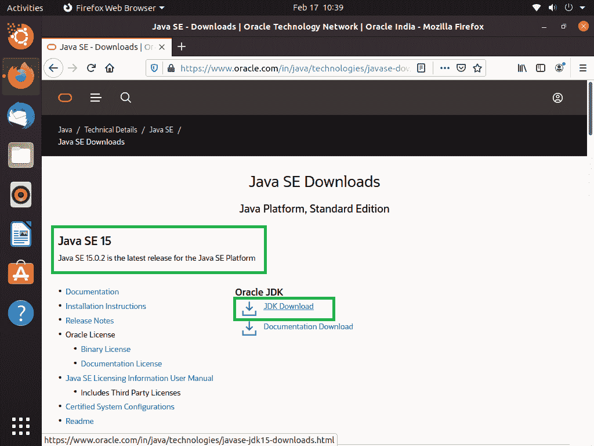

**第三步**:然后选择兼容文件。

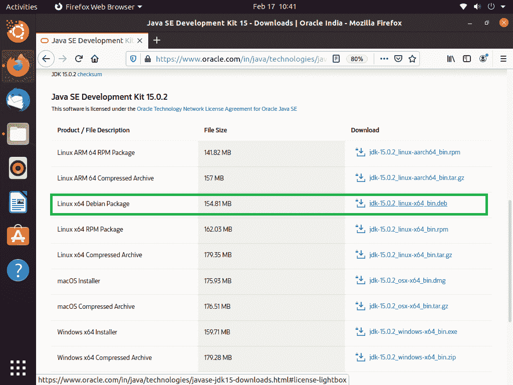

点击链接后，他们会显示弹出窗口以确认他们的条款和条件，并点击下载按钮。

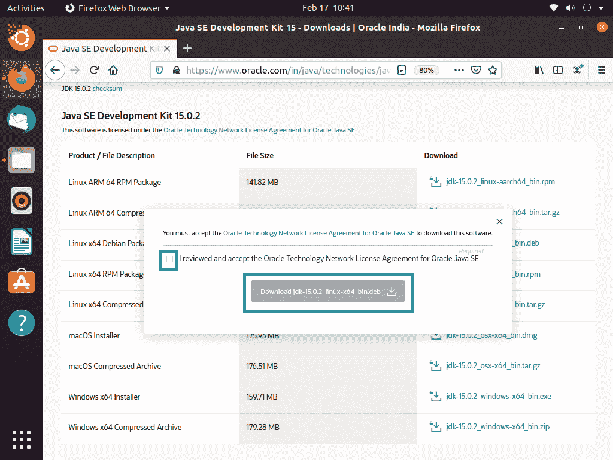

勾选并点击下载。

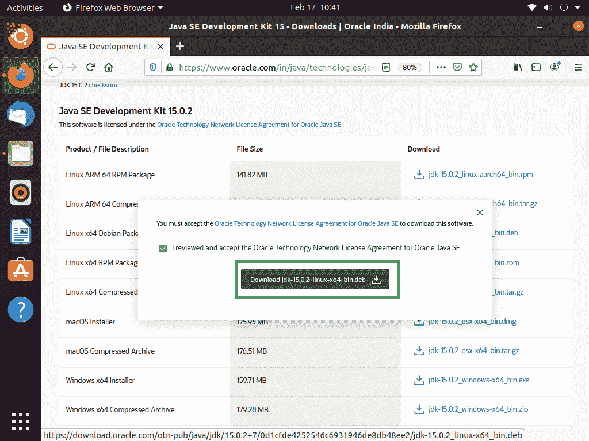

**第四步**:下载后导航到你的下载文件夹，打开终端，进入下载文件夹。

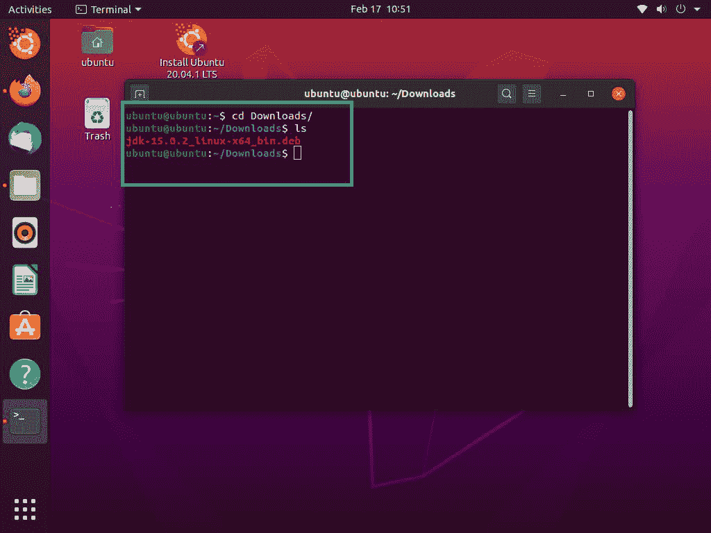

**第 5 步:**键入命令。

```
sudo dpkg -i package_name
```

键入命令后，按 enter 键。


这个过程几乎不需要时间。

**第 6 步**:完成上述步骤后，进行下一步更新路径和备选方案。

```
sudo update-alternatives --install /usr/bin/java java /usr/lib/jvm/jdk-15.0.2/bin/java 1
```

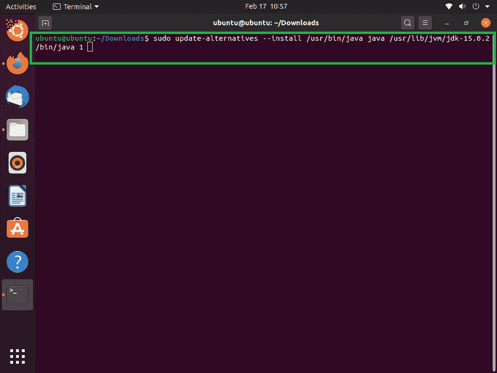

**输出:**

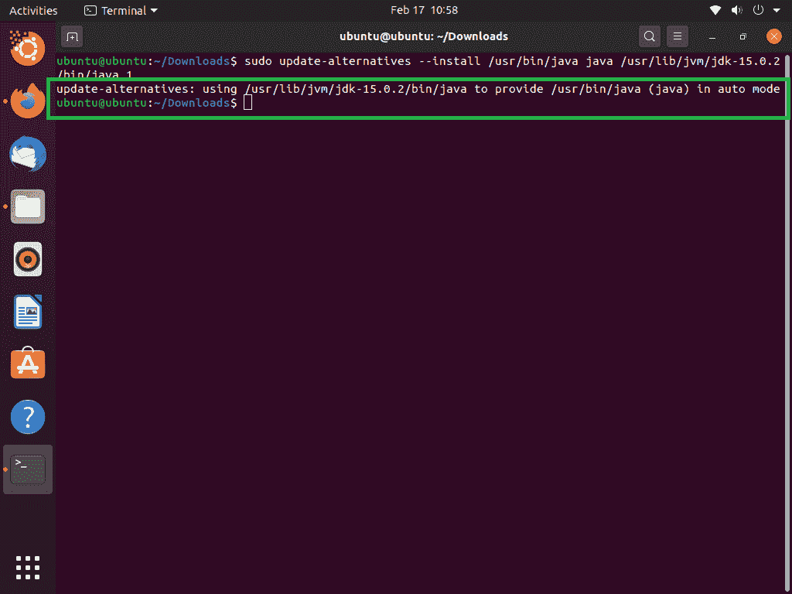

**对于备选方案**:

```
sudo update-alternatives --install /usr/bin/javac javac /usr/lib/jvm/jdk-15.0.2/bin/javac 1
```

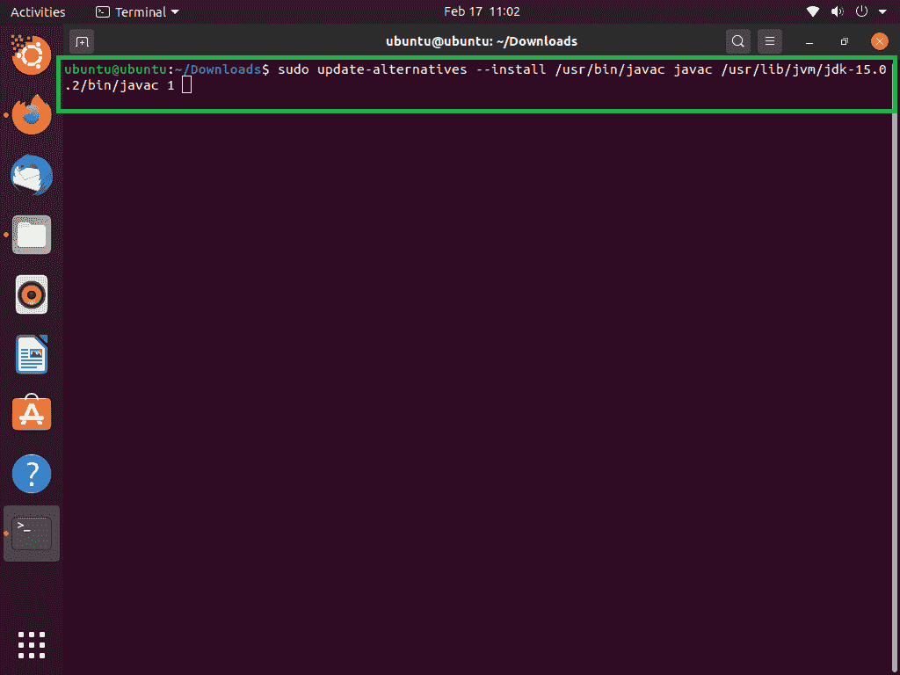

**输出:**

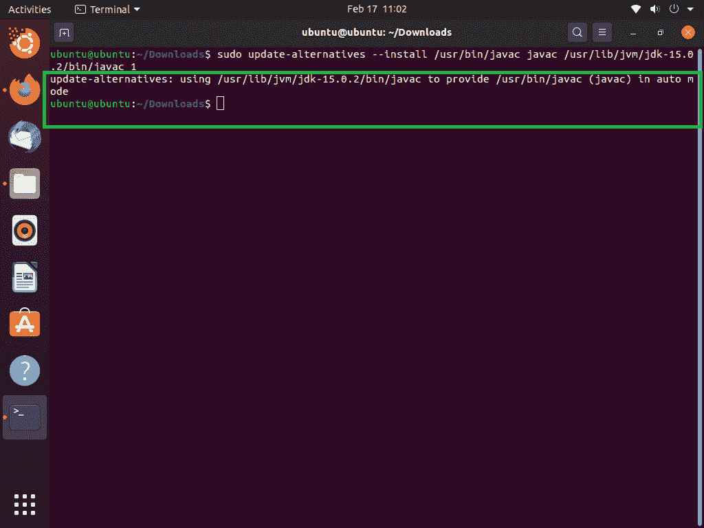

**第七步**:最后，Java JDK 安装成功。

检查 Java 安装是否正确。

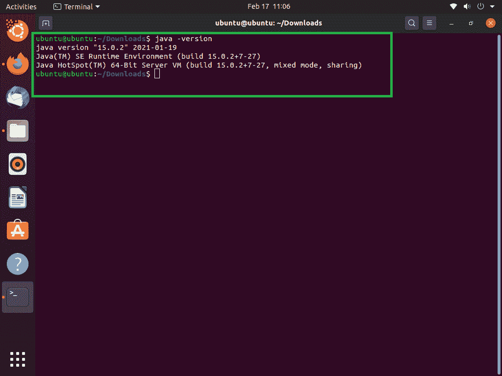

并检查 Javac 安装是否正确。

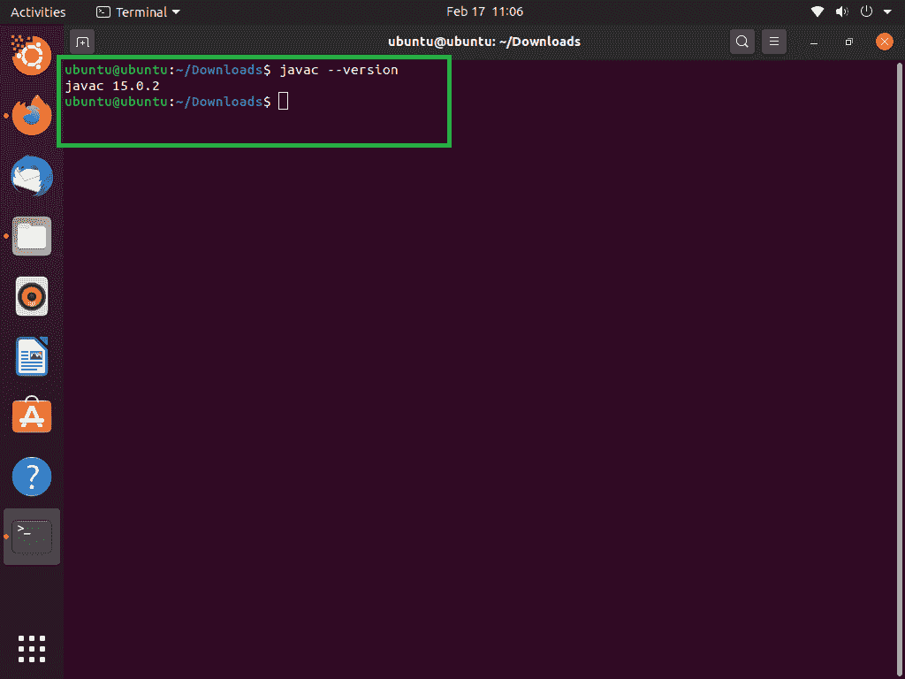