# 如何在 Windows 上安装 NetBeans Java IDE？

> 原文:[https://www . geesforgeks . org/how-install-netbeans-Java-ide-on-windows/](https://www.geeksforgeeks.org/how-to-install-netbeans-java-ide-on-windows/)

NetBeans IDE 是一个免费的开源跨平台形式**集成开发环境(IDE)** ，内置了对 JAVA 编程语言的支持。它可以运行任何由 **Java 虚拟机(JVM)组成的机器。**它包含许多应用程序开发功能，如下所示:

*   拖放**图形用户界面**创建。
*   优秀的编辑(高级源代码编辑器)
*   网络服务
*   出色的调试
*   向导、代码生成和管理工具等等。

### 在视窗系统上安装网豆的步骤

**1。**你需要在你的设置中有一个 NetBeans JAVA 的设置文件。

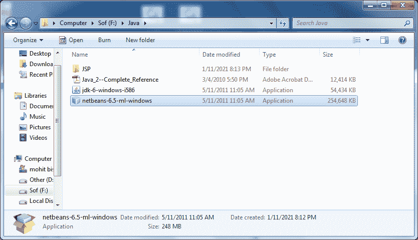

**2。**如果没有设置，可以从以下链接下载:[https://netbeans.org/images_www/v6/download/community/8.2](https://netbeans.org/images_www/v6/download/community/8.2/)

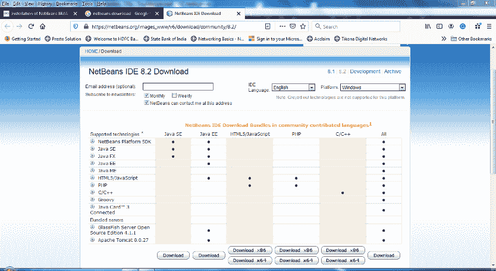

**3。**您可以根据自己的要求从上述网页下载任何类型的设置。
**4。**右键单击设置，或者使用鼠标双击设置。
**5。**点击下一个选项

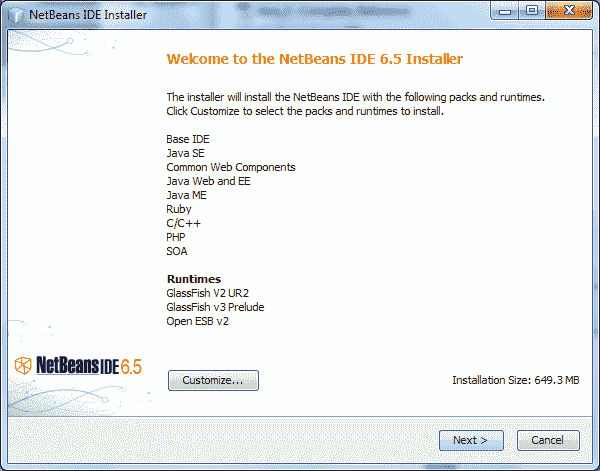

**6。**查看“**私人网络、** **如我的家庭和工作网络”。**

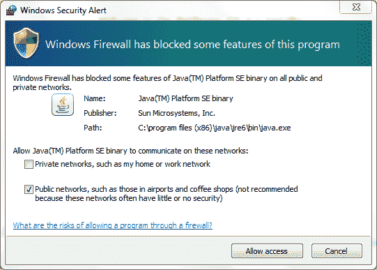

**7。**点击**允许进入**按钮。
**8。**勾选**“我接受”**选项，点击**下一步**按钮。

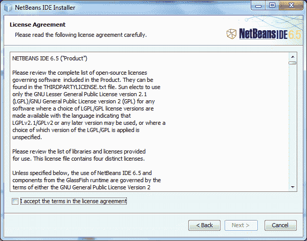

**9。**选择要安装软件的路径，然后按下“**下一步”**按钮。

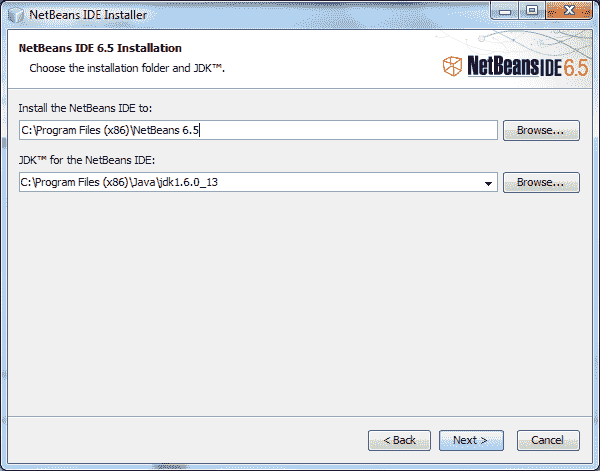

**10。**为网络连接设置**密码、用户名&端口**，或者我们可以使用这个**用户名和密码**来连接前端和后端。

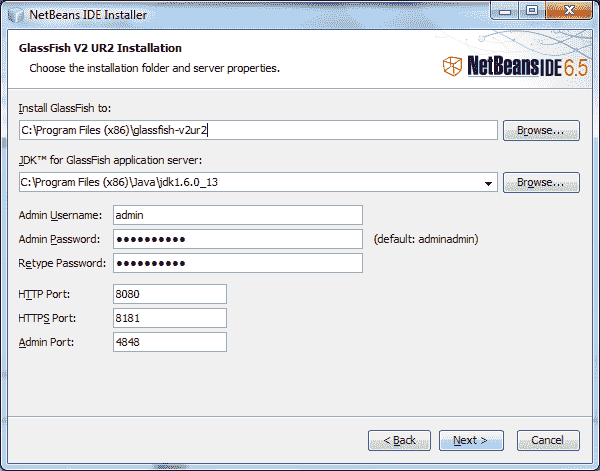

**11 时。**点击**下一步**按钮。

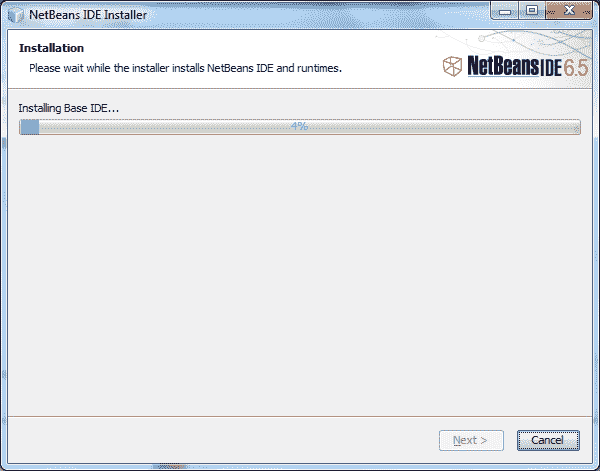

**12 时。**点击“**安装”**按钮。

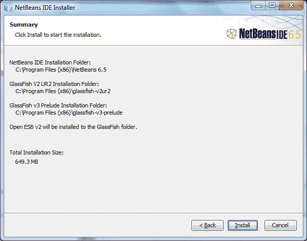

**13。**等待一会儿，直到设置正确安装到计算机中

**14。**设置完成后，您可以点击“**完成”**按钮，或者您也可以注册该软件，以获得进一步的帮助，因为它是一个自由软件。

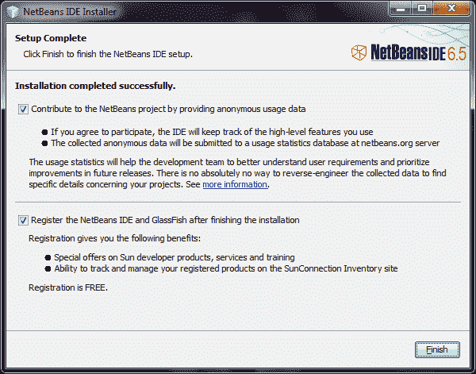

**15。**现在您可以启动 NetBeans 以供进一步使用

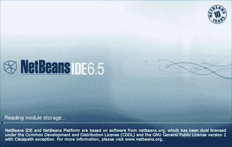